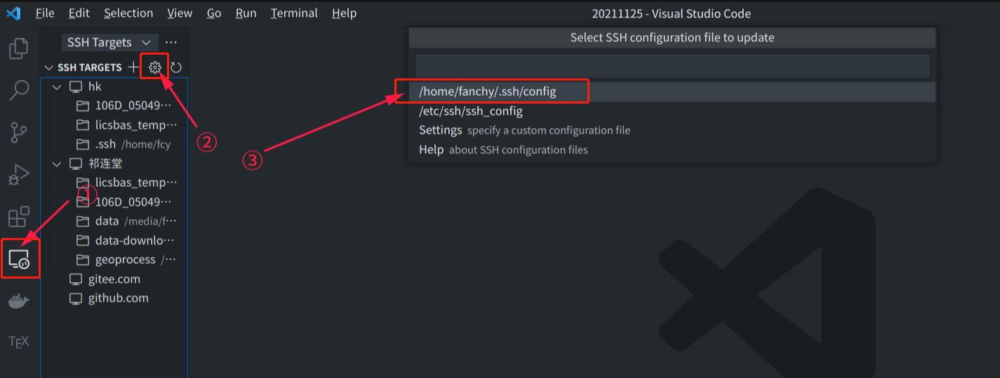
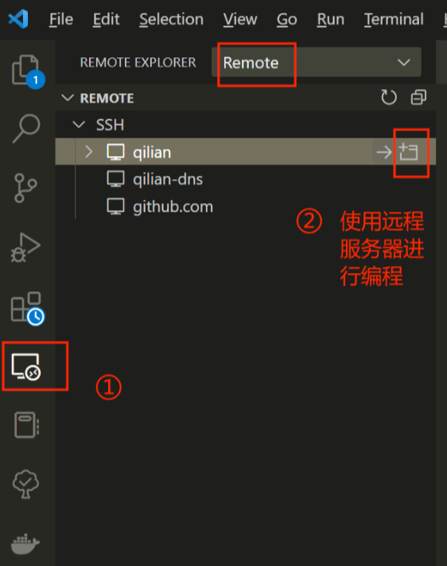

**远程开发**
windows生成本地ssh密钥，保存在`C:\Users\dawnmn\.ssh`目录：
```
ssh-keygen -t rsa
```
远程服务器，进入根目录下的`.ssh`目录，如果没有就创建。创建`authorized_keys`文件，内容为`C:\Users\dawnmn\.ssh\id_rsa.pub`
```
cd
cd .ssh
# rz 上传文件C:\Users\dawnmn\.ssh\id_rsa.pub
mv id_rsa.pub authorized_keys
```
windows执行`ssh root@192.168.126.132`，不需要密码就能登录，说明配置成功。
VScode安装插件`Remote Development`，然后修改config配置：

```
Host remote
    HostName 192.168.126.132
    User root
    Port 22
```

会打开新的VScode窗口，设置远程服务器目录后，开始远程开发。