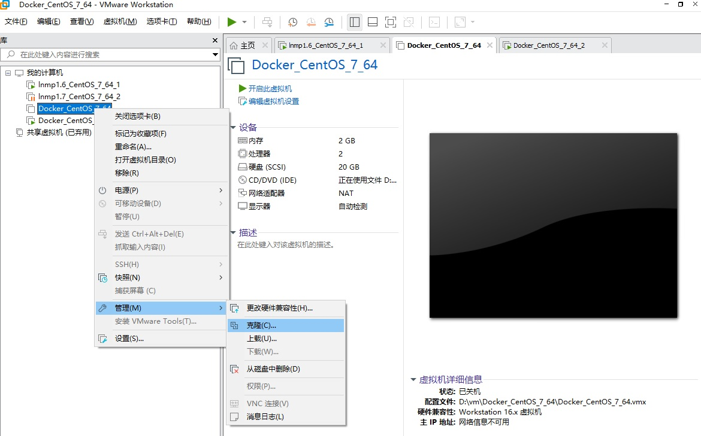

按照指引操作，克隆完后，修改ip
```
cd /etc/sysconfig/network-scripts/
vim ifcfg-ens32
#将IPADDR改成其它的

service restart network
```
修改主机名（克隆主机和原主机都要改）
```
vim /etc/hostname
```
修改hosts（克隆主机和原主机都要改）
```
vim /etc/hosts

127.0.0.1   localhost localhost.localdomain localhost4 localhost4.localdomain4
::1         localhost localhost.localdomain localhost6 localhost6.localdomain6
 
192.168.152.190 docker_test_02
192.168.152.129 docker_test_01
```