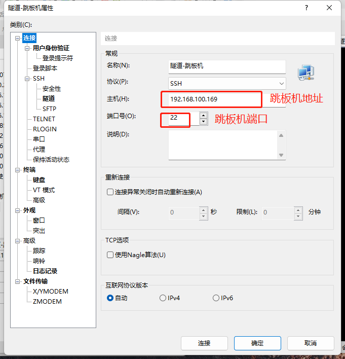
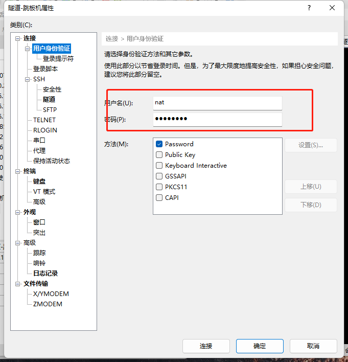
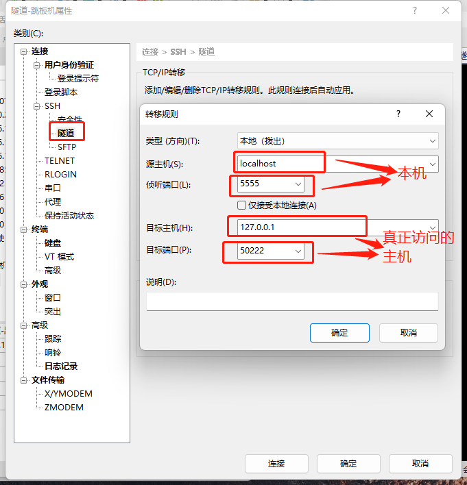
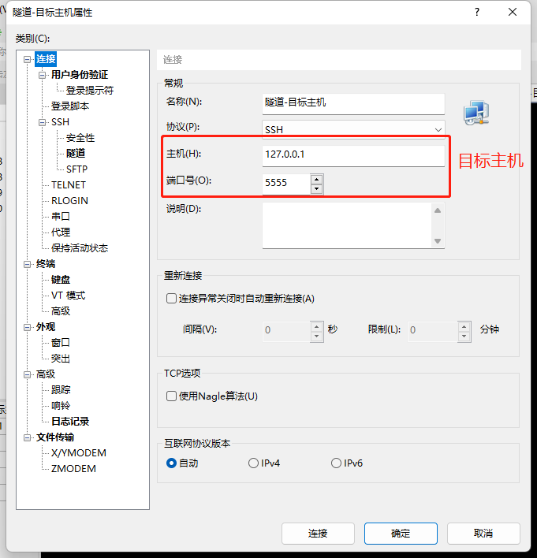
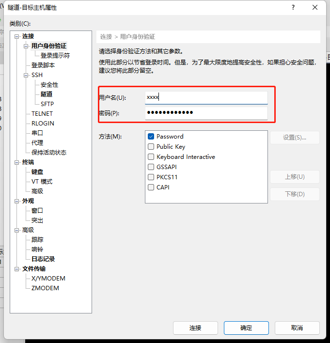

**Xshell用ssh密钥登录**
Windows：
xshell->工具->新建密钥生成导向->下一步->下一步->密码置空->下一步->保存为文件(保存公钥)->完成->导出(保存私钥)

CentOS：
```
cd
mkdir .ssh
cd .ssh #rz指令将公钥上传至该目录，并重命名为authorized_keys
chmod 700 .ssh
chmod 600 .ssh/authorized_keys

vim /etc/ssh/sshd_config
#这一行去掉注释
PubkeyAuthentication yes

service sshd restart
```
登录：
xshell用户名`root `，SSH用户身份验证选择Public Key->浏览->文件(选择私钥)

**ssh隧道**
1 连接跳板机



2 连接目标主机


