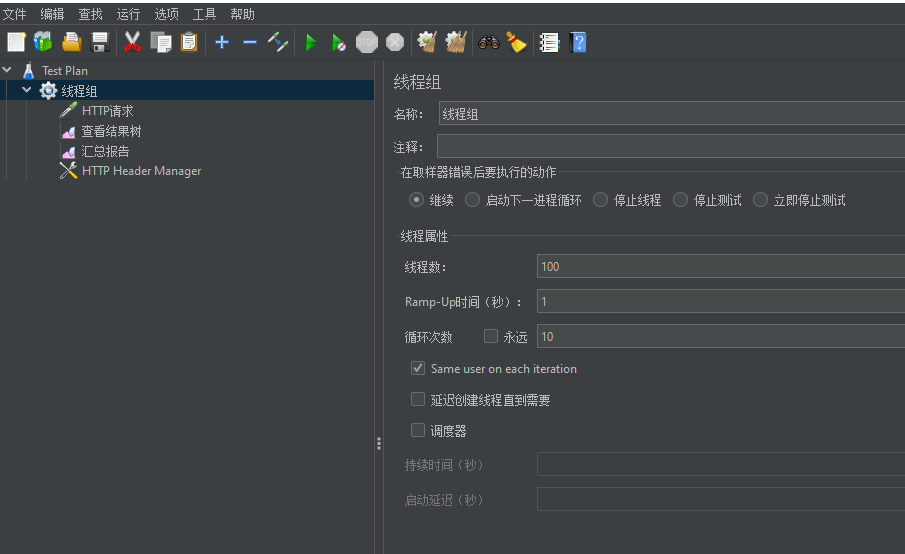

**windows安装**
[官网安装jdk1.8](https://www.oracle.com/java/technologies/javase/javase-jdk8-downloads.html)
[官网下载Apache JMeter](https://jmeter.apache.org/download_jmeter.cgi)，解压，点击`bin/jmeter.bat`启动。
**使用**
option->choose language->中文
线程组->添加->取样器->HTTP请求
线程组->添加->配置元件->HTTP信息头管理器
线程组->添加->监听器->查看结果树
线程组->添加->监听器->汇总报告

