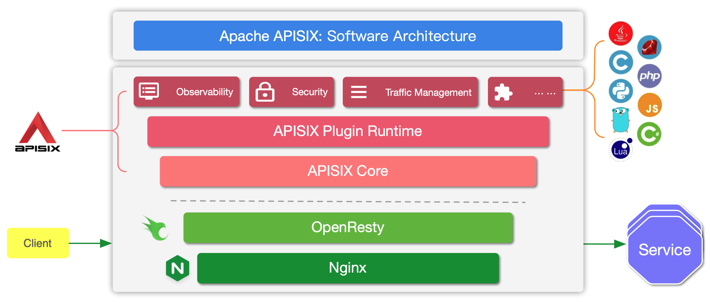

参见[官网](https://apisix.apache.org/zh/docs/apisix/installation-guide/)，选择docker安装。
**Apisix默认配置**
占用的端口：`9000`、`9080`、`9180`、`9443` 、`2379`
默认账号密码：`admin` `admin`

**配置HTTPS**
1. 用`cert.go`生成密钥，`host`为：`www.ddd.com`
2. `apisix网站后台`->`证书`-> `cert.pem`、`key.pem`
3. 本地vhost 配置 `192.168.2.70 www.ddd.com`

4. `api`访问：`https://www.ddd.com:9443/xxx`

架构图
