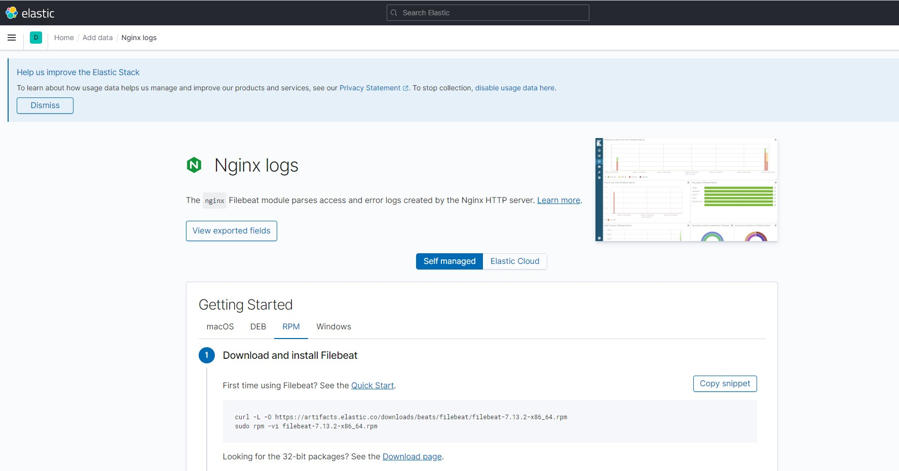

#### 安装sebp/elk
https://hub.docker.com/r/sebp/elk
```
https://hub.docker.com/r/sebp/elk

docker pull sebp/elk
sysctl -a | grep vm.max_map_count
sysctl -w vm.max_map_count=262144
docker run -p 5601:5601 -p 9200:9200 -p 5044:5044 -it --name elk sebp/elk

```

#### 安装filebeat
进入`http://192.168.152.132:5601/app/kibana_overview#/`，点击`Add data`，点击`Nginx logs`，点击`RPM`，按照教程步骤执行：

```
vim /etc/filebeat/filebeat.yml

filebeat.inputs:

- type: log 
  enabled: true
  paths:
    # 这里改成你的目录
    - /var/download/logs/*.log
```

