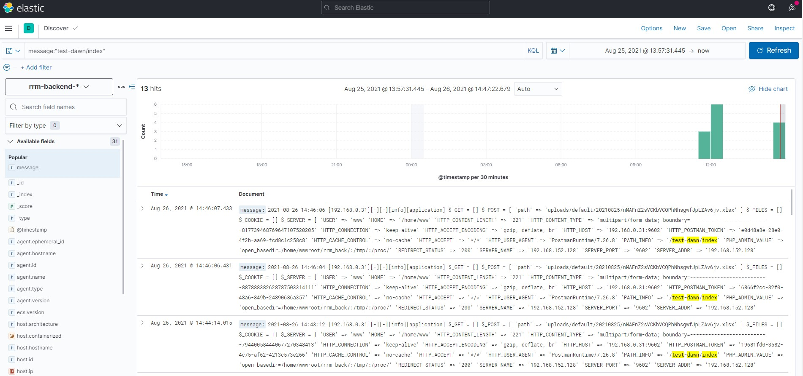

**安装sebp/elk**
https://hub.docker.com/r/sebp/elk
```

docker pull sebp/elk:7.16.0
sysctl -a | grep vm.max_map_count
sysctl -w vm.max_map_count=262144
docker run -p 5601:5601 -p 9200:9200 -p 5044:5044 -it --name elk sebp/elk:7.16.0
```
查看`http://192.168.152.132:9200/` `http://192.168.152.132:5601/`

**安装filebeat**
[官网下载filebeat-7.16.0-linux-x86_64.tar.gz](https://www.elastic.co/cn/downloads/past-releases#filebeat)，解压完进入目录即可使用。

**配置filebeat，以yii2日志为例**
`vim /etc/filebeat/filebeat.yml`
```
# ============================== Filebeat inputs ===============================

filebeat.inputs:

- type: log
  enabled: true

  paths:
    - /home/wwwroot/rrm_back/backend/runtime/logs/*.log

  multiline.type: pattern
  multiline.pattern: ^\d{4}-\d{2}-\d{2}[\s]+\d{2}:\d{2}:\d{2}
  multiline.negate: true
  multiline.match: after

# =================================== Kibana ===================================
setup.kibana:
  host: "192.168.152.133:5601"

# ======================= Elasticsearch template setting =======================

setup.template.name: "rrm-backend"
setup.template.pattern: "rrm-backend-*"
setup.template.overwrite: true

# ---------------------------- Elasticsearch Output ----------------------------
output.elasticsearch:
  hosts: ["192.168.152.133:9200"]

  username: "elastic"
  password: "changeme"

  index: "rrm-backend-%{+yyyy.MM.dd}"

# 最后一行
setup.ilm.enabled: false
setup.dashboards.index: "rrm-backend-*"
```
```
filebeat setup
service filebeat start
# ./filebeat setup
# ./filebeat -e
```
成功示例


