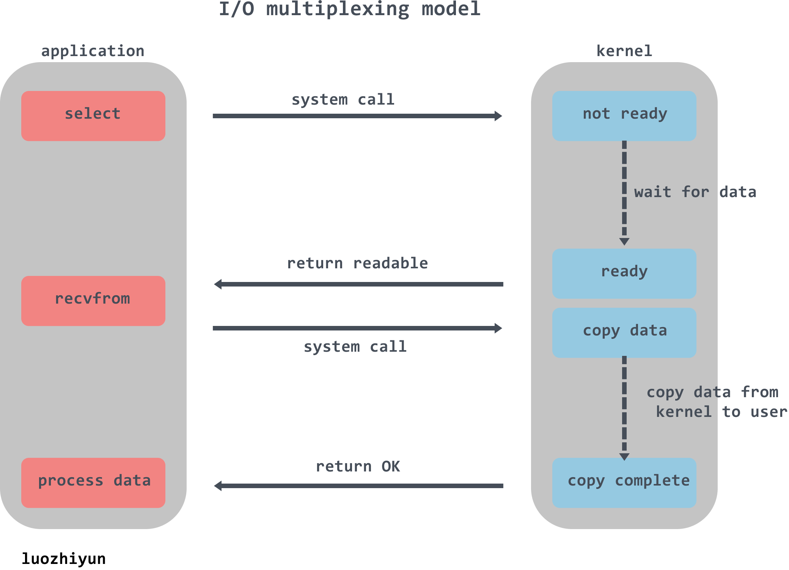

要基于 TCP 协议来构建自己的应用层协议，**就必须要自己定义消息的边界**，最常见的两种解决方案就是**基于长度或者终结符**。
go标准库net包的write read方法都加锁了。读用一个协程，写用多个，保证读写完整的业务包。
*****
同步是需要主动等待消息通知，而异步则是被动接收消息通知，通过回调、通知、状态等方式来被动获取消息。
阻塞：程序会一直等待。非阻塞：程序轮询等待。
现代操作系统都是采用虚拟存储器，对32位操作系统而言，它的寻址空间为4G。为了保证用户进程不能直接操作内核，操作系统将虚拟空间划分为两部分，一部分为内核空间，一部分为用户空间。针对linux操作系统而言，将最高的1G字节，供内核使用，称为内核空间，而将较低的3G字节，供各个进程使用，称为用户空间。
为了控制进程的执行，内核必须有能力挂起正在CPU上运行的进程，并恢复以前挂起的某个进程的执行。这种行为被称为进程切换。当进程进入阻塞状态，是不占用CPU资源的。
网络IO的本质是socket的读取，IO的数据会先被拷贝到操作系统内核的缓冲区中，然后才会从操作系统内核的缓冲区拷贝到应用程序的地址空间。
1 等待网络数据到达网卡并读取到内核缓冲区，数据准备好。
2 从内核缓冲区复制数据到进程空间。
文件描述符（File descriptor），FD，是一个指向文件的引用，是一个索引值。当程序打开一个现有文件或者创建一个新文件时，内核向进程返回一个文件描述符。
fd=io=连接
*****

链表、数组区别：数组查询快，插入删除慢很多，长度固定，顺序存储，链表插入删除快，查询线性时间慢，长度动态灵活，随机存储。相同数量的元素，链表更耗内存（存储了前后指针）

在一个线程中，同步阻塞只能等待一个连接，I/O 复用可以等待多个连接（kernel监控），用于海量并发连接且大量连接idle的场景。


select缺点：性能开销大，文件描述符数量少。
epoll是一种I/O事件通知机制，内部存储：
监听列表：所有要监听的文件描述符，使用红黑树；
就绪列表：所有就绪的文件描述符，使用链表；
select和poll都只提供了一个函数——select或者poll函数。而epoll提供了三个函数，epoll_create,epoll_ctl和epoll_wait，epoll_create是创建一个epoll句柄；epoll_ctl是在epoll上注册fd要监听的事件类型；epoll_wait则是等待事件的产生。
I/O Multiplexing首先向kernel发起system call，传入file descriptor和感兴趣的事件(readable、writable等)让kernel监测，当其中一个或多个fd数据就绪，就会返回结果。程序再发起真正的I/O操作recvfrom读取数据，或者write()。
在一个线程中对N个套接字进行事件捕获，当读写事件产生后再真正read()或者write()
epoll的连接上限是最大可以打开文件的数目。
*****


系统用一个4四元组来唯一标识一个TCP连接：{local ip, local port,remote ip,remote port}。
client最大tcp连接数：tcp端口的数据类型是unsigned short，因此本地端口个数最大只有65536，端口0有特殊含义，不能使用，这样可用端口最多只有65535。
server最大tcp连接数：理论上是客户端ip数×客户端port数，在unix/linux下限制连接数的主要因素是内存和允许的文件描述符个数。
服务器端最多可以拥有65535个Bind的Socket，最多可以开65535个服务器进程，但是你要知道这个能够连接客户端的数量没有任何关系。

server
```
package main

import (
   "bufio"
   "fmt"
   "io"
   "net"
)

func main() {
   listen, err := net.Listen("tcp", ":8080")
   if err != nil {
      fmt.Println("Listen失败", err)
      return
   }
   defer listen.Close()
   for {
      //Accept阻塞，直到有新的连接
      conn, err := listen.Accept()
      if err != nil {
         fmt.Println("Accept", err)
         return
      }
      go func() {
         defer conn.Close()
         reader := bufio.NewReader(conn)
         for {
            //ReadString阻塞，直到读到\n
            msg, err := reader.ReadString('\n')
            if err != nil {
               if err == io.EOF {
                  fmt.Println("connection close")
               } else {
                  fmt.Println("ReadString err", err)
               }
               return
            }
            fmt.Println("read data：", msg)
            b := []byte("ok")
            conn.Write(b)
         }
      }()
   }
}
```
client
```
package main

import (
   "bufio"
   "fmt"
   "net"
   "os"
)

func main() {
   conn, err := net.Dial("tcp", "127.0.0.1:8080")
   if err != nil {
      fmt.Println("Dial err:", err)
      return
   }

   //接收终端输入
   reader := bufio.NewReader(os.Stdin)
   //缓冲
   buf := make([]byte, 1024)
   fmt.Println("Please input data...")
   for {
      //读取终端输入直到读取到\n
      input, err := reader.ReadString('\n')
      if err != nil {
         fmt.Println("ReadString err:", err)
         return
      }
      //写入数据
      conn.Write([]byte(input))
      //服务器端返回的数据写入buf
      count, err := conn.Read(buf)
      if err != nil {
         fmt.Println("Read err:", err)
         return
      }
      //服务器端回传的信息
      fmt.Println("server response:", string(buf[0:count]))
   }
}
```