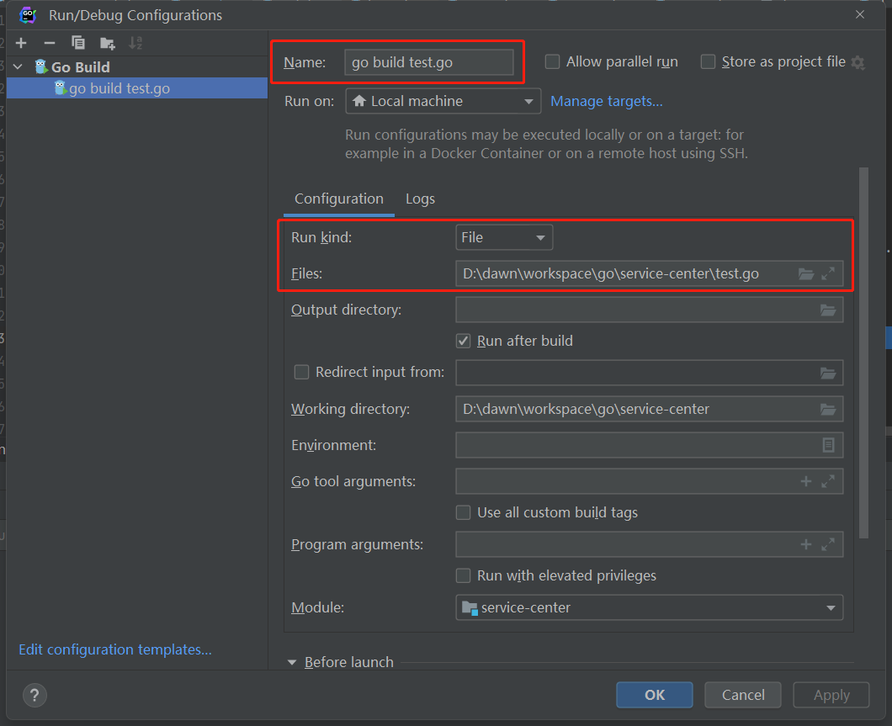

**编译**
`-gcflags`：传递给编译器的参数列表。
`-ldflags`：: 传递给链接器的参数列表。
`-ldflags "-s -w"` -s禁用符号表，panic时候的stack trace就没有任何文件名/行号。-w禁止DWARF调试信息，不能用gdb调试。
GOOS：目标平台的操作系统（darwin、freebsd、linux、windows）
GOARCH：目标平台的体系架构（386、amd64、arm64）
```
go build -o /yourpath/hello hello.go

# 使用net包或其它c库时，关闭CGO
CGO_ENABLED=0 go build -o /yourpath/hello hello.go

# 交叉编译
GOOS=linux GOARCH=amd64 go build -o /yourpath/hello hello.go
```
配置文件可以通过命令行参数利用flag包将配置文件路径传递进去。

**本地化包**
```
go mod tidy
go mod vendor
```

**goland 能运行 还是红色**
`go mod tidy`
file->setting->Go设置GOROOT、GOPATH、Go Module


**goland 断点调试**
Run -> Edit Configurations -> Go Build


**分享你的代码**
使用 [go playground](https://go.dev/play) 在线分享代码，可线上运行go程序。

**trace**


```
func main() {

	//创建trace文件
	f, err := os.Create("trace.out")
	if err != nil {
		panic(err)
	}

	defer f.Close()

	//启动trace goroutine
	err = trace.Start(f)
	if err != nil {
		panic(err)
	}
	defer trace.Stop()

	//main
	fmt.Println("Hello World")
}
```

go run trace.go
go tool trace trace.out

**pprof**


go 语言提供了 runtime/pprof （工具型）和 net/http/pprof（服务型） 两个库，查看cpu、内存、阻塞、互斥锁的情况。
工具型：

```
func main() {
   runtime.SetMutexProfileFraction(1) // 开启对锁调用的跟踪
   runtime.SetBlockProfileRate(1)     // 开启对阻塞操作的跟踪

   fileCpu, _ := os.Create("./cpu.pprof") // 在当前路径下创建一个cpu.pprof文件
   fileMem, _ := os.Create("./mem.pprof") // 记录内存

   pprof.StartCPUProfile(fileCpu) // 往文件中记录CPU profile信息
   defer func() {
      // 退出之前 停止采集
      pprof.StopCPUProfile()
      fileCpu.Close()

      pprof.WriteHeapProfile(fileMem)
      fileMem.Close()
   }()

   for i := 0; i < 10; i++ {
      logic()
   }
}

func logic() {
   // normal logic
   fmt.Println("logic")
   // bad logic loop
   for i := 0; i < 1000000000; i++ {

   }
}
```
```
# 控制台查看
go tool pprof cpu.pprof
top
list main.logic
# web图片查看
go tool pprof -http=:8090 cpu.pprof
```
服务型：

```
import _ "net/http/pprof"

func main() {
	go func() {
		log.Println(http.ListenAndServe(":6060", nil))
	}()

	http.HandleFunc("/", func(w http.ResponseWriter, r *http.Request) {
		fmt.Fprintf(w, "URL.Path = %q\n", r.URL.Path)
	})
	log.Fatal(http.ListenAndServe("localhost:8000", nil))
}
```

`http://127.0.0.1:6060/debug/pprof/`
点击`profile`，等待30s下载
`go tool pprof -http=:8090 profile`
获取trace：`http://127.0.0.1:6060/debug/pprof/trace?seconds=20`，等待10s下载
`go tool trace trace`
**基准测试bench**
文件名称：xx_test.go
函数名称：BenchmarkXx(b *testing.B)
示例：hello_test.go
```
package test

import (
	"fmt"
	"testing"
)

func BenchmarkPrint(b *testing.B) {
	b.ResetTimer()
	for i := 0; i < 10000; i++ {
		fmt.Println("hello")
	}
}
```
```
cd test
go test -bench .

# 选择压测函数
-bench="Print$"
# 显示内存信息
go test -benchmem -bench . 
# 压测轮次
-count=5
```
**查看汇编结果**
`go tool compile -N -l -S hello.go`
**dlv在linux断点调试汇编**
```
git clone https://github.com/go-delve/delve
cd delve
go install github.com/go-delve/delve/cmd/dlv
dlv help
```
hello.go
```
package main

import "fmt"

func main() {
   fmt.Println("hello world")
}
```
```
go build hello.go
chmod +x ./hello
dlv exec ./hello

r
list
exit
```