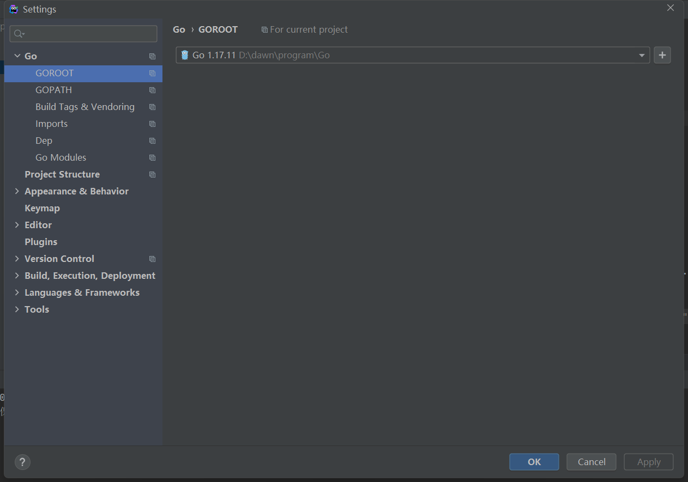
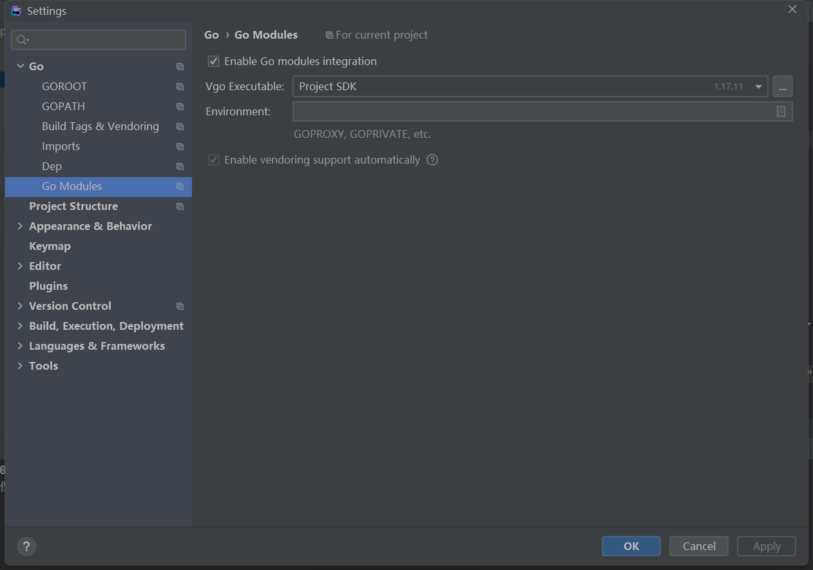

**编译**
GOOS：目标平台的操作系统（darwin、freebsd、linux、windows）
GOARCH：目标平台的体系架构（386、amd64、arm64）
```
go build -o /yourpath/hello hello.go

# 使用net包或其它c库时，关闭CGO
CGO_ENABLED=0 go build -o /yourpath/hello hello.go

#交叉编译
GOOS=linux GOARCH=amd64 go build -o /yourpath/hello hello.go
```
配置文件通过命令行参数利用flag包将配置文件路径传递进去。
**docker运行**
`docker run -v /var/data/tcp-udp/client:/client --name 1mclient_1 -d alpine /client -conn=1000 -ip=192.168.2.70`

**goland 能运行 还是红色**
`go mod tidy`
file->setting->Go设置GOROOT、GOPATH、Go Module



**分享你的代码**
使用 [go playground](https://go.dev/play) 在线分享代码，可线上运行go程序。

**trace**


```
func main() {

	//创建trace文件
	f, err := os.Create("trace.out")
	if err != nil {
		panic(err)
	}

	defer f.Close()

	//启动trace goroutine
	err = trace.Start(f)
	if err != nil {
		panic(err)
	}
	defer trace.Stop()

	//main
	fmt.Println("Hello World")
}
```

go run trace.go
go tool trace trace.out

**pprof**


go 语言提供了 runtime/pprof 和 net/http/pprof 两个库，查看cpu、内存、阻塞、互斥锁的情况
```
func main() {
	go func() {
		log.Println(http.ListenAndServe(":6060", nil))
	}()

	http.HandleFunc("/", func(w http.ResponseWriter, r *http.Request) {
		fmt.Fprintf(w, "URL.Path = %q\n", r.URL.Path)
	})
	log.Fatal(http.ListenAndServe("localhost:8000", nil))
}
```

http://127.0.0.1:6060/debug/pprof/
点击 profile，等待30s下载
go tool pprof -http=:8090 profile