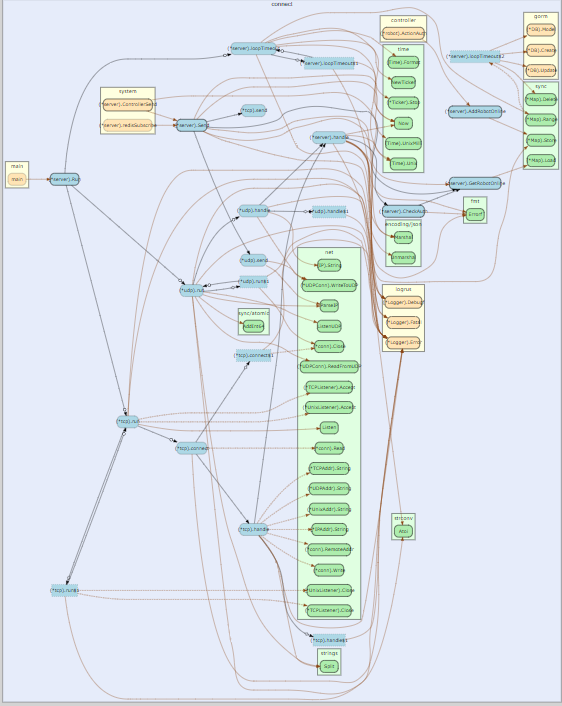

**trace**


```
func main() {

	//创建trace文件
	f, err := os.Create("trace.out")
	if err != nil {
		panic(err)
	}

	defer f.Close()

	//启动trace goroutine
	err = trace.Start(f)
	if err != nil {
		panic(err)
	}
	defer trace.Stop()

	//main
	fmt.Println("Hello World")
}
```

go run trace.go
go tool trace trace.out

**pprof**


go 语言提供了 runtime/pprof （工具型）和 net/http/pprof（服务型） 两个库，查看cpu、内存、阻塞、互斥锁的情况。
工具型：

```
func main() {
   runtime.SetMutexProfileFraction(1) // 开启对锁调用的跟踪
   runtime.SetBlockProfileRate(1)     // 开启对阻塞操作的跟踪

   fileCpu, _ := os.Create("./cpu.pprof") // 在当前路径下创建一个cpu.pprof文件
   fileMem, _ := os.Create("./mem.pprof") // 记录内存

   pprof.StartCPUProfile(fileCpu) // 往文件中记录CPU profile信息
   defer func() {
      // 退出之前 停止采集
      pprof.StopCPUProfile()
      fileCpu.Close()

      pprof.WriteHeapProfile(fileMem)
      fileMem.Close()
   }()

   for i := 0; i < 10; i++ {
      logic()
   }
}

func logic() {
   // normal logic
   fmt.Println("logic")
   // bad logic loop
   for i := 0; i < 1000000000; i++ {

   }
}
```
```
# 控制台查看
go tool pprof cpu.pprof
top
list main.logic
# web图片查看
go tool pprof -http=:8090 cpu.pprof
```
服务型：

```
import _ "net/http/pprof"

func main() {
	go func() {
		log.Println(http.ListenAndServe(":6060", nil))
	}()

	http.HandleFunc("/", func(w http.ResponseWriter, r *http.Request) {
		fmt.Fprintf(w, "URL.Path = %q\n", r.URL.Path)
	})
	log.Fatal(http.ListenAndServe("localhost:8000", nil))
}
```
如果是gin框架：
```
import github.com/gin-contrib/pprof

r := gin.New()
pprof.Register(r)
```
```
# 下载 cpu profile 默认从当前开始收集30s的cρu使用情况, 需要等待3θs
go tool pprof http://127.0.0.1:8080/debug/profile

# wait 120s
go tool pprof http://127.0.0.1:8080/debug/pprof/profile?seconds=120

# 下载 heap profile
go tool pprof http://127.0.0.1:8080/debug/pprof/heap

# 下载特定类型的heap
go tool pprof -sample_index=alloc_space http://127.0.0.1:8080/debug/pprof/heap
go tool pprof --inuse_objects http://127.0.0.1:8080/debug/pprof/heap

# 比较base
go tool pprof -base pprof.demo.alloc_objects.alloc_space.inuse_objects.inuse_space.001.pb.gz pprof.demo.alloc_objects.alloc_ space.inuse_objects.inuse_space.002.pb.gz

# 下载 goroutine profile
go tool pprof http://127.0.0.1:8080/debug/pprof/goroutine

# 下载 block profile
go tool pprof http://127.0.0.1:8080/debug/pprof/block

# 下载 mutex profile
go tool pprof http://127.0.0.1:8080/debug/pprof/mutex

# 在浏览器里交互
go tool pprof --http=:8080 ~/Downloads/LinkinStar/profile
```


`http://127.0.0.1:6060/debug/pprof/`
点击`profile`，等待30s下载
`go tool pprof -http=:8090 profile`
获取trace：`http://127.0.0.1:6060/debug/pprof/trace?seconds=20`，等待10s下载
`go tool trace trace`
**race检测**
示例程序`test.go`：
```
package main

import "fmt"

func main() {
   var a = 100
   go func() {
      a = 200
   }()
   a = 300
   fmt.Println(a)
}
```
运行`go run -race .\test.go`，会报`WARNING: DATA RACE`的告警。
**基准测试bench**
文件名称：xx_test.go
函数名称：BenchmarkXx(b *testing.B)
示例：hello_test.go
```
package test

import (
	"fmt"
	"testing"
)

func BenchmarkPrint(b *testing.B) {
	b.ResetTimer()
	for i := 0; i < 10000; i++ {
		fmt.Println("hello")
	}
}
```
```
cd test
go test -bench .

# 选择压测函数
-bench="Print$"
# 显示内存信息
go test -benchmem -bench . 
# 压测轮次
-count=5
```
**查看汇编结果**
`go tool compile -N -l -S hello.go`
**dlv在linux断点调试汇编**
```
# 执行以下命令，会在GOPATH的bin目录生成dlv
go install github.com/go-delve/delve/cmd/dlv@v1.9.0
dlv help
```
hello.go
```
package main

import "fmt"

func main() {
   fmt.Println("hello world")
}
```
```
go build hello.go
chmod +x ./hello
dlv exec ./hello

r
list
exit
```

**go-callvis**
生成调用链路图
安装：`go install github.com/ofabry/go-callvis@latest`
在包含main的目录下执行，注意该目录下只能有一个main。会自动打开浏览器（端口7878），页面是个svg，支持点击进入更深的链路：
```
go-callvis .
```

```
Usage of go-callvis:
  -debug
    	Enable verbose log.
  -file string
    	output filename - omit to use server mode
  -cacheDir string
    	Enable caching to avoid unnecessary re-rendering.
  -focus string
    	Focus specific package using name or import path. (default "main")
  -format string
    	output file format [svg | png | jpg | ...] (default "svg")
  -graphviz
    	Use Graphviz's dot program to render images.
  -group string
    	Grouping functions by packages and/or types [pkg, type] (separated by comma) (default "pkg")
  -http string
    	HTTP service address. (default ":7878")
  -ignore string
    	Ignore package paths containing given prefixes (separated by comma)
  -include string
    	Include package paths with given prefixes (separated by comma)
  -limit string
    	Limit package paths to given prefixes (separated by comma)
  -minlen uint
    	Minimum edge length (for wider output). (default 2)
  -nodesep float
    	Minimum space between two adjacent nodes in the same rank (for taller output). (default 0.35)
  -nointer
    	Omit calls to unexported functions.
  -nostd
    	Omit calls to/from packages in standard library.
  -rankdir
        Direction of graph layout [LR | RL | TB | BT] (default "LR")
  -skipbrowser
    	Skip opening browser.
  -tags build tags
    	a list of build tags to consider satisfied during the build. For more information about build tags, see the description of build constraints in the documentation for the go/build package
  -tests
    	Include test code.
  -version
    	Show version and exit.
```