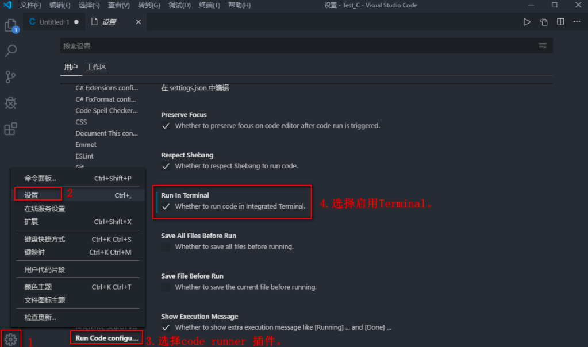
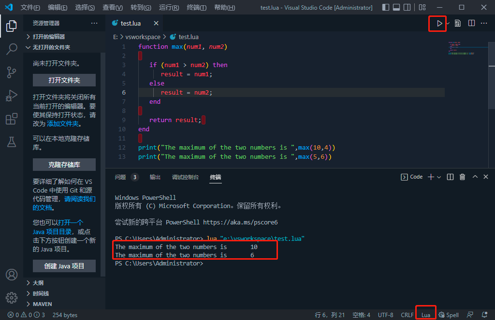

1 安装gcc，参见[windows安装gcc](https://www.kancloud.cn/book/dawnmn/blog/edit)。
2 下载Lua源码包，[官网下载](http://www.lua.org/ftp/)。
3 安装Lua，参见[官网安装lua](http://lua-users.org/wiki/BuildingLuaInWindowsForNewbies)，注意：`build.cmd`中需要修改lua版本号为你下载的。
4 将lua安装目录下的`bin`目录添加到环境变量，cmd输入lua检测。
5 配置vscode，安装插件`Lua Debug`、`Code Runner`

