**安装xdebug扩展**
[官网下载](https://xdebug.org/download#releases)，解压进入目录
```
phpize
./configure --with-php-config=/usr/local/php/bin/php-config
make && make install

vim /usr/local/php/etc/php.ini
#在末尾添加
[xdebug]
zend_extension = xdebug.so
xdebug.idekey = PHPSTOM
xdebug.remote_host = 192.168.23.1
xdebug.remote_port = 9011
xdebug.remote_handler = dbgp
xdebug.remote_autostart = 1
xdebug.remote_enable = 1
xdebug.auto_trace = 1
xdebug.remote_log = /tmp/xdebug.log

#验证
php -m |  grep xdebug
```
**phpstorm配置**
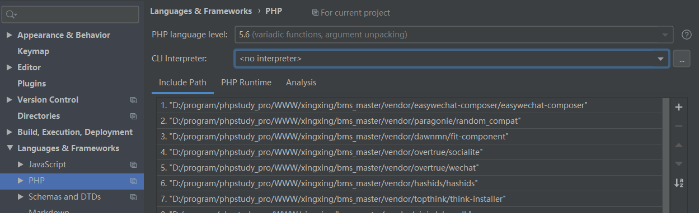
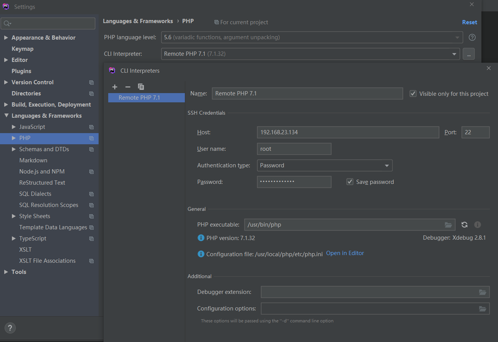
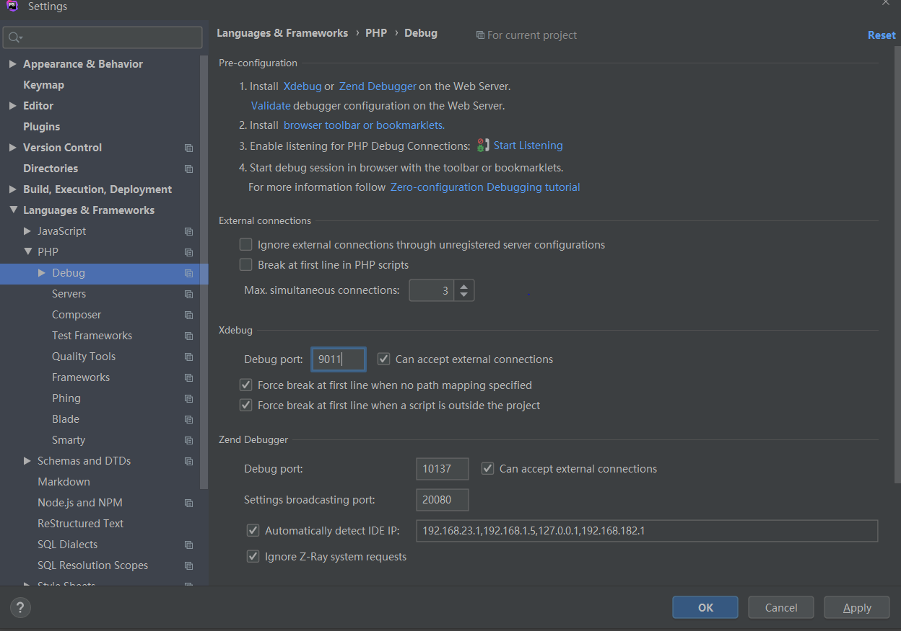
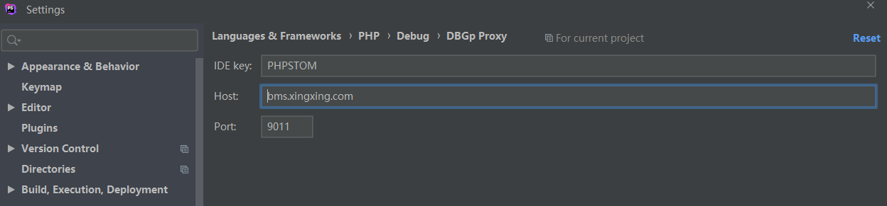
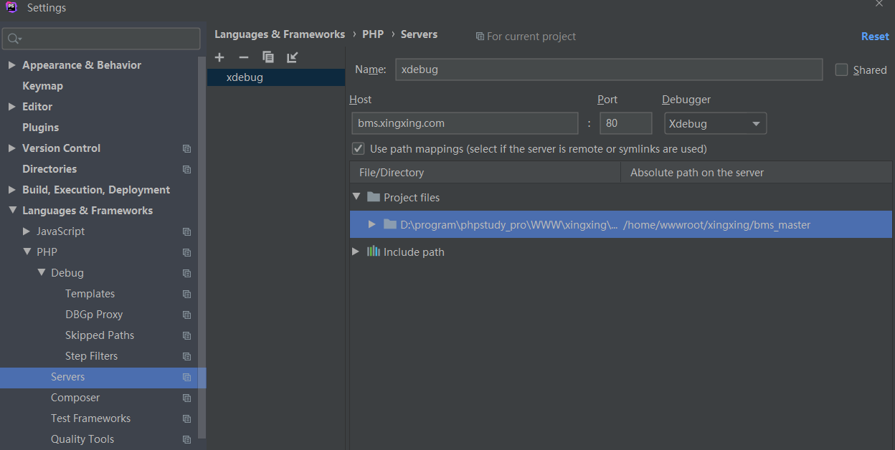
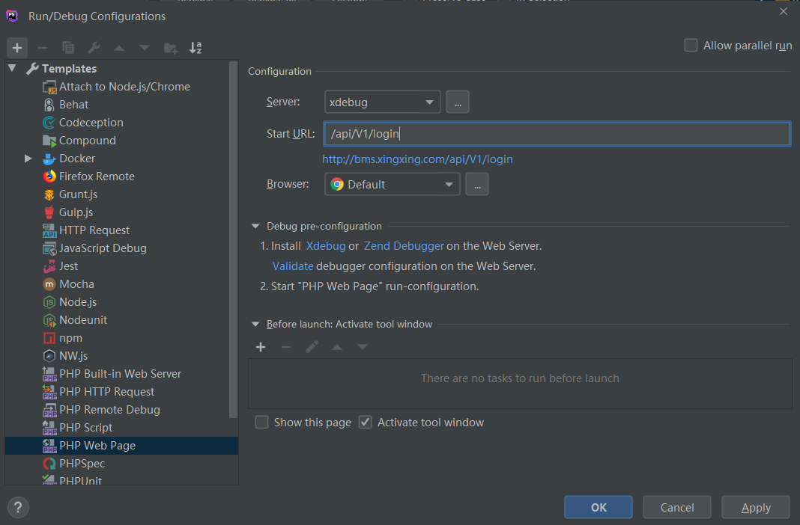
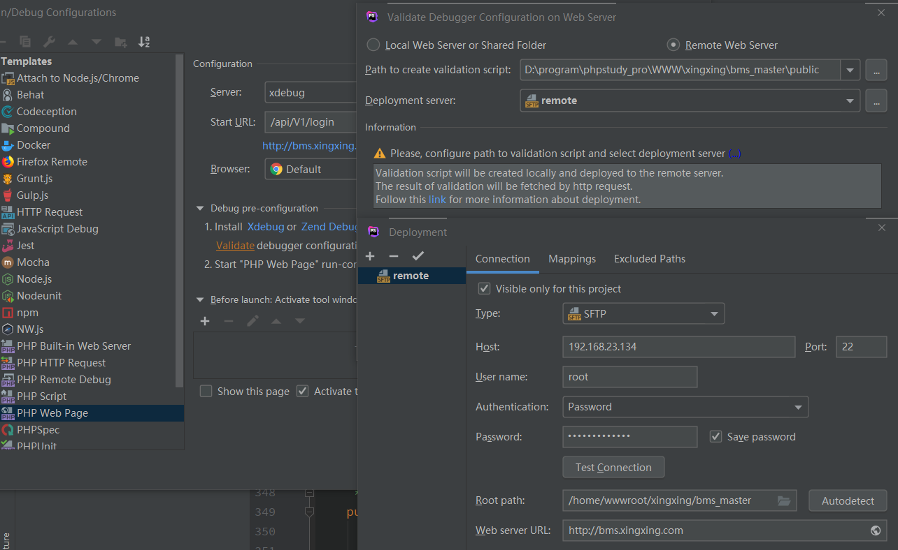
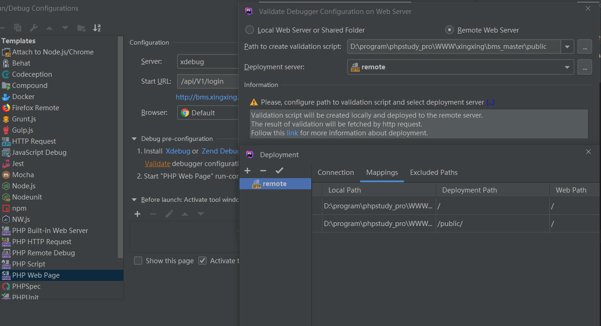
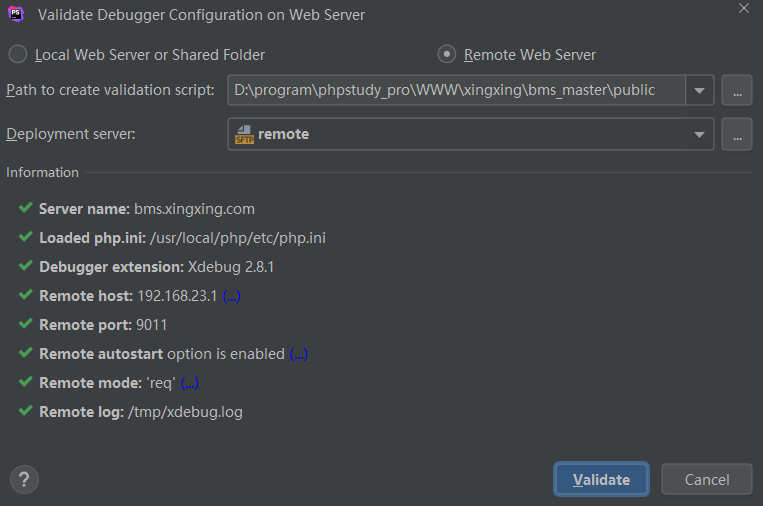
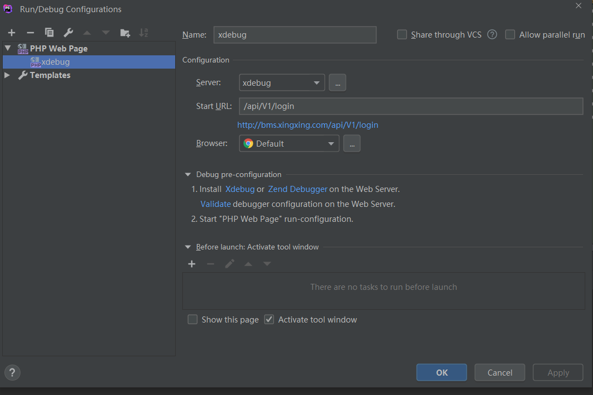

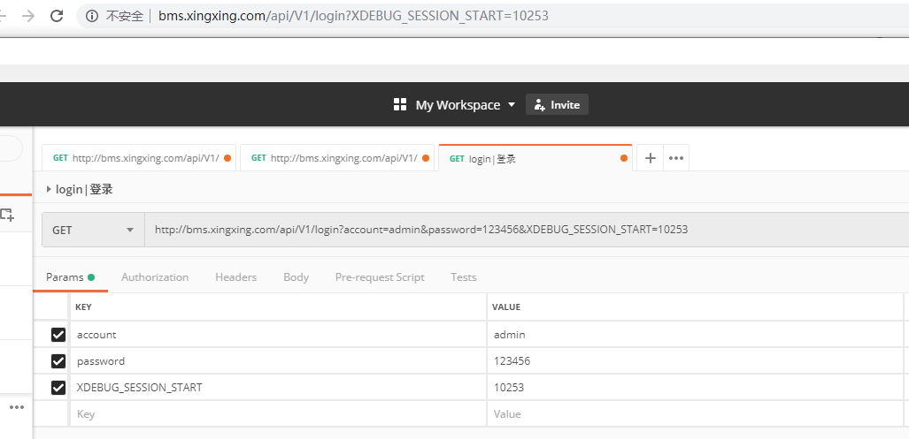

**调试配置**
代码打上断点进行调试，延长调试时间：
```
#php.ini
max_execution_time = 7200

#php-fpm.conf
request_terminate_timeout = 0

#nginx.conf
fastcgi_connect_timeout 7200;
fastcgi_send_timeout 7200;
fastcgi_read_timeout 7200;
```


