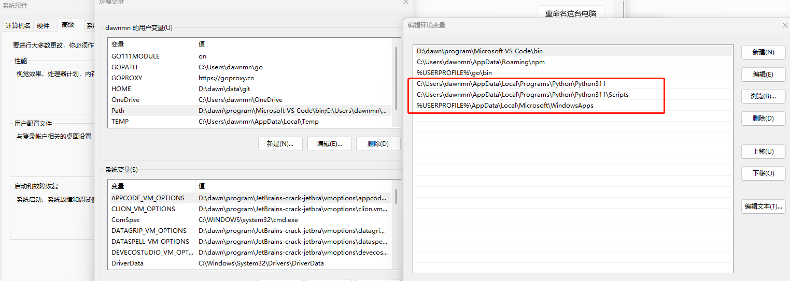

**linux安装**
[官网下载](https://www.python.org/downloads/)，解压
```
cd Python-3.6.x

mkdir /usr/local/python3
./configure -prefix=/usr/local/python3
make && make install

ln -s /usr/local/python3/bin/python3 /usr/bin/python3 
ln -s /usr/local/python3/bin/pip3 /usr/bin/pip3  
python3 
pip3 -V  
```
**windows安装**
[官网下载Windows installer (64-bit)](https://www.python.org/downloads/)
配置环境变量
