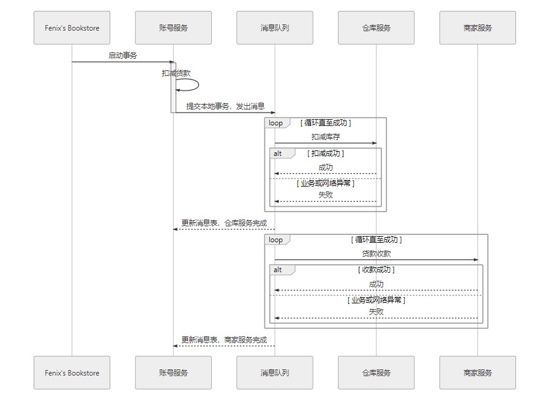
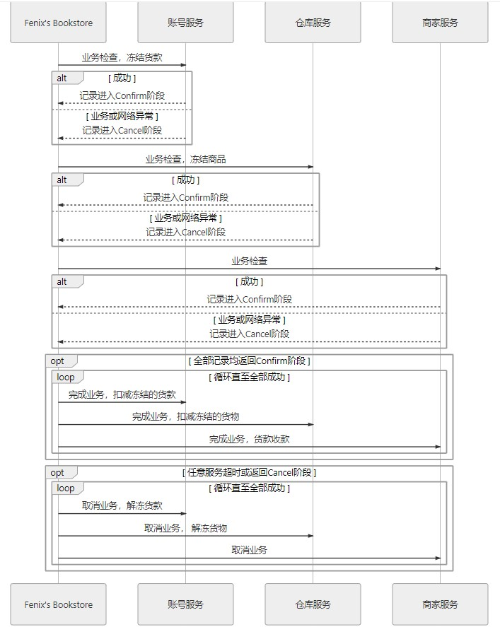

`IPC` `RPC` `SOA` `DFS`

**微服务**是一种通过多个小型服务组合来构建单个应用的架构风格，这些服务围绕业务能力而非特定的技术标准来构建。各个服务可以采用不同的编程语言，不同的数据存储技术，运行在不同的进程之中。服务采取轻量级的通信机制和自动化的部署机制实现通信与运维。

**ACID** 原子性（Atomic）一致性（Consistency）隔离性（Isolation）持久性（Durability）
**MySQL事务隔离级别**
| 级别 | symbol | 值 | 描述 |
| --- | --- | --- | --- |
| 读未提交 | READ-UNCOMMITTED | 0 | 存在脏读、不可重复读、幻读的问题 |
| 读已提交 | READ-COMMITTED | 1 | 解决脏读的问题，存在不可重复读、幻读的问题。使用 MMVC机制 |
| 可重复读 | REPEATABLE-READ | 2 | mysql 默认级别，解决脏读、不可重复读的问题，存在幻读的问题。使用 MMVC机制 |
| 序列化 | SERIALIZABLE | 3 | 解决脏读、不可重复读、幻读，可保证事务安全，但完全串行执行，性能最低 |

RR级别下防止幻读，加行锁
```
SELECT `id` FROM `users` WHERE `id` = 1 FOR UPDATE;
```

**MVCC 多版本并发控制** 可以认为 MVCC 是行级锁的一个变种，但是它在很多情况下避免了加锁操作，因此开销更低。虽然实现机制有所不同，但大都实现了非阻塞的读操作，写操作也只锁定必要的行。

在 InnoDB 中，我们可以通过行记录的`隐藏列`知道创建该行记录的事务 ID，通过 `undo log` 得到行记录的历史版本，通过` read view` 得到创建 read view 时已经提交了的事务。

在 InnoDB 中，行记录存在三个隐藏列，其中两个是`DATA_TRX_ID`、`DATA_ROLL_PTR`，另一个是`ROW_ID`，当表中没有主键或非空唯一键时存在。

DATA_TRX_ID, 表示该行记录的事务 ID，是一个全局严格递增的数值。在 InnoDB 中，修改一个行记录时，会创建一个新的记录并设置事务 ID，同时在 undo log 中保存旧的记录，这时，新纪录的 DATA_ROLL_PTR 会指向 undo log 中的记录，同时，undo log 中的记录也存在执行旧记录的 DATA_ROLL_PTR 指针。

`read view` 是在 SQL 语句执行之前创建的，在 read view 中会保存：
*   `low_limit_id`\- 创建read view时尚未提交的事务中的最大的事务 ID
*   `up_limit_id`\- 创建read view时尚未提交的事务中的最小的事务 ID
*   `trx_ids`\- 创建read view时尚未提交的事务列表

对于 RC 级别来说，我们只需要在每次只需 SELECT 语句是创建 read view 就可以知道已提交的事务列表，从而达到读 已提交 的要求。

对于 RR 级别来说，就只能在事务开始之前创建 read view，在创建事务后提交的数据对于当前事务来说都是不可见的。


**MySQL日志**是 MySQL 数据库的重要组成部分，包括错误日志、查询日志、慢查询日志，二进制日志( `binlog` )和事务日志(`redo log` 和 `undo log` )

`binlog` 逻辑日志，用于记录数据库执行的写入性操作(记录哪条数据被修改了，不包括查询)信息，以二进制的形式保存在磁盘中。使用任何存储引擎的 mysql 数据库都会记录 binlog 日志。binlog 是通过追加的方式进行写入的，可以通过max_binlog_size参数设置每个 binlog文件的大小，当文件大小达到给定值之后，会生成新的文件来保存日志。
binlog 的主要使用场景有两个，分别是 `主从复制` 和 `数据恢复 `。
`redo log` 物理日志，实现持久性，只要事务提交成功，那么对数据库做的修改就被永久保存下来了，不可能因为任何原因再回到原来的状态 。


|   |redo log | binlog |
| --- | --- |--- |
| 文件大小 | `redo log`的大小是固定的。 | `binlog`可通过配置参数`max_binlog_size`设置每个`binlog`文件的大小。 |
| 实现方式 | `redo log`是`InnoDB`引擎层实现的，并不是所有引擎都有。 | `binlog`是`Server`层实现的，所有引擎都可以使用`binlog`日志 |
| 记录方式 | redo log 采用循环写的方式记录，当写到结尾时，会回到开头循环写日志。 | binlog通过追加的方式记录，当文件大小大于给定值后，后续的日志会记录到新的文件上 |
| 适用场景 | `redo log`适用于崩溃恢复(crash-safe) | `binlog`适用于主从复制和数据恢复 |

`undo log` 实现`原子性`，同一事务中的一系列操作，要么全部成功，要么全部失败，不可能出现部分成功的情况。用于`回滚`和`MVCC`。
`隔离性`，通过加锁实现。InnoDB引擎对update,delete,insert会自动给涉及到的数据加上排他锁，select语句默认不会加任何锁类型。如果加排他锁可以使用`select ... for update` 语句，加共享锁可以使用`select ... lock in share mode`语句。
**全局事务**，XA
`两段式提交`（2 Phase Commit，2PC）协议，分为`准备阶段`，`提交阶段`

**分布式事务**
**CAP**
* 一致性（Consistency）代表数据在任何时刻、任何分布式节点中所看到的都是符合预期的。
* 可用性（Availability）代表系统不间断地提供服务的能力。
* 分区容忍性（Partition Tolerance）代表分布式环境中部分节点因网络原因而彼此失联后，即与其他节点形成“网络分区”时，系统仍能正确地提供服务的能力。

**可靠事件队列** 需要具备幂等性，可靠消息队列缺乏隔离性。


**TCC 事务** 是另一种常见的分布式事务机制，它是`Try-Confirm-Cancel`三个单词的缩写,具有较强的隔离性,避免了“超售”的问题。
* Try：尝试执行阶段，完成所有业务可执行性的检查（保障一致性），并且预留好全部需用到的业务资源（保障隔离性）(需用到的业务数据设置为“冻结”状态)。
* Confirm：确认执行阶段，不进行任何业务检查，直接使用 Try 阶段准备的资源来完成业务处理。Confirm 阶段可能会重复执行，因此本阶段所执行的操作需要具备幂等性。
* Cancel：取消执行阶段，释放 Try 阶段预留的业务资源。Cancel 阶段可能会重复执行，也需要满足幂等性。



**DNS** Domain Name System 域名系统
DNS 本身就堪称是示范性的`透明多级分流系统`，是一种递归操作
1. 客户端先检查本地的 DNS 缓存，查看是否存在并且是存活着的该域名的地址记录。DNS 是以存活时间（Time to Live，TTL）来衡量缓存的有效情况的，所以，如果某个域名改变了 IP 地址，DNS 服务器并没有任何机制去通知缓存了该地址的机器去更新或者失效掉缓存，只能依靠 TTL 超期后的重新获取来保证一致性。后续每一级 DNS 查询的过程都会有类似的缓存查询操作。
1.  客户端将地址发送给本机操作系统中配置的本地 DNS（Local DNS），这个本地 DNS 服务器可以由用户手工设置，也可以在 DHCP 分配时或者在拨号时从 PPP 服务器中自动获取到。
1. 本地 DNS 收到查询请求后，会按照“是否有www.icyfenix.com.cn的权威服务器”→“是否有icyfenix.com.cn的权威服务器”→“是否有com.cn的权威服务器”→“是否有cn的权威服务器”的顺序，依次查询自己的地址记录，如果都没有查询到，就会一直找到最后点号代表的根域名服务器为止。
1. 现在假设本地 DNS 是全新的，上面不存在任何域名的权威服务器记录，所以当 DNS 查询请求按步骤 3 的顺序一直查到根域名服务器之后，它将会得到“cn的权威服务器”的地址记录，然后通过“cn的权威服务器”，得到“com.cn的权威服务器”的地址记录，以此类推，最后找到能够解释www.icyfenix.com.cn的权威服务器地址。
1. 通过“www.icyfenix.com.cn的权威服务器”，查询www.icyfenix.com.cn的地址记录，地址记录并不一定就是指 IP 地址，在 RFC 规范中有定义的地址记录类型已经多达数十种，譬如 IPv4 下的 IP 地址为 A 记录，IPv6 下的 AAAA 记录、主机别名 CNAME 记录，等等。

每种记录类型中还可以包括多条记录，以一个域名下配置多条不同的 A 记录为例，此时权威服务器可以根据自己的策略来进行选择，典型的应用是智能线路：根据访问者所处的不同地区（譬如华北、华南、东北）、不同服务商（譬如电信、联通、移动）等因素来确定返回最合适的 A 记录，将访问者路由到最合适的数据中心，达到智能加速的目的。

**CDN** 内容分发网络（Content Distribution Network）
1. 架设好“icyfenix.cn”的服务器后，将服务器的 IP 地址在你的 CDN 服务商上注册为“源站”，注册后你会得到一个 CNAME，即本例中的“icyfenix.cn.cdn.dnsv1.com.”。

1. 将得到的 CNAME 在你购买域名的 DNS 服务商上注册为一条 CNAME 记录。

1. 当第一位用户来访你的站点时，将首先发生一次未命中缓存的 DNS 查询，域名服务商解析出 CNAME 后，返回给本地 DNS，至此之后链路解析的主导权就开始由内容分发网络的调度服务接管了。

1. 本地 DNS 查询 CNAME 时，由于能解析该 CNAME 的权威服务器只有 CDN 服务商所架设的权威 DNS，这个 DNS 服务将根据一定的均衡策略和参数，如拓扑结构、容量、时延等，在全国各地能提供服务的 CDN 缓存节点中挑选一个最适合的，将它的 IP 代替源站的 IP 地址，返回给本地 DNS。

1. 浏览器从本地 DNS 拿到 IP 地址，将该 IP 当作源站服务器来进行访问，此时该 IP 的 CDN 节点上可能有，也可能没有缓存过源站的资源。

内容分发方式：主动分发（Push）、被动回源（Pull）。

**堡垒机**，也叫做运维安全审计系统，它的核心功能是 4A：
* Authentication 身份验证 
* Account 账号管理 
* Authorization 授权控制 
* Audit 安全审计 
`Jumpserver` 是全球首款完全开源的堡垒机。
堡垒机是用来控制哪些人可以登录哪些资产（事先防范和事中控制），以及录像记录登录资产后做了什么事情（事后溯源）以及抵御外部攻击。

**DDoS** 分布式拒绝服务 

**负载均衡**（Load Balancing）
四层负载均衡的优势是性能高，七层负载均衡的优势是功能强。
负载均衡策略：
* 轮循均衡（Round Robin）
* 权重轮循均衡（Weighted Round Robin）
* 随机均衡（Random）
* 一致性哈希均衡（Consistency Hash）

**服务器缓存**
缓存淘汰策略
* FIFO（First In First Out）：优先淘汰最早进入被缓存的数据。
* LRU（Least Recent Used）：优先淘汰最久未被使用访问过的数据。
* LFU（Least Frequently Used）：优先淘汰最不经常使用的数据。
* TinyLFU（Tiny Least Frequently Used）：TinyLFU 是 LFU 的改进版本。TinyLFU 会首先采用 Sketch 对访问数据进行分析，所谓 Sketch 是统计学上的概念，指用少量的样本数据来估计全体数据的特征。
* W-TinyLFU（Windows-TinyLFU）：W-TinyLFU 又是 TinyLFU 的改进版本。W-TinyLFU 就结合了 LRU 和 LFU 两者的优点，从整体上看是它是 LFU 策略，从局部实现上看又是 LRU 策略。将新记录暂时放入一个名为 Window Cache 的前端 LRU 缓存里面，如果能通过 TinyLFU 的过滤器，再进入名为 Main Cache 的主缓存中存储。

缓存风险：
* `缓存穿透`，数据库没有的数据，缓存里自然没有。可以约定在一定时间内对返回为空的 Key 值依然进行缓存
* ` 缓存击穿`，有多个针对数据库存在但不在缓存中的数据的请求同时发送过来。加锁
* `缓存雪崩`，大批不同的数据在短时间内一起失效，导致了这些数据的请求都击穿了缓存到达数据源。分散过期时间
* `缓存污染`，指缓存中的数据与真实数据源中的数据不一致的现象。读数据时，先读缓存，缓存没有的话，再读数据源，然后将数据放入缓存，再响应请求。写数据时，先写数据源，然后失效（而不是更新）掉缓存。

**RBAC** 基于角色的访问控制 Role-Based Access Control

**OAuth2** 是面向于解决第三方应用（Third-Party Application）的认证授权协议。


