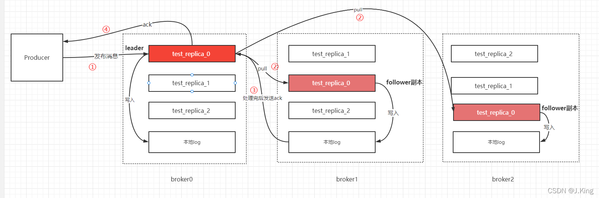

Kafka 是一个Scala语言开发的分布式消息队列，具有高性能、持久化、多副本备份、横向扩展能力，一般在架构设计中起到解耦、削峰填谷、异步处理的作用。Kafka构建在ZooKeeper（分布式协调系统，Zab协议，java开发）同步服务之上。Kafka通过 ZooKeeper 管理集群配置、选举 Leader 以及在 consumer group 发生变化时进行 Rebalance。
**点对点的消息系统**：消息保留在队列中，一个或者多个消费者可以消耗队列中的消息，但是消息最多只能被一个消费者消费，最典型的例子就是订单处理系统。
**发布-订阅消息系统**：消费者可以订阅一个或多个主题并使用该主题中的所有消息。

基本原理图：

**消息：Record**，kafak是日志文件追加的方式保存数据。
Kafka 的消息组织方式实际上是三级结构：主题 - 分区 - 消息。

一条消息从生产到消费一共要经过以下3个流程：
Producer 发送到 Broker
Broker 保存消息(持久化)，根据字节⼤⼩和时间（默认一周）保留数据。
Consumer 消费消息

Consumer 端丢失数据主要体现在 Consumer 端要消费的消息不见了。出现该情况的唯一原因就是：Consumer 没有正确消费消息，就把位移提交了，导致 Kafka 认为该消息已经被消费了，从而导致消息丢失。

常见的承诺有以下三种：

最多一次（at most once）：消息可能会丢失，但绝不会被重复发送。
至少一次（at least once）：消息不会丢失，但有可能被重复发送。
精确一次（exactly once）：消息不会丢失，也不会被重复发送。
目前，Kafka 默认提供的交付可靠性保障是第二种，即至少一次。
只能保证单分区、单会话上的幂等性。最好是在Consumer端实现幂等。

**主题：Topic**，在实际使用中多用来区分具体的业务。

**分区：Partition**，每个主题下可以有多个分区，用来实现负载均衡。一个分区对应一个append log文件。
比较常见的分区策略包括轮询（Round-robin）策略、随机策略（从实际表现来看，它要逊于轮询策略）和按消息键保序策略。
Kafka 允许为每条消息定义消息键，简称为 Key。相同Key的消息会被存储到同一个分区。
Kafka 是不能保证全局消息顺序的，只能保证单个 Partition 下的顺序。
主题分区数应当是消费者数的倍数。
**服务器：broker** 一个broker可以包含多个partition，同时一个partition可存在于多个broker（作为副本）。

**消息位移：Offset**。表示分区中每条消息的位置信息，是一个单调递增且不变的值。

**副本：Replica**。每个分区可配置多个副本实现高可用。

**生产者：Producer**。生产者把消息推送到主题下的一个分区。一个生产者持有broker列表（servers）。
消息写入过程：


producer 的 ack配置：
0：表示 producer 不需要等待 broker的消息确认。这个选项时延最小但同时风险最大。
1：默认值，表示 producer 只需要获得 kafka 集群中的 leader 节点确认即可。
-1(all)：需要 ISR 中所有的 Replica 给予接收确认，速度最慢，安全性最高，但是由于 ISR（副本同步队列） 可能会缩小到仅包含一个 Replica，所以设置参数为 all 并不能一定避免数据丢失。因此同时需要设置min.insync.replicas（ISR 中的最小副本数）值大于1。

High Watermark（HW）高水位，标识Partition中的哪些消息是可以被Consumer消费的。已commited（Leader 收到了 ISR 中的所有 Replica 的 ACK）的消息。
LEO（Log End Offset）则表示副本写入下一条消息的Offset。
**消费者组：Consumer Group**。
多个消费者实例共同组成的一个组，同时消费多个分区以实现高吞吐。

Kafka 仅仅使用 Consumer Group 这一种机制，却同时实现了传统消息引擎系统的两大模型：
如果所有实例都属于同一个 Group，那么它实现的就是消息队列模型；
如果所有实例分别属于不同的 Group，那么它实现的就是发布 / 订阅模型。

**消费者：Consumer**。消费者拉取主题下的消息，一个消费者持有broker列表（servers）。每一个消费者属于一个 consumer group，一个 group 包含多个 consumer，这些消费者分别消费不同的分区（由zookeeper再平衡确定），即一个分区只有一个消费者，因此不会出现消费者位移冲突。消费者pull主题的某一个分区里面的消息。

**消费者位移：Consumer Offset**。下一条消息的位移，表征消费者消费进度，每个消费者组都有自己的消费者位移。消费者位移用于消费者端的崩溃恢复。消费者位移也是一个普通的主题，第一个消费者程序启动的时候，Kafka 会自动创建这个主题。这位移主题中的消息，可以简单地理解为「某个消费者组在某个主题的某个分区的消费位移是多少」，也可以理解为一个键值对，其中的 Key 是 Group ID + Topic + Partition，Value 就是位移。它通过 Compact 策略，对于同一个 Key 的消息，只保留最新的一条。（与 Redis的AOF重写机制很相似）。
消费者位移用于消费者端的崩溃恢复、重平衡。当 Consumer发生故障重启之后，就能够从 Kafka 中读取之前提交的位移值，然后从相应的位移处继续消费，从而避免整个消费过程重来一遍。

Kafka 的位移数据是消费者控制的，消费者可以提交并非当前位置的位移，这样可以实现跳过或者重新消费消息。这主要是因为 Kafka 是一个基于日志结构的消息系统，而并非「队列」结构。消息对于消费者来说，永远都是只读的。

earliest
把位移重设到当前最早位移处。这里要注意，因为 Kafka 会删除较早的日志，因此，最早的位置不一定是 0。如果你想重新消费主题中现有的所有消息，可以使用这个策略。
latest
把位移重设到当前最新位移(HW)处。如果你想跳过所有的历史消息，从最新被投递的消息开始消费，那么就是用这个策略。
specified-offset
把位移重设到一个指定的位移处。

因为 Consumer 能够同时消费多个分区的数据，所以位移的提交实际上是在分区粒度上进行的，即Consumer 需要为分配给它的每个分区提交各自的位移数据。
当消费配置enable.auto.commit=true的时候代表自动提交位移。
auto.commit.interval.ms默认值5秒，自动位移提交的动作是在 poll（）方法的逻辑里完成的。自动提交会带来重复消费和消息丢失的问题。

**重平衡：Rebalance**。消费者组内某个消费者实例挂掉后，其他消费者实例自动重新分配订阅主题分区的过程。Rebalance 是 Kafka 消费者端实现高可用的重要手段。
重平衡的触发条件主要有三个：
消费者组内成员发生变更，这个变更包括了增加和减少消费者。注意这里的减少有很大的可能是被动的，就是某个消费者崩溃退出了
主题的分区数发生变更，kafka目前只支持增加分区，当增加的时候就会触发重平衡
订阅的主题发生变化，当消费者组使用正则表达式订阅主题，而恰好又新建了对应的主题，就会触发重平衡
重平衡过程中，消费者无法从kafka消费消息，应当避免触发重平衡。

Consumer 实例可能会被 Coordinator 错误地认为“已停止”从而被“踢出”Group，当 Consumer Group 完成 Rebalance 之后，每个 Consumer 实例都会定期地向 Coordinator 发送心跳请求，表明它还存活着。
Consumer 端有个参数，叫 session.timeout.ms，就是被用来表征此事的。该参数的默认值是 10 秒，即如果 Coordinator 在 10 秒之内没有收到 Group 下某 Consumer 实例的心跳。
heartbeat.interval.ms。这个值设置得越小，Consumer 实例发送心跳请求的频率就越高。
max.poll.interval.ms：它的默认值是 5 分钟，表示你的 Consumer 程序如果在 5 分钟之内无法消费完 poll 方法返回的消息，那么 Consumer 会主动发起“离开组”的请求。最好将该参数值设置得大一点，比你的下游最大处理时间稍长一点。
设置 session.timeout.ms = 6s。
设置 heartbeat.interval.ms = 2s。
要保证 Consumer 实例在被判定为“dead”之前，能够发送至少 3 轮的心跳请求，即 session.timeout.ms >= 3 * heartbeat.interval.ms。
**时间轮**
三层时间轮用60个数组元素，就可以承载[0-7999s]的定时任务。

**高吞吐和低延迟**

Kafak的高吞吐和低延迟是怎么实现的：页缓存+磁盘顺序写+零拷贝
Kafka在写入消息时是直接写入页缓存，然后由操作系统决定什么时候把页缓存里的数据刷入磁盘文件中。这样一来，消息写入性能就变成了写内存，不是在写磁盘。
通过追加文件末尾按照顺序的方式来写数据的话，其写入性能跟写内存的性能都相差无几的，Kafak就是采用顺序写的方案。
读取：零拷贝（Zero-Copy）技术，通过调用sendfile()函数，将数据直接从磁盘文件复制到网卡设备中，减少了内核和用户模式之间的上下文切换，以及数据的拷贝次数。
普通模式文件读取：上下文切换4次，CPU拷贝2次，DMA拷贝2次。

零拷贝模式文件读取：上下文切换2次，CPU拷贝0次，DMA拷贝2次。

**生产者幂等性**
Idempotent
通过生产者编号（PID）和序列号实现。
对于每个 PID，消息发送到的每一个分区都有对应的从0开始单调递增的序列号，对于收到的每一条消息，只有当它的序列号的值比broker端中对应的序列号的值大1时才会接收。

Kafka如果开启幂等、事务等功能，性能也会有所降低。

kafka和rabbitmq都支持事务。
kafka消息堆积：增加分区同时增加消费实例

对于集群中的每一个broker都保存着相同的完整的整个集群的metadata信息;
metadata信息里包括了每个topic的所有partition的信息: leader, leader_epoch, controller_epoch, isr, replicas等;

压缩：用时间换空间
缓存：用空间换时间

	功能项				Kafka	RabbitMQ

	吞吐量				每秒几十万条		每秒几万条

	优先级队列			不支持		支持。建议优先级大小设置在0-10之间。

	延迟队列			不支持		支持

	死信队列			不支持		支持

	重试队列			不支持		不支持

	消费模式			客户端主动拉取		支持客户端主动拉取以及服务端推送两种模式。

	广播消费			支持		支持

	消息回溯			支持。Kafka支持按照offset和timestamp两种维度进行消息回溯。		不支持。RabbitMQ中消息一旦被确认消费就会被标记删除。

	消息堆积			支持。考虑吞吐因素，Kafka的堆积效率比RabbitMQ总体上要高。		支持

	持久化				支持		支持

	消息追踪			不支持		支持。RabbitMQ中可以采用Firehose或者rabbitmq_tracing插件实现，但开启rabbitmq_tracing插件会影响性能，建议只在定位问题过程中开启。

	消息过滤			支持		不支持，但可以自行封装。

	多租户				不支持		支持

	多协议支持			只支持Kafka自定义协议。		RabbitMQ基于AMQP协议实现，同时支持MQTT、STOMP等协议。

	跨语言支持			采用Scala和Java编写，支持多种语言的客户端。		采用Erlang编写，支持多种语言的客户端。

	流量控制			支持client和user级别，通过主动设置可将流控作用于生产者或消费者。		RabbitMQ的流控基于Credit-Based算法，是内部被动触发的保护机制，作用于生产者层面。

	消息顺序性			支持单分区（partition）级别的顺序性。		不支持。需要单线程发送、单线程消费并且不采用延迟队列、优先级队列等一些高级功能整体配合，才能实现消息有序。

	安全机制			支持SSL、SASL身份认证和读写权限控制。		与Kafka相似

	幂等性				支持单个生产者单分区单会话的幂等性。		不支持

	事务性消息			支持		支持