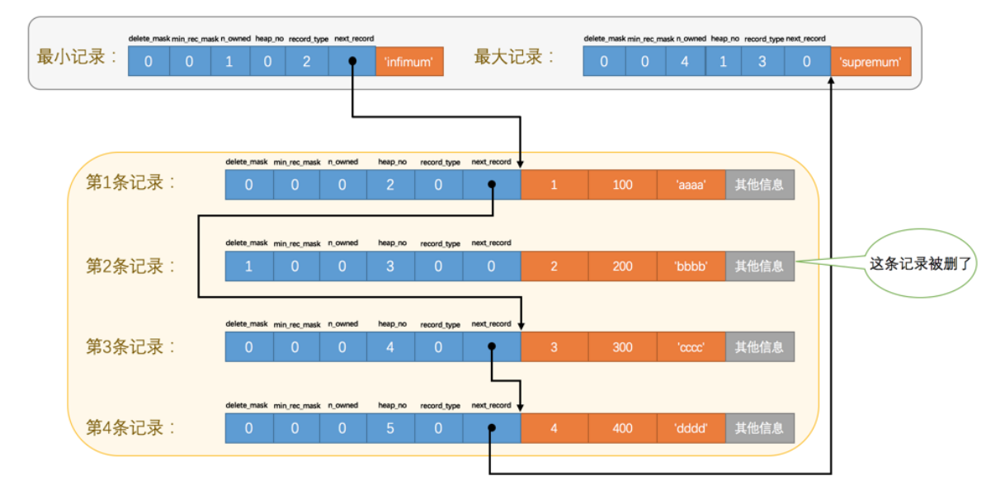

mysql由c和c++编写，服务器逻辑架构为：
* 服务层。客户端通信（消息体为字符串文本）、sql解析、查询优化等。
* 存储引擎层。innodb的索引、mvcc、锁、事务等。

**mysql.sock** 在UNIX系统下本地客户端连接MySQL服务器可以采用UNIX域套接字方式，这种方式需要一个套接字文件mysql.sock。这是因为UNIX域套接字速度比TCP/IP快。php-cgi.sock也是同理。
MySQL服务器会维持一个线程池，为每一个连接进来的客户端分配一个线程。

**my.cnf**
|   命令  |  类别   | my.cnf中能读取的组|
| --- | --- | --- |
| mysqld    |  启动服务器   |[mysqld] 、 [server] |
|  mysqld_safe   |   启动服务器  |[mysqld] 、 [server] 、 [mysqld_safe] |
|   mysql.server  |   启动服务器  | [mysqld] 、 [server] 、 [mysql.server]|
|  mysql   | 启动客户端    |[mysql] 、 [client] |
|  mysqladmin   |   启动客户端  | [mysqladmin] 、 [client]|
|   mysqldump  |   启动客户端  | [mysqldump] 、 [client]|

系统变量的设置和查看，默认是SESSION。并不是所有系统变量都具有 GLOBAL 和 SESSION 的作用范围。启动选项和系统变量是互不包含的关系。
```
SET [GLOBAL|SESSION] 系统变量名=值;

SHOW [GLOBAL|SESSION] VARIABLES [LIKE 匹配的模式];
```
状态变量的查看，默认是SESSION：
```
SHOW [GLOBAL|SESSION] STATUS [LIKE 匹配的模式];
```
**utf8字符编码** utf8只是Unicode字符集的一种编码方案，Unicode字符集可以采用utf8、utf16、utf32这几种编码方案，utf8使用1~4个字节编码一个字符，utf16使用2个或4个字节编码一个字符，utf32使用4个字节编码一个字符。在MySQL中utf8是utf8mb3的别名，只使用1~3个字节表示字符。utf8mb4则是正宗的utf8字符集，使用1~4个字节表示字符。

**InnoDB 表对主键的生成策略** 优先使用用户自定义主键作为主键，如果用户没有定义主键，则选取一个 非空Unique 键作为主键，如果表中连 Unique 键都没有定义的话，则 InnoDB 会为表默认添加一个名为row_id 的隐藏列作为主键。InnoDB存储引擎会为每条记录都添加 transaction_id和 roll_pointer 这两个列，但是 row_id 是可选的（在没有自定义主键以及Unique键的情况下才会添加该列）。
**InnoDB 页 与 行**


InnoDB中一个页一般是 16KB ，当记录中的数据太多，当前页放不下的时候，会把多余的数据存储到其他页中，这种现象称为行溢出 。
页结构：

|   名称  | 中文名    |    占用空间大小 |  简单描述   |
|-----|-----|-----|-----|
|  File Header   | 文件头部   |  38 字节   |  页的一些通用信息   |
|   Page Header  |   页面头部  |  56 字节   |   数据页专有的一些信息  |
|   Infimum + Supremum  |  最小记录和最大记录   |  26 字节   | 两个虚拟的行记录    |
|   User Records  |  用户记录   |  不确定   |  实际存储的行记录内容   |
|   Free Space  |   空闲空间  |   不确定  |  页中尚未使用的空间   |
|  Page Directory   |  页面目录   | 不确定    |   页中的某些记录的相对位置  |
|   File Trailer  |  文件尾部   |  8 字节   |  校验页是否完整   |

页头结构 Page Header：
|   名称  | 占用空间大小 |   描述  |
|-----|--------|-----|
|  PAGE_N_DIR_SLOTS   | 2字节    | 在页目录中的槽数量    |
|  PAGE_HEAP_TOP   | 2字节    |  还未使用的空间最小地址，也就是说从该地址之后就是Free Space   |
|   PAGE_N_HEAP  | 2字节    |  本页中的记录的数量（包括最小和最大记录以及标记为删除的记录）   |
| PAGE_FREE    | 2字节    |  第一个已经标记为删除的记录地址（各个已删除的记录通过next_record也会组成一个单链表，这个单链表中的记录可以被重新利用）   |
|  PAGE_GARBAGE   | 2字节    |   已删除记录占用的字节数  |
|  PAGE_LAST_INSERT   | 2字节    |   最后插入记录的位置  |
|   PAGE_DIRECTION  | 2字节    |   记录插入的方向  |
|   PAGE_N_DIRECTION  | 2字节    |   一个方向连续插入的记录数量  |
|  PAGE_N_RECS   | 2字节    |   该页中记录的数量（不包括最小和最大记录以及被标记为删除的记录）  |
| PAGE_MAX_TRX_ID    | 8字节    |  修改当前页的最大事务ID，该值仅在二级索引中定义   |
|  PAGE_LEVEL   | 2字节    |  当前页在B+树中所处的层级   |
|   PAGE_INDEX_ID  | 8字节    |  索引ID，表示当前页属于哪个索引   |
|  PAGE_BTR_SEG_LEAF   | 10字节   | B+树叶子段的头部信息，仅在B+树的Root页定义    |
|  PAGE_BTR_SEG_TOP   | 10字节   |  B+树非叶子段的头部信息，仅在B+树的Root页定义   |

文件头结构 File Header：
|名称     |  占用空间大小   |  描述   |
|-----|-----|-----|
|   FIL_PAGE_SPACE_OR_CHKSUM  | 4字节    |  页的校验和（checksum值），检测内存中同步到磁盘的页的完整性。  |
|  FIL_PAGE_OFFSET   |  4字节   |  页号，0开始   |
|  FIL_PAGE_PREV   |  4字节   |  上一个页的页号   |
|  FIL_PAGE_NEXT   |  4字节   |   下一个页的页号  |
|   FIL_PAGE_LSN  |   8字节  |   页面被最后修改时对应的日志序列位置（英文名是：Log Sequence Number）  |
|  FIL_PAGE_TYPE   |   2字节  |  该页的类型   |
|  FIL_PAGE_FILE_FLUSH_LSN   |  8字节   |   仅在系统表空间的一个页中定义，代表文件至少被刷新到了对应的LSN值  |
|   FIL_PAGE_ARCH_LOG_NO_OR_SPACE_ID  |  4字节   |  页属于哪个表空间   |

FIL_PAGE_PREV和FIL_PAGE_NEXT代表上一页、下一页的页号，通过这个双向链表把磁盘上并不相邻的页串联起来。

innodb中，下一个数据页中用户记录的主键值必须大于上一个页中用户记录的主键值。

页分裂是磁盘的概念，当记录在一页中装不下时，就会页分裂。不同槽、页的记录再分配的时候会根据主键大小排序。


Compressed 行格式：

*****

*****

*****

记录头结构：
|名称     | 大小(bit) | 描述                                         |
|-----|---------|--------------------------------------------|
|  预留位1   | 1       | 没有使用                                       |
|   预留位2  | 1       | 没有使用                                       |
|   delete_mask  | 1       | 标记该记录是否被删除                                 |
|  min_rec_mask   | 1       | B+树的每层非叶子节点中的最小记录都会添加该标记                   |
| n_owned    | 4       | 表示当前记录拥有的记录数                               |
|  heap_no   | 13      | 表示当前记录在记录堆的位置信息，从2开始自增（自动生成的0是最小记录、1是最大记录） |
|   record_type  | 3       | 表示当前记录的类型:0 普通记录；1 B+树非叶节点记录；2 最小记录；3 最大记录 |
|   next_record  | 16      |              从当前记录的真实数据到按照主键从小到大下一条记录的真实数据的地址偏移量                              |

Dynamic 和 Compressed 行格式与Compact 行格式很相似，只是在处理 行溢出 数据时不同。Compressed 行格式会采用压缩算法对页面进行压缩。

被删除的记录会在delete_mask标记1，并加入垃圾链表，作为可重用空间等待被覆盖。

主键查询：innodb会对记录分组，称为slot（槽），二分查找确定槽，在槽中遍历查找记录。
Page Directory（页目录）：由槽组成，槽值为最小主键值地址偏移量。

**innodb的目录项**

`key`：最小主键值
`page_no`：页号
`聚簇索引` 目录项与用户数据使用相同的页结构，只是字段为key、page_no。这种结构称为聚簇索引。

二级索引：

二级索引：实际上还有主键字段，图中没画

**Buffer Pool**
Buffer Pool是一片连续的内存。

表空间号+页号作为key ，缓存页作为value创建一个哈希表，通过这个哈希表定位一个页。
每个控制块大约占用缓存页大小的5%。

`free链表`：将空闲的缓存页对应的控制块作为一个节点放到一个链表中。

`flush链表`：将脏页对应的控制块作为一个节点放到一个链表中。

`简单的LRU（Least Recently Used）链表`：将当前访问的页的 控制块 移动到 LRU链表 的头部。用于Buffer Pool不够时删除页的判定。
`预读`：如果顺序访问了某个区（ extent ）的页面超过系统变量的值，就会触发一次 异步 读取下一个区中全部的页面到 Buffer Pool 的请求。
`mysql的LRU链表`：young区域+old区域，先进入old区域，再进入young区域。尽量高效的提高 Buffer Pool 的缓存命中率。

`刷新脏页到磁盘`：
* 异步的定时从 flush链表 中刷新一部分页面到磁盘。
* 异步的定时从 LRU链表 尾部开始扫描出脏页到磁盘。

`SHOW ENGINE INNODB STATUS\G;` 查看 BUFFER POOL AND MEMORY 项，Total large memory allocated：Buffer Pool大小（字节）；Buffer pool size：页数目。
**索引**

`多列索引`：将这些列和主键作为数据字段，生成一个b+树。要使用联合索引，搜索条件中的各个列必须是联合索引中从最左边连续的列。


`索引的代价`：
* 空间：存储索引b+树。
* 时间：增删改时修改索引b+树。

`like '%xx' `可以使用索引；like 'xx%' 可以将字段字符串翻转存储，用like '%xx'曲线救国。
如果对多个列同时进行范围查找的话，只有对索引最左边的那个列进行范围查找的时候才能用到 B+ 树索引，因为通过索引a进行范围查找的记录中可能并不是按照索引b进行排序的。

`ORDER BY`：在内存或磁盘中进行的排序叫文件排序（filesort）。对于联合索引，ORDER BY的子句后边的列的顺序也必须按照索引列的顺序给出，ASC、DESC混用将不能使用索引。

`GROUP BY`：分组列的顺序也需要和索引列的顺序一致。

如何选择索引：
1 列的基数越大，索引越有效。列的基数：某一列中不重复数据的个数。
2 索引列的类型尽量小。
3 索引字符串值的前缀。
最好让索引列以单独的形式出现在表达式中。
`SELECT * FROM single_table WHERE key1='abc' AND key2>1000;` 查询过程：先通过索引key1查找对应的主键，再用主键回表查询数据，在数据中用key2>1000条件筛选。

一个使用到索引的搜索条件和没有使用该索引的搜索条件使用OR连接起来后是无法使用该索引的。
`索引实现方式`：
* `B-Tree索引`（层级更少，所有数据保存在叶子节点，顺序存储，有序链表，天然支持排序和范围查找，索引列的顺序非常重要：最左法则）innodb使用b+树。
* `哈希索引`：只有精确匹配索引所有列的查询才有效，innodb有一个自适应哈希索引的功能，当某些索引使用非常频繁，会基于B-tree索引之上再创建一个哈希索引。
* `全文索引`：针对单词，不能匹配单词中的字母。mysql5.7后支持innodb的中文全文索引，只有字段的数据类型为 char、varchar、text 及其系列才可以建全文索引，fulltext key  使用 match 和 against（IN BOOLEAN MODE） 关键字，将ft_min_word_len 改为1，like + %在文本比较少时是合适的。

索引创建类型：INDEX、UNIQUE INDEX、FULLTEXT INDEX、INDEX(email(6))、PRIMARY KEY。mysql表结构的sql语法中，KEY和INDEX是同义词。
`索引三大优点`：
* 大大减少服务器查询时扫描的数据量。
* 避免排序和临时表。
* 将随机I/O变为顺序I/O。

`三星索引`：索引包含需要查找的全部记录、索引中的数据顺序和查找的排序顺序一致、索引的列包含查询的全部列

`覆盖索引`：一个索引包含所有需要查询的字段的值，只需要扫描索引而无需回表。mysql只能使用b-tree索引做覆盖索引。explain:Extra:Using index
`二级索引`：叶子节点内容是主键的值。非主键索引也被称为二级索引（secondary index）。
`二次索引`：索引和数据分开。
`最左前缀`：不只是索引的全部定义，只要满足最左前缀，就可以利用索引来加速检索。
`前缀索引`：创建前缀索引节省空间，但是会增加查询的扫描行数（回表精确查询），并且加了之后不能使用覆盖索引。key (name(6))   distinct/all 接近 distinct left(email,7)/all 对应：将整个字符串作为索引结构。如果前缀相近，可以使用倒序存储reverse(field_name)、增加hash字段
`多列索引、单列索引`，(a,b)这个联合索引，单独查询a可以利用，b不行。
选择合适的索引列顺序，上小下大的树形结构是最合理的。

`延迟关联`：将连表查询改为子查询，充分使用索引。


**join 连表**
`join原理`：MySQL内部采用了一种叫做 nested loop join（嵌套循环连接）的算法。通过驱动表的结果集作为循环基础数据，然后将该结果集的数据一条的作为过滤条件到下一个表中查询数据，然后合并结果集。如果还有第三个参与 Join，如此往复。
内连接中的WHERE子句和ON子句是等价的。

`扇出`：对驱动表进行查询后得到的记录条数称之为驱动表的扇出。

连表查询成本公式：
`连接查询总成本` = `单次访问驱动表的成本` +` 驱动表扇出数` x `单次访问被驱动表的成本`

尽量在被驱动表的连接列上建立索引。

多表连接的成本分析：提前结束某种顺序的成本评估，比如A、B、C三个表连表，已经得到连接顺序ABC是当前的最小连接成本，在计算连接顺序BCA时，发现B和C的连接成本就已经大于ABC时，就不再继续往后分析BCA。
join优化：小表作为驱动表，给被驱动表的关联字段加上索引，order by只用一个表的字段，查询条件放在on里面不要放在where。应用中有查询条件时才连表。

**查询优化**
服务层查询优化器方案：
1. 根据搜索条件，找出所有可能使用的索引
2. 计算全表扫描的代价
3. 计算使用不同索引执行查询的代价
4. 对比各种执行方案的代价，找出成本最低的那一个

成本计算规则：IO成本和CPU成本组成的公式推导出来。

mysql会记录表的统计信息，其中一些字段是估计值，在增/删数目达到阈值时自动更新统计信息。查看表的统计信息：`show table status like 'auth_api_log'\G;` 其中，`n_rows`统计方法：采样，选取几个叶子节点页面，计算平均记录数，再乘以页面数。

临时表：读写操作代价比较高

**子查询**
```
# 标量子查询
SELECT * FROM t1 WHERE m1 = (SELECT MIN(m2) FROM t2);
# 行子查询
SELECT * FROM t1 WHERE (m1, n1) = (SELECT m2, n2 FROM t2 LIMIT 1);
# 列子查询
SELECT * FROM t1 WHERE m1 IN (SELECT m2 FROM t2);
# 表子查询
SELECT * FROM t1 WHERE (m1, n1) IN (SELECT m2, n2 FROM t2);
```
子查询语句一般放在FROM或者WHERE后面。
EXISTS子查询，不关心查询内容是什么，只关心是否查出来，EXISTS返回true或者false。
```
SELECT * FROM t1 WHERE [NOT] EXISTS (SELECT 1 FROM t2)
```
查询优化器可能会将子查询转换为了连接查询。

**explain 执行计划**
```
explain sql

explain FORMAT=JSON sql
```
|  列名   |   描述  |
|-----|-----|
|  id   |  在一个大的查询语句中每个SELECT关键字都对应一个唯一的id  |
|  select_type   |  SELECT关键字对应的那个查询的类型   |
|  table   |  表名   |
|  partitions   |  匹配的分区信息   |
|   type  |   针对单表的访问方法  |
|  possible_keys   |  可能用到的索引   |
| key    |  实际上使用的索引   |
|   key_len  |  实际使用到的索引长度   |
| ref    |  当使用索引列等值查询时，与索引列进行等值匹配的对象信息   |
|   rows  |  预估的需要读取的记录条数   |
| filtered    |  某个表经过搜索条件过滤后剩余记录条数的百分比   |
|   Extra  |  一些额外的信息   |

UNION会创建临时表，将各个查询结果去重。UNION ALL则不需要使用临时表。

访问方法（type）：const、ref、ref_or_null、range、index、all
除了 all 这个访问方法外，其余的访问方法都能用到索引，除了 index_merge 访问方法外，其余的访问方法都最多只能用到一个索引。

optimize trace 查看mysql查询优化过程：
```
SHOW VARIABLES LIKE 'optimizer_trace';
SET optimizer_trace="enabled=on";
SELECT ...;
SELECT * FROM information_schema.OPTIMIZER_TRACE;
SET optimizer_trace="enabled=off";
```

**事务**：ACID 原子性（一个事务中所有操作全部成功，全部失败）一致性（数据库总是从一个一致性的状态转换到另一个一致性的状态）隔离性（一个事务执行过程中不会对另一个事务产生影响）持久性（事务执行完后会写入磁盘，永久保存）
事务隔离级别：Read Uncommitted 读未提交（脏读）Read Committed 读已提交，写锁会一直持续到事务结束，但加的读锁在查询操作完成后就马上会释放。（不可重复读，事务A和B，A 多次读取同一数据，B 在A多次读取的过程中对数据作了修改并提交，导致A多次读取同一数据时，结果不一致）Repeatable Read 可重复读（innodb默认级别，通过行级锁+MVCC实现。幻读，A在读取范围数据时，B插入了一行，导致A多读了一行，多次读取记录数不同。幻读的定义侧重于多条记录，就是记录条数的变化，而不可重复读侧重于单条记录数据的变化，这样区分原因在于解决幻读需要范围锁，解决不可重复读只需要单条记录加锁。）。Serializable 串行化（对所有读取的行加锁，避免幻读，性能低）。

隐式提交：当我们在一个事务还没提交或者回滚时就又使用 START TRANSACTION等指令时，会隐式的提交上一个事务。
当前读：事务中数据修改的操作(update、insert、delete)和显示锁(LOCK IN SHARE MODE、FOR UPDATE)都是采用当前读的模式。

幻读：同一个事务里面连续执行两次同样的sql语句，第二次sql语句可能会返回之前不存在的行。


**redo log** 重做日志：会把事务在执行过程中对数据库所做的所有修改都记录下来（WAL），顺序写入磁盘，在之后系统奔溃重启后可以把事务所做的任何修改都恢复出来。环形缓冲区。
**Bin Log**: mysql服务器层，逻辑日志，归档日志，追加写，二进制形式记录，没有 crash-safe 能力。两种模式：statement：记录sql，row：记录修改前和修改后的行内容。sync_binlog 这个参数设置成 1，每次事务的binlog都持久化 。主从复制、数据恢复（需要配合数据库定期备份mysqldump）。
取ID=2的行->数据页在内存中（不在就从磁盘中读取）->内存中更新数据->写入redo-log prepare（redolog buffer）->写入bin log->更新redo log commit状态（日志写入磁盘），MySQL 使用两阶段（2PC）提交主要解决 binlog 和 redo log 的数据一致性的问题。
**undo log** 回滚日志：实现事务的原子性、实现多版本并发控制。一个事务会生成多条undo log

**MVCC** Multiversion Concurrency Control 多版本并发控制，在不使用锁的情况下实现非阻塞读。在Read Committed 和 Repeatable Read两个隔离级别下工作。
普通的 select 语句不会对记录加锁，因为它属于快照读。
mvcc解决了快照读ReadView的幻读问题，但是当前读依然会有幻读，需要手动加锁解决。

**ReadView概念**
Read View一致性视图：RC隔离级别 在事务中每一个select操作前生成，RR隔离级别 在第一个select操作前生成。
READ COMMITTED 每次查询开始时都会生成一个独立的ReadView。
REPEATABLE READ 在第一次读取数据时生成一个ReadView，后面复用该ReadView。
UPDATE操作都是读取当前读(current read)数据进行更新的。
m_ids ：表示在生成 ReadView 时当前系统中活跃的读写事务的 事务id 列表。
min_trx_id ：表示在生成 ReadView 时当前系统中活跃的读写事务中最小的 事务id ，也就是 m_ids 中的最
小值。
max_trx_id ：表示生成 ReadView 时系统中应该分配给下一个事务的 id 值。
 小贴士：
 注意max_trx_id并不是m_ids中的最大值，事务id是递增分配的。比方说现在有id为1，2，3这三
个事务，之后id为3的事务提交了。那么一个新的读事务在生成ReadView时，m_ids就包括1和2，mi
n_trx_id的值就是1，max_trx_id的值就是4。
creator_trx_id ：表示生成该 ReadView 的事务的 事务id 。
 只有在对表中的记录做改动时（执行INSERT、DELETE、UPDATE这些语句时）才会为事务分配事务id，否则在一个只读事务中的事务id值都默认为0。

版本可见性判断依据：
如果被访问版本的 trx_id 属性值与 ReadView 中的 creator_trx_id 值相同，意味着当前事务在访问它自己修改过的记录，所以该版本可以被当前事务访问。
如果被访问版本的 trx_id 属性值小于 ReadView 中的 min_trx_id 值，表明生成该版本的事务在当前事务生成 ReadView 前已经提交，所以该版本可以被当前事务访问。
如果被访问版本的 trx_id 属性值大于 ReadView 中的 max_trx_id 值，表明生成该版本的事务在当前事务生成 ReadView 后才开启，所以该版本不可以被当前事务访问。
如果被访问版本的 trx_id 属性值在 ReadView 的 min_trx_id 和 max_trx_id 之间，那就需要判断一下trx_id 属性值是不是在 m_ids 列表中，如果在，说明创建 ReadView 时生成该版本的事务还是活跃的，该版本不可以被访问；如果不在，说明创建 ReadView 时生成该版本的事务已经被提交，该版本可以被访问。

从最新的版本开始，依次往下查询，如果最后一个版本也不可见，查询结果就不包含该记录。

undo log 回滚日志：为了实现原子性。一个事务会生成多条undo log

**锁**
共享锁：SELECT ... LOCK IN SHARE MODE; 会影响加锁行的写
独占锁：SELECT ... FOR UPDATE; 会影响加锁行的读和写

隐式锁：事务中的写操作（update、delete）会在记录上隐式加独占锁，应当把最可能造成锁冲突、最可能影响并发度的锁尽量往后放。

行锁类型：
Record Lock:	在索引上对单行记录加锁。
Gap Lock:	锁定一个范围的记录,但不包括记录本身.锁加在未使用的空闲空间上,可能是两个索引记录之间，也可能是第一个索引记录之前或最后一个索引之后的空间。用于解决幻读问题。
Next-Key Lock:	行锁与间隙锁组合起来用就叫做Next-Key Lock。锁定一个范围，并且锁定记录本身。对于行的查询，都是采用该方法，主要目的是解决幻读的问题。
mysql会根据不同的情况在记录上加不同类型的行锁。

死锁innodb解决方式：检测到死锁的循环依赖后，将有最少行级排它锁的事务回滚，稍后重新执行该事务即可。
在InnoDB事务中，行锁是在需要的时候才加上的，但是要等到事务结束时才释放。因此，要把最可能造成锁冲突、最可能影响并发度的锁尽量往后放。

**数据目录** 在数据目录下，每个数据库都对应一个同名的目录，里面包含：
db.opt 记录数据库信息
表名.frm 记录表的结构
表名.ibd 记录表的数据

**性能优化**：表结构优化、索引优化、查询优化、应用层优化（业务实现方式、redis缓存、mongdb分担存储）

自增主键可能是不连续的：SQL错误时、回滚时。

Change Buffer：提高了写的性能。对非唯一的普通索引的新增或更新操作，如果索引B+树的需要新增或更新的数据页不在内存中，则直接更新change buffer，等到后面需要使用这个数据页（真正读到内存中来）的时候，再根据change buffer在内存中做merge合并操作。用于业务场景中的写远大于读时。

select * from table_name use index(index_name) ... 显示选择索引

count(列不包含null)，count(*)mysql做了特殊优化，性能最好。
distinct 与 group by 切换
offset limit优化：select * from table_name offset 1000 limit 10 改成 select id from table_name offset 1000 limit 10 和 select * from table_name where id in()
union all 

InnoDB Myisam比较
事务：InnoDB 是事务型的，可以使用 Commit 和 Rollback 语句。
并发：MyISAM 只支持表级锁，而 InnoDB 还支持行级锁。
外键：InnoDB 支持外键。
备份：InnoDB 支持在线热备份。
崩溃恢复：MyISAM 崩溃后发生损坏的概率比 InnoDB 高很多，而且恢复的速度也更慢。

主从策略：
单主多从，MySQL Cluster，进行全同步复制时，会等待所有 Slave 节点的 Binlog 都完成写入后，Master 节点的事务才进行提交。
双主单写，一个Master提供线上服务，另一个Master作为备胎。也叫做主备模式

**分库和分表**是两码事，可能光分库不分表，也可能光分表不分库。
分库：将一个库的数据拆分到多个库，访问时就访问一个库。垂直分库：按业务拆分，水平分库：相同库结构按数据拆分。
分表：把一个表的数据放到多个表中，查询时，就查一个表。单表到几百万时性能就会相对差点，就该分表。垂直分表：按字段拆分。水平分表：相同表结构按数据拆分。

用null而不是自己伪造零值。


