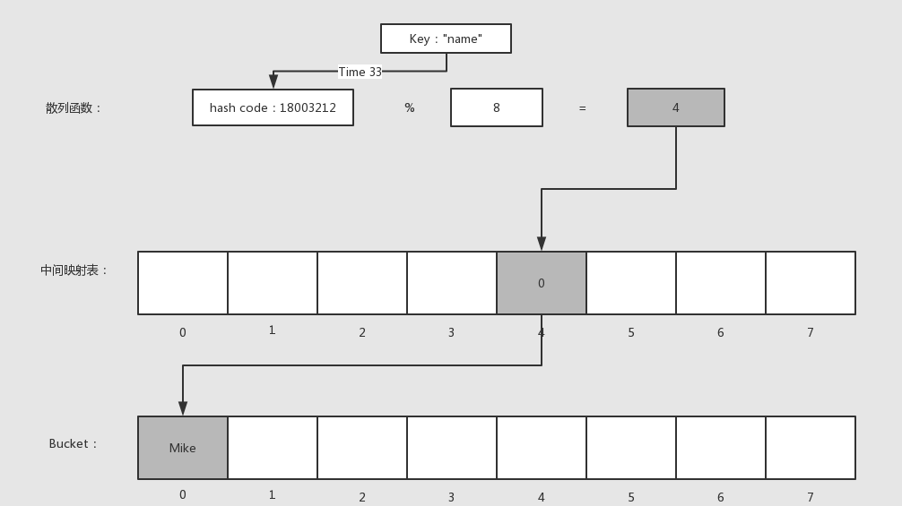

数据类型：`int` `float` `bool` `string` `object` `callable` `array ` `resource` `null`
值为false的情况: `''` `0` `0.0` `[]` `'0'` `null`
进制表达前缀：`0x` `0` `0b`
整数溢出转化为float，5/3结果为1.666...
浮点数转整数，向下取整
string是由字节组成的数组加上一个整数指明缓冲区的长度。可以把string当做字符组成的array，字符串会按照脚本文件的编码方式编码，`strlen` `mb_strlen`，字符串类型既是字符串也是byte，二进制字符串。

数组的key是int或者string，值可以是任意类型，如果数组定义中有多个相同的键，后面会覆盖前面的值，如果没指定键名，则为最大整数键名加一。
数组array是列表、散列表（哈希表）、队列、栈、集合、树形结构、多维数组，底层实现是散列表(HashTable结构体)。映射函数将key与value建立映射关系，可以根据key的哈希值与Bucket数组大小取模得到。哈希碰撞是指不同的key可能计算得到相同的哈希值，这时Bucket里面的zval里面的联合体里有一个next指针会串成链表，查找时遍历链表比较key。
函数、类、全局变量、静态变量、常量等都是HashTable存储。
```
//Bucket：散列表中存储的元素
typedef struct _Bucket {
    zval              val; //存储的具体value，这里嵌入了一个zval，而不是一个指针
    zend_ulong        h;   //key根据times 33计算得到的哈希值，或者是数值索引编号
    zend_string      *key; //存储元素的key
} Bucket;

//HashTable结构
typedef struct _zend_array HashTable;
struct _zend_array {
    zend_refcounted_h gc; //引用计数信息
    union {
        struct {
            ZEND_ENDIAN_LOHI_4(
                    zend_uchar    flags,
                    zend_uchar    nApplyCount,
                    zend_uchar    nIteratorsCount,
                    zend_uchar    reserve)
        } v;
        uint32_t flags;
    } u;
    uint32_t          nTableMask; //哈希值计算掩码，等于nTableSize的负数(nTableMask = -nTableSize)
    Bucket           *arData;     //存储元素数组，指向第一个Bucket，保证了PHP数组的有序性
    uint32_t          nNumUsed;   //已用Bucket数
    uint32_t          nNumOfElements; //哈希表有效元素数
    uint32_t          nTableSize;     //哈希表总大小，为2的n次方
    uint32_t          nInternalPointer; // 下一个数据元素的指针，用于迭代（foreach）
    zend_long         nNextFreeElement; //下一个可用的数值索引,如:arr[] = 1;arr["a"] = 2;arr[] = 3;  则nNextFreeElement = 2;
    dtor_func_t       pDestructor;
};
```



当删除或扩容达到一定数量后，会重建散列表、重建索引、将arData移到新的空间。

变量有两个组成部分：变量名、变量值，PHP中可以将其对应为：zval、zend_value，PHP7中引用计数是在zend_value而不是zval上，变量之间的传递、赋值通常也是针对zend_value。
```
//zend_types.h
typedef struct _zval_struct     zval;

typedef union _zend_value {
    zend_long         lval;    //int整形
    double            dval;    //浮点型
    zend_refcounted  *counted;
    zend_string      *str;     //string字符串
    zend_array       *arr;     //array数组
    zend_object      *obj;     //object对象
    zend_resource    *res;     //resource资源类型
    zend_reference   *ref;     //引用类型，通过&$var_name定义的
    zend_ast_ref     *ast;     //下面几个都是内核使用的value
    zval             *zv;
    void             *ptr;
    zend_class_entry *ce;
    zend_function    *func;
    struct {
        uint32_t w1;
        uint32_t w2;
    } ww;
} zend_value;

struct _zval_struct {
    zend_value        value; //变量实际的value
    union {
        struct {
            ZEND_ENDIAN_LOHI_4( //这个是为了兼容大小字节序，小字节序就是下面的顺序，大字节序则下面4个顺序翻转
                zend_uchar    type,         //变量类型
                zend_uchar    type_flags,  //类型掩码，不同的类型会有不同的几种属性，内存管理会用到
                zend_uchar    const_flags,
                zend_uchar    reserved)     //call info，zend执行流程会用到
        } v;
        uint32_t type_info; //上面4个值的组合值，可以直接根据type_info取到4个对应位置的值
    } u1;
    union {
        uint32_t     var_flags;
        uint32_t     next;                 //哈希表中解决哈希冲突时用到
        uint32_t     cache_slot;           /* literal cache slot */
        uint32_t     lineno;               /* line number (for ast nodes) */
        uint32_t     num_args;             /* arguments number for EX(This) */
        uint32_t     fe_pos;               /* foreach position */
        uint32_t     fe_iter_idx;          /* foreach iterator index */
    } u2; //一些辅助值
};
```
字符串结构体
```
struct _zend_string {
    zend_refcounted_h gc;
    zend_ulong        h;                /* hash value */
    size_t            len;
    char              val[1]; // 字符串内容，变长struct，分配时按len长度申请内存
};
```
对象/资源结构体
```
struct _zend_object {
    zend_refcounted_h gc;
    uint32_t          handle;
    zend_class_entry *ce; //对象对应的class类
    const zend_object_handlers *handlers;
    HashTable        *properties; //对象属性哈希表
    zval              properties_table[1];
};

struct _zend_resource {
    zend_refcounted_h gc;
    int               handle;
    int               type;
    void             *ptr;
};
```
引用结构体
```
struct _zend_reference {
    zend_refcounted_h gc;
    zval              val;
};
```


引用只能通过&产生，无法通过赋值传递：
```
$a = "time:" . time();
$b = &$a;
$c = $b; // 只是将$a的值赋值给$c，修改$c不会影响$a
```
PHP中的引用只可能有一层，不会出现一个引用指向另外一个引用的情况，也就是没有C语言中指针的指针的概念。

函数引用传递参数和返回引用，定义和使用都要带上&符号。
引用是用不同的名字访问同一个变量的内容，引用不是指针，不是内存地址，而是符号表别名，可以看作是linux的硬连接。
unset一个引用只是断开变量名与内容的联系，参考linux的硬连接。

变量赋值、函数传参时变量内存管理通过引用计数（变量赋值、传递时并不会直接硬拷贝）+写时复制（只有在必要的时候(写)才会发生硬拷贝）。
并不是所有的php变量都会用到refcount，标量：true/false/double/long/null是硬拷贝不需要，interned string（可以理解为预定义字符串）也不需要。

对象、资源是引用传递。

include与require没有本质上的区别，唯一的不同在于错误级别，当文件无法被正常加载时include会抛出warning警告，而require则会抛出error错误。
include就是把其它文件的内容拷贝到了调用文件中。
include_once、require_once在一次请求中同一文件只会被加载一次。

for($i=0;$i<func();$i++) // 每次判断都会执行func()

foreach(func() as $v) // func()只执行一次，php的foreach与go语言的for range相似

xdebug_debug_zval('变量名')

php三大组成部分：
* sapi是php的接入层，将用户的输入引导至php脚本，包含cli、php-fpm。
* zend引擎，编译器（将php代码编译成可执行的opcode），执行器（执行opcode）
* 扩展

php不像go语言一样实现了http网络库，而是通过php-fpm实现FastCGI协议，与web服务器配合来实现对http请求的处理。
php-fpm （php fastcgi process manager）的实现就是创建一个master进程，在master进程中创建并监听socket，然后fork出多个子进程，这些子进程各自accept请求（请求不经过master），子进程的处理非常简单，它在启动后阻塞在accept上，有请求到达后开始读取请求数据，读取完成后开始处理然后再返回，在这期间是不会接收其它请求的，也就是说fpm的子进程同时只能响应一个请求，响应超时返回504。没有可用的worker时，master返回502。master负责控制worker数量（启动、关闭worker）、接收外部信号，master与worker通过共享内存获取worker 进程当前状态、已处理请求数等。
PHP-FPM 启动后，master 进程会陷入 event_loop(0) 中来管理维持 worker 进程，而 fork 出的 worker 进程会回到主函数开始循环接收、处理请求。一次请求可以总结为 请求接收、请求处理、请求结束 三个阶段。操作系统调度分配请求到worker。

php-fpm可以同时监听多个端口，每个端口对应一个worker pool，每个pool里有多个worker进程。
static: 这种方式比较简单，在启动时master按照pm.max_children配置fork出相应数量的worker进程，即worker进程数是固定不变的
dynamic: 动态进程管理，首先在fpm启动时按照pm.start_servers初始化一定数量的worker，运行期间如果master发现空闲worker数低于pm.min_spare_servers配置数(表示请求比较多，worker处理不过来了)则会fork worker进程，但总的worker数不能超过pm.max_children，如果master发现空闲worker数超过了pm.max_spare_servers(表示闲着的worker太多了)则会杀掉一些worker，避免占用过多资源，master通过这4个值来控制worker数。

超全局变量：$GLOBALS、$_SERVER、$_REQUEST、$_POST、$_GET、$_FILES、$_ENV、$_COOKIE、$_SESSION、argv、argc。
静态变量的初始化发生在编译阶段。

**垃圾回收机制**（引用计数）：
PHP变量的内存管理，即引用计数机制，当变量赋值、传递时并不会直接硬拷贝，而是增加value的引用数，unset、return等释放变量时再减掉引用数，减掉后如果发现refcount变为0则直接释放value，这是变量的基本gc过程，PHP正是通过这个机制实现的自动垃圾回收，但是有一种情况是这个机制无法解决的，从而因变量无法回收导致内存始终得不到释放，这种情况就是循环引用，简单的描述就是变量的内部成员引用了变量自身，比如数组中的某个元素指向了数组，这样数组的引用计数中就有一个来自自身成员，试图释放数组时因为其refcount仍然大于0而得不到释放，而实际上已经没有任何外部引用了，这种变量不可能再被使用，所以PHP引入了另外一个机制用来处理变量循环引用的问题。
1 如果一个变量value的refcount减少到0， 那么此value可以被释放掉，不属于垃圾。
2 如果一个变量value的refcount减少之后大于0，那么此zval还不能被释放，此zval可能成为一个垃圾。
对于第2种情况GC会将变量收集起来，目前垃圾只会出现在array、object两种类型中。object的情况则是成员属性引用对象本身导致的。
当变量的refcount减少后大于0，会被加入垃圾缓存区，变量会被标记为紫色（疑似垃圾）。垃圾缓存区是一个双向链表，等到缓存区满了（10000个可能根）以后则启动垃圾检查过程：
1 从buffer链表的roots开始遍历，把当前value标为灰色(zend_refcounted_h.gc_info置为GC_GREY)，然后对当前value的成员进行深度优先遍历，把成员value的refcount减1，并且也标为灰色
2 重复遍历buffer链表，检查当前value引用是否为0，为0则表示确实是垃圾，把它标为白色(GC_WHITE)，如果不为0则排除了引用全部来自自身成员的可能，表示还有外部的引用，并不是垃圾，这时候因为步骤(1)对成员进行了refcount减1操作，需要再还原回去，对所有成员进行深度遍历，把成员refcount加1，同时标为黑色。
3 再次遍历buffer链表，将非GC_WHITE的节点从roots链表中删除，最终roots链表中全部为真正的垃圾，最后将这些垃圾清除。
PHP的GC采用引用计数的方式，不需要暂停整个程序，没有STW问题。

zend针对内存的操作主要参考了tcmalloc，定义了三种粒度的内存块：chunk、page、slot，每个chunk的大小为2M，page大小为4KB，一个chunk被切割为512个page，而一个或若干个page被切割为多个slot，所以申请内存时按照不同的申请大小决定具体的分配策略：
* Huge(chunk): 申请内存大于2M，直接调用系统分配，分配若干个chunk
* Large(page): 申请内存大于3092B(3/4 page_size)，小于2044KB(511 page_size)，分配若干个page
* Small(slot): 申请内存小于等于3092B(3/4 page_size)，内存池提前定义好了30种同等大小的内存(8,16,24,32，...3072)，他们分配在不同的page上(不同大小的内存可能会分配在多个连续的page)，申请内存时直接在对应page上查找可用位置

TS指Thread Safety，即线程安全，针对多线程。
NTS 非线程安全，php-fpm是多进程单线程，因此适用。

命名空间：解决类、函数、常量、接口名字冲突。
类的自动加载：`spl_autoload_register`，可以支持任意数量的加载器，直到类成功注册为止，里面还是用的是require。常用框架比如yii2（有一套自己的autoload）也是借用composer+PSR规范实现框架外部类的自动加载，通过引入/vendor/autoload.php。
use不会触发自动加载，只有在new时才触发自动加载。

composer是php包管理器，也是自动加载的关键，它实现了类与文件的映射关系（namespace use），并且使用spl_autoload_register在需要时载入内存。
psr4：命名空间必须对应一个目录，类名必须与php文件名相同，大小写敏感。

获取客户端真实IP：HTTP_X_ORIGINAL_FORWARDED_FOR HTTP_X_FORWARDED_FOR HTTP_CLIENT_IP REMOTE_ADDR
服务器真实IP：SERVER_ADDR

重定向：header函数（location） + exit()
BOM头是一串隐藏的字符,用于让记事本等编辑器识别这个文件是否以UTF-8编码，PHP不能识别，会把BOM作为文件开头正文的一部分。
if (substr($t, 0, 3) == '\xef\xbb\xbf') {
	$t = substr($t, 3);
}

PHP魔术方法（php类的特殊成员方法，是PHP提供的一些特殊操作时的钩子函数）：
__construct() __destruct() __call() __callStatic() __set() __get() __isset() __isget() __sleep() __wakeup() __clone()
__sleep()、__wakeup()，这两个主要是serialize()、unserialize()中使用，写死的。

YII2 优点：结构清晰，组件齐全，能快速开发项目，特点：配置强大，自定义修改请求、响应、日志等，yii队列也很好用。依赖注入（Denpdency Injection, DI）和服务定位器（Service Locator）两种模式。

PHP7 性能提升的原因：程序运作时搬动的内存位数，存储变量的结构体变小、字符串结构体的改变、数组结构的改变。

`password_hash` `password_verify`
