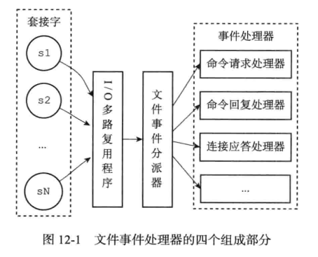
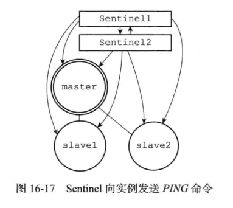

redis是单线程的nosql（非关系型数据库），由C语言开发。
字符串、哈希、列表、集合、有序集合、发布订阅、GEO
字符串：计数器、key-value缓存数据、加锁解锁、数据库缓存、缓存session
哈希：hget hset 存储对象、缓存数据库查询结果、购物车
列表：按照插入顺序排序的列表 lpush lpop rpop rpush lrange 用作消息队列、api限流
集合：内部的键值对是无序的、唯一的 sadd smembers sismember spop srem 缓存日活记录，好友、关注、粉丝，数据全局去重，交集、并集、差集
有序集合 zadd zrem zrange zcard zrank 排名，延迟队列

Redis分布式锁：加锁$redis->set($key, 1, 'NX', 'EX', $expire) 解锁 键过期或del
api限流: 使用列表lrange，rpush存入时间，lpop弹出超时 事务的watch multi
消息队列：rpush生产消息，lpop消费消息。

SDS simple dynamic string
```
struct sdshdr{
	int len;
	int free;
	char buf[];
}
```
buf[]字符数组以空字符\0结尾，这一点与c语言字符串保持一致。但是能够存储二进制数据。
键名、字符串键值等使用SDS结构。

链表
```
typedef struct listNode{
	struct listNode *prev;
	struct listNode *next;
	void *value;
}
```
列表等使用链表结构。

字典
哈希、数据库键空间等使用字典结构。
rehash：当字典扩展或收缩到一定值时，会发生rehash。
哈希冲突：使用拉链法解决哈希冲突，被分配到同一个索引上的多个键值对会连接成一个单向链表。

跳跃表
是一种有序数据结构，实现比平衡树简单，性能相近，平均O(logN)，最坏O(N)。
有序集合、集群内部使用跳跃表。

整数集合
```
typedef struct intset{
	uint32_t encoding; // contents元素的整数类型
	uint32_t length; // contents元素个数
	int8_t contents[]; // 集合元素数组
}
```
集合的底层实现之一，当一个集合只包含整数，并且数量不多时使用。

对象
redis的对象系统使用了基于引用计数的gc。每个键值对都包含一个键对象和一个值对象。共享对象：共享值为0~9999的字符串对象，节约内存。
对象会记录最后一次被访问的时间，用于计算空转时间（当前时间-最后一次访问时间）。

过期键删除策略：
定时删除（创建大量定时器，耗费CPU）
惰性删除（耗费内存）
定期删除（需要制定删除策略），合理设置删除操作的执行时长和执行频率，达到CPU和内存的合理利用。
redis使用惰性删除+定期删除（分批次遍历所有数据库的所有键）。

LRU（Least Recent Used，淘汰掉最不经常使用的，基于hashmap的双向链表数据结构）

RDB持久化：生成的RDB文件是经过压缩的二进制文件，保存数据库的键值对数据。SAVE BGSAVE（执行时客户端发送的SAVE BGSAVE不会执行，BGREWRITEAOF在BGSAVE执行完后执行），SAVE命令由服务器进程执行保存工作，因此会阻塞服务器，BGSAVE由子进程执行保存工作，不会阻塞。因此可以用BGSAVE自动保存：save 600 1，600秒修改一次就保存。redis启动时会自动载入RDB文件（如果AOF持久化开启时，则会载入AOF文件，忽略RDB）。
AOF（append only file）持久化：只追加的方式，保存执行的写命令，appendfsync：aways everysec no。AOF文件重写（数据相同，体积更小，BGREWRITEAOF），它不是基于现有的AOF文件，而是通过遍历服务器当前数据来重新生成写操作指令。当子进程完成AOF重写工作后，父进程会将AOF重写缓冲区的内容写入新AOF文件，并将新的AOF文件覆盖现有的AOF文件，完成新旧替换，这整个过程会阻塞（不接受客户端命令）。

redis单线程模型：采用 IO 多路复用机制同时监听多个 Socket，根据 Socket 上的事件来选择对应的事件处理器进行处理。



Redis是基于内存采用单进程单线程的KV数据库，C语言编写。绝大部分操作都是在内存中操作，速度很快。并且它的数据结构是专门进行设计的。
避免了上下文切换和竞争条件（加锁解锁）

redis集群：主从，哨兵，cluster
主从：读写分离
主库：所有的写操作都在主库发生，然后主库同步数据到从库，同时也可以进行读操作；
从库：只负责读操作；
全量同步：从服务器首次加入主服务器中发生的是全量同步。同步依赖RDB文件，主库会通过bgsave命令，生成RDB文件，然后将RDB文件传送到从库中。主库会在内存中用专门的replication buffer（主库对每个从库都会单独创建的缓冲区），记录 RDB 文件生成后收到的所有写操作，然后在 RDB 文件，同步完成之后，再将replication buffer中的命令发送到从库中。
增量同步：用于主从服务器之间发生网络闪断，利用repl_backlog_buffer（主库独一份的缓冲区，环形缓冲区），从库通过slave_repl_offset锚定缺失的数据。如果超过repl_backlog_buffer，则会进行全量同步。

哨兵机制，Sentinel
监控：周期性PING主库、从库，检测它们是否在线。
选主：主库宕机后，从库中选择一个作为新的主库，选取策略是网络最好，性能最好，数据最新最多。
通知：通知其它从库切换新主库连接和数据同步，通知客户端新的主库地址（pub/sub通知），当旧的主库重新上线后，把它设置为新主库的从库。
哨兵集群：通过多个哨兵节点，避免网络拥塞等引起误判主库离线。当主库宕机后，哨兵选举出Leader，由Leader处理故障转移。哨兵Leader 节点的选举用的是 Raft 算法。



集群，Cluster：分布式方案，水平扩容（横向扩展），利用哈希槽实现KEY在不同节点的分布。
一个集群共有16384个哈希槽，每个键值对的key通过哈希之后取模被映射到一个哈希槽中。一个集群包含多个节点，所有哈希槽会被分配到每个节点中。并且支持重新分配哈希槽。
各个节点的联通是通过 CLUSTER MEET 命令完成的：CLUSTER MEET <ip> <port> 。
Cluster 是具备Master和Slave模式，但是Slave只是作为备份，不支持读写分离。
故障检测：占据多数的实例节点都认为某个节点挂起，cluster才进行下线和主从切换的工作。
故障转移：当主库宕机后，用Raft 算法选主，新主会撤销旧主的slot指派，并将这些slot指派给自己，并广播通知集群。

一致性哈希：hash取模，当数量变化时会对应不上。将服务器使用IP地址或服务器名哈希后,对2^32取模，形成一个Hash环，再将数据key使用相同的函数哈希取模，沿环顺时针“行走”，第一台遇到的服务器就是其应该定位到的服务器，对于节点的增减都只需重定位环空间中的一小部分数据。数据倾斜：增加虚拟节点。

发布/订阅：publish subscribe，Redis无法对消息持久化存储，没有提供消息传输保障
事务：watch multi exec，其它指令会进入事务队列。watch是一个乐观锁，被watch的键在事务外部被修改时，整个事务会被取消。入队期间错误会拒绝执行，执行期间会执行正确的指令，忽略错误的指令，即没有回滚功能。由于redis是单线程的，redis事务总是串行执行。
redis集群不支持事务。

redis慢查询日志：记录执行时间超过指定时间的日志。

HashMap的读写时间复杂度都是O(1)

布隆过滤器：一个空的布隆过滤器有长度为M比特的bit数组构成，且所有位都初始化0。一个元素通过K个不同的hash函数随机散列到bit数组的K个位置上，K必须远小于M。K和M的大小由错误率（falsepositiverate）决定。布隆过滤器能够准确判断一个元素不在集合内，但只能判断一个元素可能在集合内。
布隆过滤器使用场景：缓存穿透、去重

`缓存穿透`，数据库没有的数据，缓存里自然没有。可以约定在一定时间内对返回为空的 Key 值依然进行缓存，接口层增加校验，布隆过滤器（在空间和时间方面都具备巨大优势）
`缓存击穿`，有多个针对数据库存在但不在缓存中的数据的请求同时发送过来。cache miss 后请求DB之前必须先获取分布式锁，设置热点数据永远不过期
`缓存雪崩`，大批不同的数据在短时间内一起失效，导致了这些数据的请求都击穿了缓存到达数据源。随机过期时间，设置热点数据永远不过期
`缓存污染`，双写一致性。指缓存中的数据与真实数据源中的数据不一致的现象。读数据时，先读缓存，缓存没有的话，再读数据源，然后将数据放入缓存，再响应请求。写数据时，先写数据源，然后失效（而不是更新）掉缓存。
发生时：限流、降级
`并发竞争`，分布式事务，分布式锁 zookeeper
