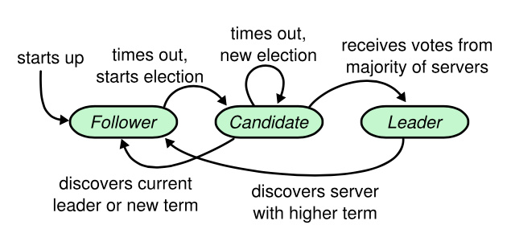

# Raft算法
Raft是一种为了管理复制日志的一致性算法。一致性算法允许一组机器像一个整体一样工作，即使其中一些机器出现故障。
**复制状态机** 通常都是基于复制日志实现的，而一致性算法的任务是保证复制日志的一致性。状态机从日志中处理相同顺序的相同指令，所以产生的结果也是相同的。因此，服务器集群看起来形成了一个高可靠的状态机。
Raft算法特点：
* 安全性：网络延迟、分区、丢包、重复和乱序等错误都可以保证正确，决不返回一个错误的结果。
* 可用性：只要大多数机器正常，就可以保证可用。

通过领导人的方式，Raft 将一致性问题分解成了三个子问题:
* 领导人选举：领导人故障时，新的领导人要被选举出来。
* 日志复制：领导人必须从客户端接收日志条目（log entries）然后复制到集群中的其他节点，并强制要求其他节点的日志和自己保持一致。
* 安全性：日志索引唯一。

**状态转换** 在任何时刻，每一个服务器节点都处于这三个状态之一：领导人、跟随者或者候选人。在通常情况下，系统中只有一个领导人并且其他的节点全部都是跟随者。跟随者只能响应来自领导人或者候选人的请求。


**任期号** 每个节点存储一个当前任期号，这一编号在整个时期内单调递增。每次服务器之间通信都会交换当前任期号；如果服务器的当前任期号较小，则会更新到较大的任期号值。如果一个候选人或者领导人发现自己的任期号较小，那么他会立即恢复成跟随者状态。任期在 Raft 算法中充当`逻辑时钟`的作用。
RPC：服务器会并行发起RPC，并会在RPC超时后重试。

**领导人选举**
当服务器程序启动时，他们都是跟随者身份。如果一个跟随者在一段时间里没有接收到领导人或候选人的任何消息，就会转换到候选人状态，自增当前的任期号（currentTerm），给自己投票，重置选举超时计时器，发送请求投票的RPC给其他所有服务器。这时会有三种可能性：
* 当候选人获得超过1/2选票时，就会成为领导人，广播发送心跳。每一个服务器最多会对一个任期号投出一张选票，按照先来先服务的原则。跟随者会拒绝掉拥有已提交日志条目<=自己的投票请求。Raft通过比较两份日志中最后一条日志条目的索引值和任期号定义谁的日志比较新。
* 在等待投票的时候，候选人可能会收到其它的服务器声明它是领导人的心跳，如果该领导人的任期号>=候选人当前的任期号，那么候选人会回到跟随者状态。
* 瓜分选票。Raft算法使用随机选举超时（从跟随者转换成候选人需要等待的时间）的方法减少选票瓜分的情况，选举超时时间是从一个固定的区间（例如 150-300 毫秒）随机选择。

当服务器在当前最小选举超时时间内收到一个请求投票 RPC，他不会更新当前的任期号或者投出选票。
**日志复制**
日志由序号、创建时的任期号、客户端指令组成。
日志条目只从领导人发送给其他的服务器。当客户端指令到来时，领导人把这条指令作为一条新的日志条目附加到日志中，再推送给追随者。在领导人将创建的日志条目复制到大多数的服务器上的时候，日志条目就会被提交。当日志提交后，领导人会将该指令应用到状态机。一旦跟随者知道一条日志条目已经被提交，那么他也会将这个日志条目应用到本地的状态机中（按照日志的顺序）。
要使得跟随者的日志进入和自己一致的状态，领导人必须找到最后两者达成一致的地方，然后删除跟随者从那个点之后的所有日志条目，并发送自己在那个点之后的日志给跟随者。领导人针对每一个跟随者维护了一个nextIndex，当一个领导人刚获得权力的时候，他初始化所有的 nextIndex 值为自己的最后一条已提交日志的 index 加 1。在被跟随者拒绝之后，领导人就会减小 nextIndex 值并进行重试。领导人从来不会覆盖或者删除自己的日志。

**集群成员变化**：使用共同一致的方法，配置更改必须使用两阶段方法。共同一致可以让集群在配置转换的过程中依然响应客户端的请求。
当一个领导人接收到一个改变配置从C-old到C-new的请求，会向C-old+C-new的服务器广播C-old+C-new配置，在两种配置上分别获得大多数的支持后提交。
领导人创建一条关于C-new配置的日志条目并复制给集群。
每个服务器在见到新的配置的时候都会立即生效。

**RPC**
服务器会并行发起RPC，并会在RPC超时后重试。Raft 的RPC都应当是幂等的。
**追加条目（AppendEntries）RPC**：

由领导人调用，用于日志条目的复制，同时也被当做心跳使用

| 参数 | 解释 |
| --- | --- |
| term | 领导人的任期 |
| leaderId | 领导人 ID 因此跟随者可以对客户端进行重定向（译者注：跟随者根据领导人 ID 把客户端的请求重定向到领导人，比如有时客户端把请求发给了跟随者而不是领导人） |
| prevLogIndex | 紧邻新日志条目之前的那个日志条目的索引 |
| prevLogTerm | 紧邻新日志条目之前的那个日志条目的任期 |
| entries\[\] | 需要被保存的日志条目（被当做心跳使用时，则日志条目内容为空；为了提高效率可能一次性发送多个） |
| leaderCommit | 领导人的已知已提交的最高的日志条目的索引 |

| 返回值 | 解释 |
| --- | --- |
| term | 当前任期，对于领导人而言 它会更新自己的任期 |
| success | 如果跟随者所含有的条目和 prevLogIndex 以及 prevLogTerm 匹配上了，则为 true |

接收者的实现：

1.  返回假 如果领导人的任期小于接收者的当前任期（译者注：这里的接收者是指跟随者或者候选人）。
2.  返回假 如果接收者日志中没有包含这样一个条目 即该条目的任期在 prevLogIndex 上能和 prevLogTerm 匹配上 （译者注：在接收者日志中 如果能找到一个和 prevLogIndex 以及 prevLogTerm 一样的索引和任期的日志条目 则继续执行下面的步骤 否则返回假）。
3.  如果一个已经存在的条目和新条目（译者注：即刚刚接收到的日志条目）发生了冲突（因为索引相同，任期不同），那么就删除这个已经存在的条目以及它之后的所有条目
4.  追加日志中尚未存在的任何新条目。
5.  如果领导人的已知已提交的最高日志条目的索引大于接收者的已知已提交最高日志条目的索引（`leaderCommit > commitIndex`），则把接收者的已知已经提交的最高的日志条目的索引commitIndex 重置为 领导人的已知已经提交的最高的日志条目的索引 leaderCommit 或者是 上一个新条目的索引 prevLogIndex取两者的最小值。

**请求投票（RequestVote）RPC**：

由候选人负责调用用来征集选票

| 参数 | 解释 |
| --- | --- |
| term | 候选人的任期号 |
| candidateId | 请求选票的候选人的 ID |
| lastLogIndex | 候选人的最后日志条目的索引值 |
| lastLogTerm | 候选人最后日志条目的任期号 |

| 返回值 | 解释 |
| --- | --- |
| term | 当前任期号，以便于候选人去更新自己的任期号 |
| voteGranted | 候选人赢得了此张选票时为真 |

接收者实现：

1.  如果`term < currentTerm`返回 false 
2.  如果 votedFor 为空或者为 candidateId，并且候选人的日志至少和自己一样新，那么就投票给他。

**特性**
所有服务器：
如果commitIndex>lastApplied，则 lastApplied 递增，并将log[lastApplied]应用到状态机中。
如果接收到的RPC请求或响应中，任期号T>currentTerm，则令currentTerm=T，并切换为跟随者状态。

matchIndex[]对于每一台服务器，已知的已经复制到该服务器的最高日志条目的索引（初始值为0，单调递增）。
需要持久化的参数：currentTerm、votedFor、log[]。

# boltdb
**磁盘数据结构**
```
type page struct {
	id       pgid    // 页头字段 页id，从0开始，单调递增
	flags    uint16  // 页头字段 页4种类型之一
	count    uint16  // 页头字段 页里面的元素个数，最大65535
	overflow uint32  // 页头字段 溢出页数目
	ptr      uintptr // 页在byte[]的起始元素地址，只存在于内存中的概念
}

type meta struct {
	magic    uint32 // 固定值，作为boltdb数据库文件标识
	version  uint32 // boltdb版本
	pageSize uint32 // 操作系统页大小，单位是字节
	flags    uint32 // 保留字段，未使用
	root     bucket // x字节，所有bucket的根，bucket.root值初始化为3
	freelist pgid   // 空闲页id，空闲页只有一个
	pgid     pgid   // 下一个将要分配的页id，当前最大页id+1，不一定连续
	txid     txid   // 下一个将要分配的事务id，从0开始，单调递增
	checksum uint64 // 以上8个字段值[]byte校验和，保证读取的是上一次写入的数据
}

type bucket struct {
	root     pgid   // 桶的根级页的页id。叶根id
	sequence uint64 // 从0开始，单调递增
}

freelist []pgid // 如果pgid数目超过65535，页头count置为65535，同时pgid[0]存储pgid数目

type branchPageElement struct {
	pos   uint32 // 该元素与key的偏移量
	ksize uint32 // key的长度，字节
	pgid  pgid   // 子节点的页id
}

type leafPageElement struct {
	flags uint32 // 0 k/v 1 subBucket，存储bucket结构体信息
	pos   uint32 // 该元素与key的偏移量
	ksize uint32 // key的长度，字节
	vsize uint32 // value的长度，字节
}
```
内存数据结构
```
type freelist struct {
	ids     []pgid          // 已释放的页id列表
	pending map[txid][]pgid // 即将释放的页id列表
	cache   map[pgid]bool   // 已释放和即将释放的页id列表
}

type node struct {
	bucket     *Bucket // 关联一个桶
	isLeaf     bool    // 是否是leaf页
	unbalanced bool    // 是否需要页合并
	spilled    bool    // 是否需要页分裂
	key        []byte  // branch页时，第一个key的值
	pgid       pgid    // 关联的页id
	parent     *node   // 父节点
	children   nodes   // 子节点
	inodes     inodes  // 节点保存的k/v数据
}

type inode struct {
	flags uint32 // 区分 subBucket 1 和 value 0
	pgid  pgid   // subBucket时有值，子节点的页id
	key   []byte // key值/bucket的名称
	value []byte // value时有值
}

type Bucket struct {
	*bucket                        // bucket值，结构体指针嵌套
	tx          *Tx                // 关联的事务
	buckets     map[string]*Bucket // subBucket列表，键为bucket的名称
	page        *page              // inline页面信息
	rootNode    *node              // 根节点
	nodes       map[pgid]*node     // 缓存已经读入内存的page对应的node信息。
	FillPercent float64            // 填充率
}

type DB struct {
	path     string            // 数据库文件路径
	file     *os.File          // 数据库文件
	data     *[maxMapSize]byte // mmap 磁盘映射到内存中的数据
	datasz   int               // mmap 数据大小
	filesz   int               // 数据库文件大小
	meta0    *meta             // 第一个meta
	meta1    *meta             // 第二个meta
	pageSize int               // 页大小
	rwtx     *Tx               // 一个写事务指针，同时事务也持有db指针
	txs      []*Tx             // 多个读事务
	freelist *freelist         // freelist
	pagePool sync.Pool         // 页池

	...
}

type Tx struct {
	db    *DB            // db指针，同时db也持有事务指针
	meta  *meta          // meta页
	root  Bucket         // 页根对应的bucket
	pages map[pgid]*page // 涉及到的页

	...
}

type Cursor struct {
	bucket *Bucket   // 关联的bucket
	stack  []elemRef // 作为移动游标时的临时栈
}

type elemRef struct {
	page  *page // 页
	node  *node // 节点，页在内存中的形式
	index int   //  
}
```
**主体说明**
一个db文件对应一个数据库。db文件由page（页）组成。页分为四类：meta、freelist、leaf、branch。

branch/leaf页 <=> node
k/v => leaf页
subBucket => branch/leaf页

一个db存在一个唯一的根Bucket。子Bucket信息保存在leaf页中。

事务：支持acid，mvcc。commit时写磁盘的顺序：先写freelist、branch、leaf页，再写meta页，通过通过File.WriteAt()、File.Sync()
每次写事务，freelist、branch、free会重新分配页，将旧页id写入freelist.pending，等到没有读事务依赖旧页id时，删除（在创建写事务时，会找到db.txs中最小的txid，释放freelist.pending中所有txid小于它的pending page。）。
只读事务结束：tx.db.removeTx(tx)
读写事务结束：tx.db.rwtx = nil
mvcc：通过filelist.pending保存上一个版本的数据。

Cursor：对b+树的实现

数据库级别的锁：syscall.Flock，同时只能有多个共享锁（多个只读的db实例）或一个独占锁（一个读写的db实例）。
事务级别的锁：sync.Mutex针对读写事务，只能有一个；只读事务没有锁，可以共存多个。

boltDB在更新B+树数据时不会直接修改树的结构，而只是更新数据。在数据写入磁盘前才按需合并、分裂node。


**bolt.Open**

初始化数据库：2个meta页（用于写操作时交替保存，获取的时候取校验正确并且txid更大的一个）、1个freelist页、1个leaf页。写磁盘：通过File.WriteAt()、File.Sync()将4个初始页中的内存数据[]byte写入文件。
fnv哈希算法：可以快速hash大量的数据并保持较小的冲突概率。go语言中标准库实现。

打开数据库
读磁盘：通过File.ReadAt()读取第一个meta页（unsafe.Pointer映射到page、meta结构体），用于验证数据库文件的正确性。
设置mmap的size：小于32kb时，置为32kb；然后从32kb开始翻倍，直到1Gb；之后每次增加1Gb，直到256TB，注意需为页大小的倍数。
位运算，左移：
1 << 15 == 1 * 2^15
15 << 1 == 15 * 2^1
mmap：将磁盘地址映射到内存地址的方法，通过操作内存实现对磁盘的读写。boltdb利用mmap读取size大小的数据到db.data，通过db.data来操作页，将磁盘的页数据赋值给db.meta0、db.meta1、db.freelist。
在数据库初始化和扩充文件大小时调用mmap


**db.Update**

创建一个写事务。给tx.db、tx.meta、tx.root赋值，meta.txid自增1。
tx.root作为bucket根
tx.root.tx = tx
tx.root.bucket = tx.meta.root

创建一个cursor，关联该bucket，从根bucket开始找key对应的bucket。

刚创建Bucket是inline-buckets。尽管每个Bucket内部的数据是合法的B+树，但它们共同组成的Bucket树通常不是B+树。


**freelist**

freelist存储空间分配：遍历freelist.ids，找到 连续的pgid数目=待分配页数 的首个pgid。
读取：将磁盘数据读入ids
写入：将ids和pending写入磁盘
# etcd
Etcd是CoreOS基于Raft协议用Go语言开发的分布式键值对存储，可用于服务发现、共享配置、一致性保障（如数据库选主、分布式锁等）。
Etcd单实例(V3)支持每秒10KQps。
etcd 网关是一个简单的 TCP 代理，转发网络数据到 etcd 集群。
Etcd是CoreOS基于Raft协议用Go语言开发的分布式键值对存储，可用于服务发现、共享配置、一致性保障（如数据库选主、分布式锁等）。
Etcd单实例(V3)支持每秒10KQps。
etcd 网关是一个简单的 TCP 代理，转发网络数据到 etcd 集群。
etcd是一个有序的k-v存储。
如果多个 key的过期时间是一样的，那么这些 key 就可以共享一个租约。
etcd v3数据库存储在磁盘上，底层的存储引擎使用的是BoltDB。
目前 etcd 可以存储百万到千万级别的 key。
事务：global.Etcd.Txn(context.TODO()).If().Then().Else().Commit()，If().Then().Else()参数均可为空。

etcd客户端与服务器端、节点之间使用grpc通信。
etcd(Server)大体上可以分为网络层(http(s) server)、Raft模块、复制状态机(RSM)和存储模块。
网络层:提供网络数据读写功能，监听服务端口，完成集群节点之间数据通信，收发客户端数据。
Raft模块：Raft强一致性算法的具体实现。
存储模块：涉及KV存储、WAL文件、Snapshot管理等，用户处理etcd支持的各类功能的事务，包括数据索引 节点状态变更、监控与反馈、事件处理与执行 ，是 etcd 对用户提供的大多数 API 功能的具体实现。
复制状态机：这是一个抽象的模块，状态机的数据维护在内存中，定期持久化到磁盘，每次写请求都会持久化到 WAL 文件，并根据写请求的内容修改状态机数据。

etcd它是etc和distributed的结合体。

mvcc多版本
每个tx事务有唯一事务ID，在etcd中叫做mainID，全局递增不重复。
一个tx可以包含多个修改操作（put和delete），每一个操作叫做一个revision(修订)，共享同一个mainID。
一个tx内连续的多个修改操作会被从0递增编号，这个编号叫做subID。
每个revision由（mainID，subID）唯一标识。

索引+存储
内存索引btree+磁盘存储value
在boltdb中，revision作为key
etcd支持按key前缀查询，其实也就是通过内存btree在keyIndex.generations[0].revs中找到最后一条revision，再根据revision去bbolt中获取用户的value。
boltdb中的value结构：
type KeyValue struct {
	Key            []byte 
	CreateRevision int64  
	ModRevision    int64  
	Version        int64  
	Value          []byte 
	Lease          int64  
}


watch
推送机制
etcd的watch机制是基于mvcc多版本实现的。客户端可以提供一个要监听的revision.main作为watch的起始ID，只要etcd当前的全局自增事务ID > watch起始ID，etcd就会将MVCC在bbolt中存储的所有历史revision数据（value中的key是不是用户watch的），逐一顺序的推送给客户端。
若watcher监听的版本号已经小于当前 etcd server 压缩的版本号，服务器会返回一个错误。
当收到创建 watcher 请求的时候，它会把 watcher 监听的 key 范围插入到上面的区间树中，区间的值保存了监听同样 key 范围的 watcher 集合 /watcherSet。
当产生一个事件时，etcd 首先需要从 map 查找是否有 watcher 监听了单 key，其次它还需要从区间树找出与此 key 相交的所有区间，然后从区间的值获取监听的 watcher 集合。
区间树支持快速查找一个 key 是否在某个区间内，时间复杂度 O(LogN)，因此 etcd 基于 map 和区间树实现了 watcher 与事件快速匹配。


key删除后指定查询指定版本号,还可以获得版本号对应的值。

MVCC
MVCC 模块将请求请划分成两个类别，分别是读事务（ReadTxn）和写事务（WriteTxn）
etcd 设计上支持多种 Backend 实现，目前实现的 Backend 是 boltdb。boltdb 是一个基于 B+ tree 实现的、支持事务的 key-value 嵌入式数据库。
为什么 etcd 使用 B-tree 而不使用哈希表、平衡二叉树？

从功能特性上分析， 因 etcd 支持范围查询，因此保存索引的数据结构也必须支持范围查询才行。所以哈希表不适合，而 B-tree 支持范围查询。
从性能上分析，平横二叉树每个节点只能容纳一个数据、导致树的高度较高，而 B-tree 每个节点可以容纳多个数据，树的高度更低，更扁平，涉及的查找次数更少，具有优越的增、删、改、查性能。

etcd 是基于最小堆来管理 Lease。

etcd 默认数据一更新就落盘持久化，数据持久化存储使用 WAL (write ahead log ，预写式日志）格式 WAL 记录了数据变化的全过程，在 etcd 中所有数据在提交之前都要先写人 WAL 中； etcd Snapshot （快照）文件则存储了某一时刻 etcd 的所有数据，默认设置为每 10 000 条记录做一次快照，经过快照后WAL文件即可删除。v3日志和快照的主要作用是进行分布式的复制。
v2、v3公用raft协议，但是通信方式、存储方式都是独立的。
v3客户端与服务器只有一个http2长连接，watch、get等操作多路复用

goreman 使用 https://github.com/mattn/goreman
go-nsq https://github.com/nsqio/go-nsq

boltdb protobuf
protobuf的效率是JSON的数倍

IaaS：基础架构即服务。
PaaS：平台即服务，主要面向开发人员，它允许用户开发、运行和管理自己的应用，而无需构建和维护通常与该流程相关联的基础架构或平台。
SaaS：软件即服务。

CAP
客户端一致性：多并发访问时获取最新的数据
服务端一致性：节点之间的数据保持一致

复制状态机。，指令在状态机上的执行顺序并不一定等同于指令的发出顺序或接收顺序。

拜占庭将军问题

etcd 默认数据一更新就落盘持久化，数据持久化存储使用 WAL (write ahead log ，预写式日志）格式 WAL 记录了数据变化的全过程，在 etcd 中所有数据在提交之前都要先写人 WAL 中； etcd Snapshot （快照）文件则存储了某一时刻 etcd 的所有数据，默认设置为每 10 000 条记录做一次快照，经过快照后WAL 文件即可删除。


节点间通信：
Leader Follower 发送心跳包， Follower Leader 回复消息
Leader Follower 发送日志追加信息
Leader Follower 发送 Snapshot 数据
Candidate 节点发起选举，向其他节点发起投票请求
Follower 将收到的写操作转发给 Leader

2类消息传输通道：stream，节点之间维持一个http长连接，小数据；pipeline，http短链接，大数据
etcd server 之间通过 peer 端口使用 HTTP 进行通信。

分布式锁实现思路：
prefix
锁名称+租约id，每个客户端只操作自己持有的锁。
lease
租约保活，在创建锁的时候绑定租约，并定期进行续约，如果获得锁期间客户端意外宕机，则持有的锁会被自动删除，避免了死锁的产生。
Revision
用Revision值的大小来决定获取锁的先后顺序，避免产生惊群效应。
watch
watch机制可以用于监听锁的删除事件，不必使用忙轮询的方式查看是否释放了锁。同时，在watch时候可以通过Revision来进行监听，比较create_revision比自己小一个的最大create_revision。

revision、create_revision、mod_revision

Peer ：对同 etcd 集群中另外一个 Member 的叫法。

etcd server 之间是可以重定向请求的。--advertise-client-urls

MVCC 模型是指由于保存了键的历史，因此可以查看过去某个 revision （时刻）的 key value 存储。

etcd 支持key的前缀和范围查询。

在一个事务中多次修改同一个 key 是被禁止的。if检查可以是如下内容：该 key后台存储是否有 value ？该 key 自由 value 是否等于某个给定的值？(CAS)

watch：Event 按照 revision 排序，后发 Event 不会在前面的 Event之前出现在 watch 流中。

resume

etcd的grpc代理：
etcd grpc-proxy start --endpoints=http://192.168.10.7:2379,http://192.168.10.8:2379,http://192.168.10.9:2379 --listen-addr=192.168.10.7:12379
etcdctl --endpoints=192.168.10.7:12379 put foo bar

即使 panic 是出现在其他启动的子 goroutine 中，也会导致 Go 程序的崩溃退出，同时 panic 只能捕获 goroutine 自身的异常。

客户端可以通过调用cli.Sync(context.Background())方法同步endpoint。

主节点故障不会影响租约。

etcd比较吃cpu。
etcd用于读多写少的场景。

在MVCC 中，每当想要更改或者删除某个数据对象时， DBMS 不会在原地删除或修改这个已有的数据对象本身，而是针对该数据对象创建一个新的版本，这样一来，并发的读取操作仍然可以读取老版本的数据，而写操作就可以同时进行。读写无锁，写写有锁。

b+树中键值对的 key是revision, revision 是一个二元组（ main, sub ），其中main 是该 revision 的主版本号， sub 是副版本号，用于区分同一个 revision 不同 key，一个事务中每次一操作的编号。 B+树中键值对的 value 包含了相对于之前revision 的修改。b+树按 key 字典字节序进行排序。
etcd 还在内存中维护了一个基于b树的二级索引来加快对 key 的范围查询。该b树索引的 key 是向用户暴露的 key ，而该树索引的value 是revision，etcd 的压缩操会删除指向B树索引的无效指针。
etcd 在BoltDB 中存储的 key 是reversion, value etcd 自己的 key-value组合，也就是说 etcd BoltDB 中保存每个版本，从而实现多版本机制。
KeyValue{ 
	Key : key , 
	Value : value, 
	CreateRevision : c , 
	ModRevision : rev, 
	Version : ver, 
	Lease: int64 (leaseID),
}

etcd保证事务以某种顺序串行化运行。