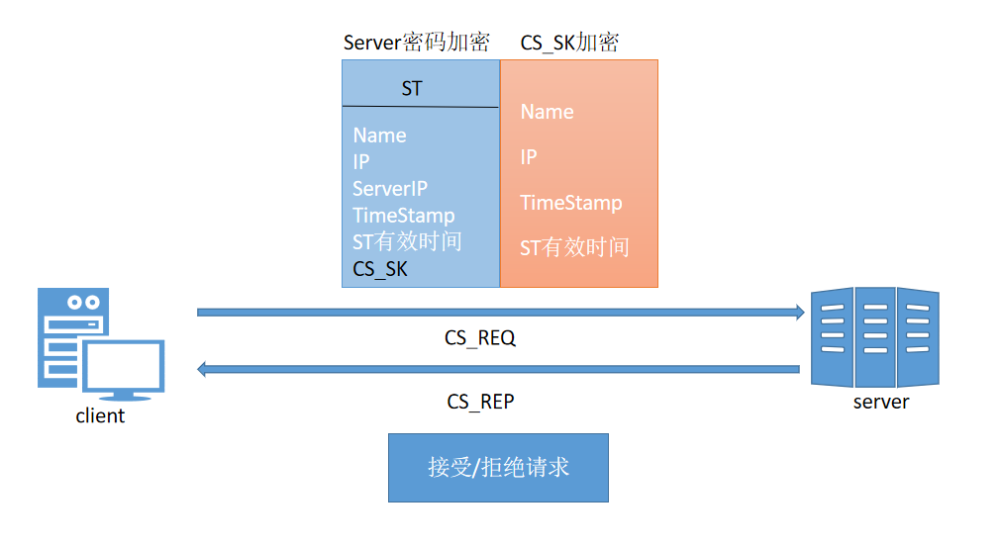

**Kerberos协议** 起源于美国麻省理工学院，基于公私钥加密体制，为分布式环境提供双向验证。Kerberos提供了一种单点登录 (Single Sign-On, SSO)的方法。不是让每个业务服务器自己实现一套认证系统，而是提供一个中心认证服务器(Authentication Server, AS)供这些服务器使用。Kerberos协议是一个基于票据(Ticket)的系统。

**三个角色**
* 客户端（client）：发送请求的一方。
* 服务端（Server）：接收请求的一方，业务服务器。
* 密钥分发中心（Key Distribution Center，KDC）。

**密钥分发中心** 
* AS（Authentication Server）：认证服务器，专门用来认证客户端的身份并发放客户用于访问TGS的TGT（票据授予票据）。
* TGS（Ticket Granting Ticket）：票据授予服务器，用来发放整个认证过程以及客户端访问服务端时所需的服务授予票据（Ticket）。

**认证过程**

`第一次通信`
1. KDC的AS认证客户端身份，确认客户端是一个可靠且拥有访问KDC权限的客户端。
2. 客户端用户向KDC以明文的方式发起请求（包含自己的用户名，主机IP，和当前时间戳）。AS接收到请求后，从数据库中查询该用户是否存在，如果不存在，认证失败；如果存在，返回两部分内容：
    * TGT（票据授予票据），客户端需要使用TGT去KDC中的TGS（票据授予中心）获取访问网络服务所需的Ticket（服务授予票据）。TGT包含本轮认证的Session_key(CT_SK)、时间戳，TGT使用TGS密钥加密，客户端是解密不了的。
    * 客户端密钥加密的内容，包含本轮认证的Session_key(CT_SK)、时间戳，客户端用自己的密钥进行解密，验证时间戳是否5分钟以内。

`第二次通信`
1. 客户端从TGS获取用于访问业务服务器的Ticket。
2. 客户端将自己的信息用CT_SK加密、明文的Server服务、TGT发送给TGS。
3. TGS从数据库中查询Server服务是否存在，如果不存在，认证失败。TGS使用自己的密钥解密TGT、使用CT_SK解密客户端的信息，取出其中的用户信息和TGT中的用户信息进行比对，如果全部相同则认为客户端身份正确。TGS返回两部分内容给客户端：
    * Server密码加密的ST（Servre Ticket），包含CS_SK（Session Key）、时间戳。
    * CT_SK加密的内容，包含CS_SK（Session Key）、时间戳，客户端使用缓存在本地的CT_SK解密进行解密，验证时间戳。

`第三次通信`
1. 客户端将自己的信息用CS_SK加密、ST发送给server。
2. server使用自己的密钥将客户端第二部分内容进行解密，验证时间戳，使用CS_SK将客户端发来的第一部分内容进行解密，将两部分客户端信息比对，确认身份。使用CT_SK加密一部分内容发送给客户端，客户端通过缓存在本地的CS_ST解密之后也确定了服务端的身份。

