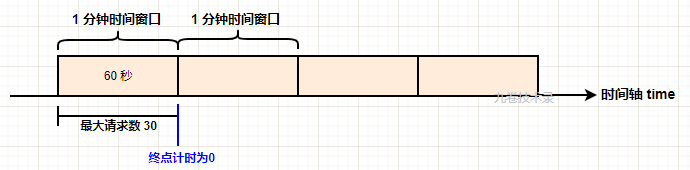
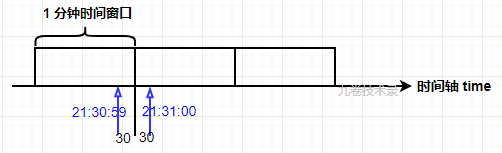
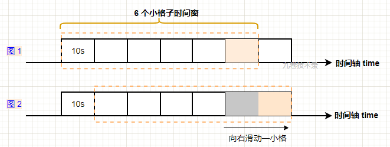
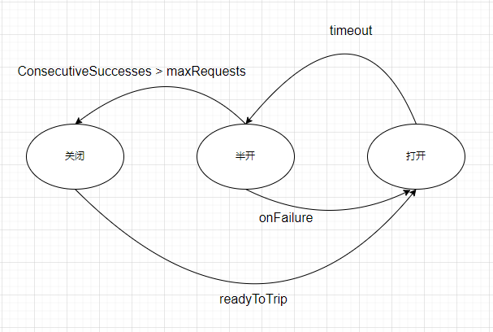

单体系统的缺陷：缺乏隔离、自治、技术异构能力，没法做到单独停止、更新、升级，需要制定专门的停机更新计划。
**SOA**，Service-Oriented Architecture，面向服务架构，过时的架构。
**微服务架构**（Microservices）
微服务是一种通过多个小型服务组合来构建单个应用的架构风格，这些服务围绕业务能力而非特定的技术标准来构建。各个服务可以采用不同的编程语言，不同的数据存储技术，运行在不同的进程之中。服务采取轻量级的通信机制和自动化的部署机制实现通信与运维。
微服务追求的是更加自由的架构风格，摒弃了几乎所有SOA里可以抛弃的约束和规定，提倡以“实践标准”代替“规范标准”。

**云原生**：DevOps+持续交付+微服务+容器。
符合原原生架构的落地应用体系是采用k8s+docker进行容器化部署，基于微服务架构开发前后端完全分离的应用，提高灵活性和可维护性，借助敏捷迭代方法支持功能持续迭代完善的对方工具，支持上线发布自动化利用云平台设施实现弹性伸缩，动态调整，最优化资源利用率，这样的架构共建应用简便快捷，部署应用轻松自如，运行应用5G流量分布秒杀传统的为应用架构，吊打以往的IT建设模式，是整个互联网技术发展到今日的集大成体系。

边车代理模式：由系统自动在服务容器（通常是指 Kubernetes 的 Pod）中注入一个通信代理服务器，这个代理除了实现正常的服务间通信外，还接收来自控制器的指令（熔断、认证、度量、监控、负载均衡等）
RESTful 资源表征状态转移，面向资源来抽象问题。降低的服务接口的学习成本，资源天然具有集合与层次结构(GET /users/icyfenix/cart/2),绑定于 HTTP 协议，使用HTTP的方法和状态码。

**信息密度**：二进制>yaml>json>xml

RPC的三个问题：表示数据、传递数据、表示方法。
REST：面向资源编程，资源表征状态转移。
REST 与 RPC 作为主流的两种远程调用方式，应用场景上是有区别的。REST用在C/S，RPC用在服务间调用。

事务的概念虽然最初起源于数据库系统，但不局限于数据库。
本地事务：单个应用使用单个数据源：ACID，超卖用lock in share mode
全局事务：单个事务使用多个数据源：XA，二阶段提交（2 Phase Commit，2PC，准备阶段，提交阶段，存在单点问题、性能问题、一致性风险）
共享事务：多个不同的服务共用同一个数据源
分布式事务：多个服务同时访问多个数据源，CAP，可靠消息队列，靠着持续重试来保证可靠性

**CAP** 定理（Consistency、Availability、Partition Tolerance Theorem）
一致性 代表数据在任何时刻、任何分布式节点中所看到的都是符合预期的。
可用性 代表系统不间断地提供服务的能力，理解可用性要先理解与其密切相关两个指标：可靠性（Reliability）和可维护性（Serviceability）。
分区容忍性 代表分布式环境中部分节点因网络原因而彼此失联后，即与其他节点形成“网络分区”时，系统仍能正确地提供服务的能力。
理解 CAP 理论的最简单方式是想象两个节点分处分区两侧。允许至少一个节点更新状态会导致数据不一致，即丧失了 C 性质。如果为了保证数据一致性，将分区一侧的节点设置为不可用，那么又丧失了 A 性质。除非两个节点可以互相通信，才能既保证 C 又保证 A，这又会导致丧失P性质。一般来说跨区域的系统，设计师无法舍弃P性质，那么就只能在数据一致性和可用性上做一个艰难选择。

如果放弃分区容忍性（CA without P），意味着我们将假设节点之间通信永远是可靠的。永远可靠的通信在分布式系统中必定不成立的。
如果放弃可用性（CP without A），意味着我们将假设一旦网络发生分区，节点之间的信息同步时间可以无限制地延长，可以通过 2PC/3PC 等手段同时获得分区容忍性和一致性。银行、证券这些涉及金钱交易的服务，宁可中断也不能出错。
如果放弃一致性（AP without C），意味着我们将假设一旦发生分区，节点之间所提供的数据可能不一致。选择放弃一致性的 AP 系统目前是设计分布式系统的主流选择。大多数 NoSQL 库（redis等）和支持分布式的缓存框架。

**BASE可靠事件队列**：用户账号扣款、商家账号收款、库存商品例子，消息队列服务器将在每次轮询的时候持续地向未响应的服务重复发送消息，所有被消息服务器发送的消息都必须具备幂等性，通常的设计是让消息带上一个唯一的事务 ID，以保证一个事务中的出库、收款动作会且只会被处理一次。最大努力交付，不支持回滚，缺乏隔离性。

**TCC**事务：Try-Confirm-Cancel
Try：尝试执行阶段，完成所有业务可执行性的检查（保障一致性），冻结并暂存全部需用到的业务资源（保障隔离性）。
Confirm：最大努力交付确认执行，不进行任何业务检查，直接使用 Try 阶段准备的资源来完成业务处理，解冻资源。Confirm 阶段采用最大努力交付，可能会重复执行，因此本阶段所执行的操作需要具备幂等性。
Cancel：取消try的操作，解冻 Try 阶段预留的业务资源。Cancel 阶段可能会重复执行，也需要满足幂等性。
TCC 其实有点类似 2PC 的准备阶段和提交阶段，但 TCC 是位于用户代码层面，而不是在基础设施层面。TCC 事务具有较强的隔离性，避免了“超售”的问题。
局限：业务侵入性很强，如果用户、商家的账号余额由银行管理，也就无法完成冻结款项、解冻、扣减这样的操作。

**SAGA**事务：大事务拆分若干个原子事务，为每一个子事务设计对应的补偿动作，Ti与 Ci都具备幂等性。Ti与 Ci满足交换律（Commutative），即先执行 Ti还是先执行 Ci，其效果都是一样的。Ci必须能成功提交。如果 T1到 Tn均成功提交，那事务顺利完成，否则采用正向恢复（最大努力交付）或反向恢复（补偿机制）


四层负载均衡的优势是性能高，七层负载均衡的优势是功能强。

引入缓存的理由：
为缓解 CPU 压力而做缓存：把方法运行结果存储起来、把原本要实时计算的内容提前算好等
缓解 I/O 压力而做缓存：譬如把原本对网络、磁盘等较慢介质的读写访问变为对内存等较快介质的访问，将原本对单点部件（如数据库）的读写访问变为到可扩缩部件（如缓存中间件）的访问等。
是典型以空间换时间来提升性能的手段。


**摘要**也称之为数字摘要（Digital Digest）或数字指纹（Digital Fingerprint）。
加密与摘要的本质区别在于加密是可逆的，逆过程就是解密。


分布式共识算法用于实现CAP

状态转移：以同步为代表的数据复制方法
让分布式系统内部暂时容忍存在不同的状态，但最终能够保证大多数节点的状态达成一致，让分布式系统在外部看来始终表现出整体一致的结果。

Quorum 机制，少数节点服从多数节点。比如一份数据在5台设备上有冗余，Quorum算法可以让写操作只要写完3台就返回。剩下的由系统内部缓慢同步完成。而读操作，则需要也至少读3台，才能保证至少可以读到一个最新的数据。

**paxos**是一种协商共识算法
Paxos 算法将分布式系统中的节点分为三类：
提案节点：称为 Proposer，提出对某个值进行设置操作的节点，设置值这个行为就被称之为提案（Proposal），值一旦设置成功，就是不会丢失也不可变的。
决策节点：称为 Acceptor，是应答提案的节点，决定该提案是否可被投票、是否可被批准。
记录节点：被称为 Learner，不参与提案，也不参与决策，只是单纯地从提案、决策节点中学习已经达成共识的提案。
分布式环境中的锁必须是可抢占的。
示例 S1、S2、S3、S4、S5节点，引入随机超时时间来避免活锁的产生。

Multi Paxos 即Raft算法 对 Basic Paxos 的核心改进是增加了“选主”的过程（自动选主），这时候的二元组(id, value)已经变成了三元组(id, i, value)，这是因为需要给主节点增加一个“任期编号”。
主节点将 X 写入自己的变更日志，但先不提交，接着把变更 X 的信息在下一次心跳包中广播给所有的从节点，并要求从节点回复确认收到的消息，从节点收到信息后，将操作写入自己的变更日志，然后给主节点发送确认签收的消息，主节点收到过半数的签收消息后，提交自己的变更、应答客户端并且给从节点广播可以提交的消息，从节点收到提交消息后提交自己的变更，数据在节点间的复制宣告完成。
通过随机超时来实现无活锁的选主过程，通过主节点来发起写操作，通过心跳来检测存活性，通过Quorum机制来保证一致性。

**Gossip** 协议：比特币网络中使用到了 Gossip 协议，用它来在各个分布式节点中互相同步区块头和区块体的信息
1 如果有某一项信息需要在整个网络中所有节点中传播，那从信息源开始，选择一个固定的传播周期（譬如 1 秒），随机选择它相连接的 k 个节点（称为 Fan-Out）来传播消息。
2 每一个节点收到消息后，如果这个消息是它之前没有收到过的，将在下一个周期内，选择除了发送消息给它的那个节点外的其他相邻 k 个节点发送相同的消息，直到最终网络中所有节点都收到了消息，尽管这个过程需要一定时间，但是理论上最终网络的所有节点都会拥有相同的消息。

服务注册（添加到列表）、维护（将无效的 服务剔除列表）、发现（消费者从列表中找到精确接口地址）、负载均衡、流量管控
服务发现注册中心：1 在分布式 K/V 存储框架上自己开发的服务发现，这类的代表是 ZooKeeper、Doozerd、Etcd 2 专门用于服务发现的框架和工具，这类的代表是 Eureka、Consul 和 Nacos2 
网关 = 路由器（基础职能） + 过滤器（可选职能）+ 负载均衡 + 反向代理

容错设计模式：
断路器模式（熔断）

流量控制
每秒事务数（Transactions per Second，TPS）每秒请求数（Hits per Second，HPS）每秒查询数（Queries per Second，QPS）
限流设计模式：滑动时间窗模式、漏桶模式、令牌桶模式。

**RPC**
客户端->请求数据序列化->网络->请求数据反序列化->服务器函数调用->响应数据序列化->网络->响应数据反序列化->服务器端

Kubernetes Master → kubelet → KubeGenericRuntimeManager → DockerShim → Docker Engine → containerd → runC
Kubernetes Master → kubelet → KubeGenericRuntimeManager → containerd → runC

分布式锁实现方式：
mysql: 创建一张锁表，添加锁：insert into methodLock(method_name,cust_id) values (‘method_name’,‘cust_id’)；释放锁：delete from methodLock where method_name ='method_name' and cust_id = 'cust_id' 重入锁判断：select 1 from methodLock where method_name ='method_name' and cust_id = 'cust_id'
设置一个定时处理, 定期清理过期锁

IaaS：基础架构即服务。
PaaS：平台即服务，主要面向开发人员，它允许用户开发、运行和管理自己的应用，而无需构建和维护通常与该流程相关联的基础架构或平台。
SaaS：软件即服务。
**限流算法**
计数器：
设置最大请求数 MaxRequest = 30，窗口时间 WindowTime = 60 秒，还有一个计时开始时间 BeginTime , 请求计数 Counter。
```
const (
	MAXREQUEST = 10              // 限制最大请求数
	WINDOWTIME = 3 * time.Second // 最大窗口时间
)

type limit struct {
	beginTime time.Time
	counter   int
	mu        sync.Mutex
}
```

计数器的临界点问题

滑动时间窗口：
部分解决了计数器算法（固定时间窗口算法）“时间临界点” 的问题。
把大时间窗口等分成小窗口，每次前移小窗口，小窗口有自己的计数器、时间点，比较小窗口内请求数：(大时间窗口内规定最大请求数 / N个小窗口) > 小窗口内总请求数。
```
const (
	MAXREQUEST = 10              // 限制最大请求数
	WINDOWTIME = 3 * time.Second // 最大窗口时间
)

type SlidingWindow struct {
	smallWindowTime int64         // 小窗口时间大小
	smallWindowNum  int64         // 小窗口总数
	smallWindowCap  int           // 小窗口请求容量
	counters        map[int64]int // 小窗口计数器
	mu              sync.Mutex    // 锁
}
```

漏桶算法：
人为设定请求处理速率。[参照uber的实现](https://github.com/uber-go/ratelimit)。可以控制请求处理的速率，不能控制请求接受的速率。
```
type mutexLimiter struct {
	sync.Mutex
	last       time.Time     // 上一个请求的时间
	sleepFor   time.Duration // 当前请求休眠时间（人为限制请求处理速率）
	perRequest time.Duration // 每一个请求消耗的时间
	maxSlack   time.Duration // 每一个请求的最大浮动时间：-(perRequest/10)
	clock      Clock
}
```
令牌桶算法：
对请求接受和请求处理的速率都能控制。
```
golang.org/x/time/rate

Wait/WaitN
Allow/AllowN

```
**断路器算法**
三个状态之间的转换：关闭 半开 全开

```
const (
	StateClosed State = iota
	StateHalfOpen
	StateOpen
)

type Counts struct {
	Requests             uint32 // 请求总数
	TotalSuccesses       uint32 // 累计成功
	TotalFailures        uint32 // 累计失败
	ConsecutiveSuccesses uint32 // 连续成功
	ConsecutiveFailures  uint32 // 连续失败
}

type Settings struct {
	Name          string
	MaxRequests   uint32                   // 半开状态下允许通过的最大请求数
	Interval      time.Duration            // 闭合状态下清理计数器的时间间隔；闭合状态下如果间隔<=0计数器不清零
	Timeout       time.Duration            // 开放->半开 的耗时
	ReadyToTrip   func(counts Counts) bool // 断路器打开策略。闭合状态下，请求失败一次它就会调用，如果返回true，就会变成打开状态，如果是nil会调用默认的，它的定义是连续失败5次，返回true。
	OnStateChange func(name string, from State, to State)
	IsSuccessful  func(err error) bool
}

// CircuitBreaker is a state machine to prevent sending requests that are likely to fail.
type CircuitBreaker struct {
	name          string
	maxRequests   uint32
	interval      time.Duration
	timeout       time.Duration
	readyToTrip   func(counts Counts) bool
	isSuccessful  func(err error) bool
	onStateChange func(name string, from State, to State)

	mutex      sync.Mutex
	state      State
	generation uint64 // 第几代
	counts     Counts
	expiry     time.Time // 过期的时间
}
```
**自适应限流**
令牌桶限流、断路器都需要提前配置参数，而能够准确的配置参数是比较难的。自适应限流就是自动根据系统能够承载的最大吞吐量，来进行限流。

**服务降级**


当服务器资源不足、不重要的服务失败或异常后，返回指定的默认信息，针对一些不重要的模块，是系统层面的。

