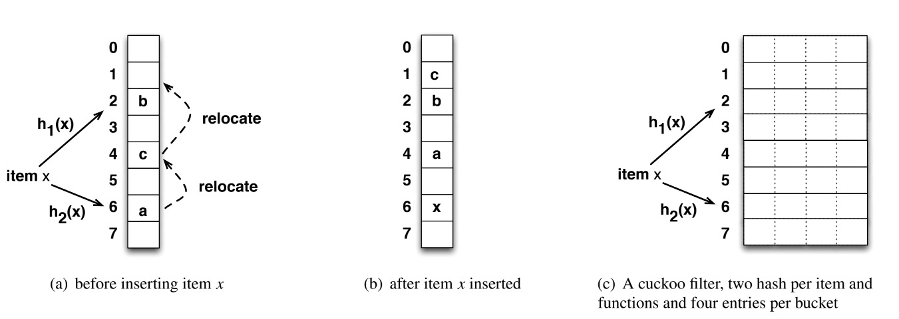
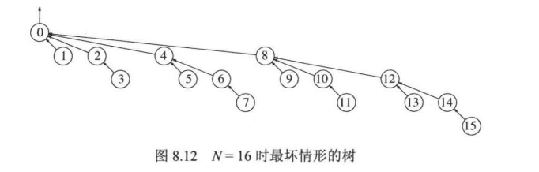

**指数**

**对数**
在计算机科学中，除非特别声明，所有的对数都是以2为底的。
对数公式证明思路：将对数转化成指数，再证明指数相等。


指数增长很快，对数增长很慢。
**级数**


**取模**
mod运算，即求余运算，得到的是一个数除以另一个数的余数。

**递归**
基本法则：
1. 基准情形。必须总要有某些基准的情形，它们不用递归就能求解。
2. 要有进展。递归调用必须总能够朝着一个基准情形进展。
3. 设计法则。假设所有的递归调用都能运行。
4. 合成效益法则。切勿在不同的递归调用中做重复性的工作。

递归转循环的思路：找到基准情形、进展、计算的代码，在循环中复刻。
**时间复杂度**
平均时间复杂度、最坏时间复杂度


求一串数字的连续最大和：
```
func alg(a []int) int {
	var max int
	var tmp int
	for i := 0; i < len(a); i++ {
		tmp += a[i]
		if max < tmp {
			max = tmp
		} else if tmp < 0 {
			tmp = 0
		}
	}
	return max
}
```
**栈**
列表数据结构：
`[]any`
链表数据结构：
```
type Node struct {
	Val  any
	Next *Node
}
type Stack struct {
	top    *Node
	length int
}
```
**队列**
列表数据结构：
`[]any`
链表数据结构：
```
type Node struct {
	Data any
	Next *Node
}
type Queue struct {
	head   *Node
	tail   *Node
	length int
}
```
**集合**
数据结构：`map[any]bool`
**树**
树的深度：根节点到当前节点的路径长度。
树的高度：当前节点到叶子节点的最大路径长度。
**二叉树**
数据结构：
```
type BNode struct {
	Value int
	Left  *BNode
	Right *BNode
}
```
先序遍历、中序遍历、后序遍历、层次遍历。先序、中序、后序其实指的是父节点被访问的次序。若在遍历过程中，父节点先于它的子节点被访问，就是先序遍历；父节点被访问的次序位于左右子节点之间，就是中序遍历；访问完左右子节点之后再访问父节点，就是后序遍历。不论是先序遍历、中序遍历还是后序遍历，总是先访问左子节点，再访问右子节点。而层次遍历，就是按照从上到下、从左向右的顺序访问二叉树的每个节点，存储结构为数组时使用。
**二叉查找树**
bst，对于树中每个节点X，它的左子树中所有项的值均小于X中的项，而它的右子树中所有项的值均大于X中的项。

数据结构：
```
type BSNode struct {
	key    any
	parent *BSNode
	left   *BSNode
	right  *BSNode
}
type BinarySearch struct {
	Root *BSNode
}
```
最小值为最左叶子，最大值为最右叶子。
查询和插入操作相似：自顶向下比较。
删除：删除的节点下有两个子树，用右子树中的最小元素来替换删除的节点；删除的节点只有一个子树，那么该子树直接替换被删除的节点；其它情况，直接删除节点。
中序遍历可以实现排序，时间复杂度O(N)。
平均时间复杂度O(logN)，最大时间复杂度O(N)（比如插入有序数据时，二叉树退化为链表）。
**AVL树**
平衡二叉查找树，每个节点的左子树和右子树高度最多差1。


高度 H<=1.44log(N+2)-1.328，因此查找的最坏时间复杂度为O(logN)

AVL树的查询与二叉查找树相同，插入和删除多了再平衡树的步骤。时间复杂度O(logN)。
平衡因子 ：节点的左子树高度-节点的右子树高度
右旋
情况：当前结点的平衡因子>1 && 当前结点的左子树的平衡因子>=0。
方式：左子结点变为当前结点的父结点，左子结点的右子结点变为当前结点的左子结点，右子结点保持不变。


左旋
情况：当前结点的平衡因子<-1 && 当前结点的右子树的平衡因子<=0。
方式：右子结点变为当前结点的父结点，右子结点的左子结点变为当前结点的右子结点，左子结点保持不变。


左右旋
情况：当前结点的平衡因子>1 && 当前结点的左子树的平衡因子<0。


右左旋
情况：当前结点的平衡因子<-1 && 当前结点的右子树的平衡因子>0。

**满二叉树**
一个二叉树，如果每一个层的结点数都达到最大值，则这个二叉树就是满二叉树。也就是说，如果一个二叉树的层数为K，且结点总数是(2^k) -1 ，则它就是满二叉树。
满二叉树 != 完全二叉树
**完全二叉树**
若设二叉树的深度为h，除第h层外，其它各层 (1～h-1) 的结点数都达到最大个数，第h层所有的结点都连续集中在最左边。时间复杂度为O(logN)，使用数组实现而不需要链表。
**最小堆**
又叫二叉堆，是一种完全二叉树，比二叉查找树简单，用于优先级队列。
任一节点均小于等于它的左右子节点，位于堆顶节点的值最小。


结构性质：对于数组中任一位置i（i从1开始）上的节点，其左子节点在位置2i上，右子节点在2i+1上，父节点在i/2位置上。
堆序性质：对于任一节点i，i的父节点关键字小于等于i的关键字，根节点除外（没有父节点）。
插入：上滤，将新节点放入尾部，与父节点比较并交换位置，直到根节点。


删除最小节点：下滤，将尾节点放入根节点，与子节点中的较小者比较并交换位置，直到没有子节点。


```
func (h *Heap[T]) down(parent int) {
	lessIdx := parent
	lChild, rChild := (parent<<1)+1, (parent<<1)+2
	if lChild < len(h.heaps) && h.lessFunc(h.heaps[lChild], h.heaps[lessIdx]) {
		lessIdx = lChild
	}
	if rChild < len(h.heaps) && h.lessFunc(h.heaps[rChild], h.heaps[lessIdx]) {
		lessIdx = rChild
	}
	if lessIdx == parent {
		return
	}
	h.swap(lessIdx, parent)
	h.down(lessIdx)
}
```
构建堆：从下往上、从右到左，将每个非叶子节点当作根结点，通过比较当前节点与左右子节点大小并交换，将其和其子树调整成堆。时间复杂度O(N)，是数学公式计算出来的近似值。

**红黑树**
是二叉查找树，是特化的AVL树（黑色完美平衡）。红色、黑色为节点作色，是节点的一个属性。具有如下特性：
1. 节点是红色或黑色。
2. 根节点是黑色。
3. 所有叶子都是黑色（叶子是NIL节点）。
4. 每个红色结点的两个子结点一定都是黑色。
5. 任意一结点到每个叶子结点的路径都包含数量相同的黑结点。


红黑树的查询与二叉查找树相同，插入和删除多了修复红黑树的步骤。时间复杂度O(logN)。

插入时，新的节点为红色。
情形1:新节点N位于树的根上，没有父节点。新节点置为黑色。
```
void insert_case1(node *n){
	 if(n->parent == NULL)
			 n->color = BLACK;
	 else
			 insert_case2 (n);
}
```
情形2:新节点的父节点P是黑色。不用修改。
```
void insert_case2(node *n){
	 if(n->parent->color == BLACK)
			 return; /* 树仍旧有效*/
	 else
			 insert_case3 (n);
}
```
情形3:父节点P和叔父节点U都是红色（此时新插入节点N做为P的左子节点或右子节点都属于情形3）。将它们两个重绘为黑色并重绘祖父节点G为红色，处理祖父节点。
```
void insert_case3(node *n){
	 if(uncle(n) != NULL && uncle (n)->color == RED) {
			 n->parent->color = BLACK;
			 uncle (n)->color = BLACK;
			 grandparent (n)->color = RED;
			 insert_case1(grandparent(n));
	 }
	 else
			 insert_case4 (n);
}
```


在余下的情形下，我们假定父节点P是其祖父G的左子节点。如果它是右子节点，情形4和情形5中的左和右应当对调。
情形4:父节点P是红色而叔父节点U是黑色或缺少，并且新节点N是其父节点P的右子节点而父节点P又是其父节点的左子节点。对父节点P左旋，处理父节点。
```
void insert_case4(node *n){
	 if(n == n->parent->right && n->parent == grandparent(n)->left) {
			 rotate_left(n);
			 n = n->left;
	 } else if(n == n->parent->left && n->parent == grandparent(n)->right) {
			 rotate_right(n);
			 n = n->right;
	 }
	 insert_case5 (n);
}
```
情形5:父节点P是红色而叔父节点U是黑色或缺少，新节点N是其父节点的左子节点，而父节点P又是其父节点G的左子节点。对祖父节点G右旋，处理父节点。
```
void insert_case5(node *n){
	 n->parent->color = BLACK;
	 grandparent (n)->color = RED;
	 if(n == n->parent->left && n->parent == grandparent(n)->left) {
			 rotate_right(n->parent);
	 } else {
			 /* Here, n == n->parent->right && n->parent == grandparent (n)->right */
			 rotate_left(n->parent);
	 }
}
```

删除：
如果需要删除的节点有两个儿子，那么问题可以被转化成删除另一个只有一个儿子的节点的问题。
删除一个红色节点，不用修复。
被删除节点是黑色而它的儿子是红色，将儿子变为黑色。
要删除的节点和它的儿子二者都是黑色：共有6种情形。
**B树**
为什么使用：
数据在磁盘中，因为CPU指令执行速度远高于磁盘访问，因此用复杂的指令去减少磁盘的访问次数。这与通常的数据在内存中的情况不同。M叉树的高度大约为LogmN，使用M叉树替代二叉树，以降低树的高度（查询时间复杂度）。
B树的阶：子节点最大值M。
阶为M的B树是具有如下特性的M叉平衡查找树：
非叶节点可以存储M-1个关键字。
树的根要么是树叶，要么根的子节点数目在2和M之间。
除根外，所有非叶节点的子节点数在M/2和M之间。
所有叶节点在同一层，每个叶节点的数据项个数在L/2和L之间。


插入：子节点满员会进行分裂，如果父节点也满员，会一直向上分裂。直到根节点，这时创建新的根，将分裂的两个根作为新的根节点的子节点。
删除：被删除数据所在的叶节点数据项个数小于L/2时，如果相邻节点不丰满，则相邻节点领养，如果丰满，则向父节点借一个元素。

**B+树**
B树的变种，数据只存储在叶子节点，叶子节点构成一个有序链表，能更好支持范围查找。

**散列**
散列是一种用常数平均时间执行插入、删除、查找的技术，不支持与有序相关的操作。
散列的过程：通过一个散列函数，将一个关键字换算成散列值，并将关键字对应的值存储到散列值对应的存储空间。
一个简单的散列函数：
```
func hash(key string, tableSize int) int {
	hashVal := 0
	for _, r := range key {

		hashVal += int(r)
	}
	return hashVal % tableSize
}
```

装填因子：散列表中元素的个数/散列表大小
哈希冲突：两个不同的关键字通过一个散列函数得到相同的散列值。解决方法：拉链法、探测法（比如线性探测法、平方探测法，需要保证装填因子小于0.5）。
再散列：如果散列表填的太满，需要重新散列到2倍大的表中。

**布谷鸟过滤器**
杜鹃散列的应用。
异或 XOR：不同为1，相同为0。

```
i1=hash(x)
f=fingerprint(x)
i2=i1⊕hash(f)
```
A ⊕ B ⊕ B = A，这样就不需要知道当前的位置是 i1 还是 i2，只需要将当前的位置和 hash(f) 进行异或计算就可以得到另一个位置。

特点：
查询快速，支持删除（但由于不能确定此指纹副本是要删除的key的指纹，存在误删的概率）。
插入复杂度较高，存在桶满，踢出的操作。
同一个元素最多插入kb次，（k指哈希函数的个数，b指的桶中能装指纹的个数）。
**排序**
通用排序算法的最好时间复杂度为O(NlogN)。
通过交换相邻元素进行排序的任何算法平均时间复杂度为O(N*N)。
任何基于比较的排序算法必然使用大约NlogN次比较。
稳定性：排序前后两个相等的数相对位置不变，则算法稳定。
**插入排序**
保证0到p位置上的元素为已排序，p+1逐个向前比较，移动+填充的方式。
对于几乎已经排好序的数据操作时，效率高。但插入排序一般来说是低效的，因为每次只能将数据移动一位。
稳定
**希尔排序**

也叫递减增量排序，是插入排序的升级版，通过步长序列工作。
简单的步长n/2，
已知的最好步长序列是由Sedgewick提出的(1, 5, 19, 41, 109,...)，该序列的项，从第0项开始，偶数来自 9*4^i-9*2^i+1 和奇数来自2^(i+2)*(2^(i+2)-3)+1这两个算式。最坏时间复杂度O(N^(4/3))
不稳定
```
func Shell[T constraints.Ordered](arr []T) []T {
   for d := int(len(arr) / 2); d > 0; d /= 2 {
      for i := d; i < len(arr); i++ {
         for j := i; j >= d && arr[j-d] > arr[j]; j -= d {
            arr[j], arr[j-d] = arr[j-d], arr[j]
         }
      }
   }
   return arr
}
```
**堆排序**
先创建堆，再执行n次deleteMin，时间复杂度O(NlogN)。堆排序是原地排序，不需要额外的空间。
不稳定
**归并排序**
是经典的分治策略，基本操作是合并两个已排序的表，将输出放入第三个表中。
分：递归地把当前序列平均分割成两半。
治：在保持元素顺序的同时将上一步得到的子序列集成到一起（归并）。
归并排序需要N的额外存储空间。
稳定
**快速排序**
也是分治策略。
基准值：从数列中挑出一个元素，作为基准值（pivot），
分割：重新排序数列，所有比基准值小的元素摆放在基准前面，所有比基准值大的元素摆在基准后面（与基准值相等的数可以到任何一边）。
递归排序子序列：递归地将小于基准值元素的子序列和大于基准值元素的子序列排序。
快速排序平均时间复杂度O(NlogN)，最坏时间复杂度O(N^2)需要logN的额外存储空间。
不稳定
**并查集**
也叫不相交集，用于处理一些没有重复元素集合的合并（union）及查询（find）问题。一般来说，“并查集”特指其中最常见的一种实现：不交集森林。
使用场景：用来处理元素连通性问题。


union：按大小求并，使较小的树成为较大的树的子树，从而完成合并。这样树的深度不会超过logN，执行M次find的时间复杂度为O(MlogN)。
find：路径压缩：在查询时，把被查询的节点到根节点的路径上的所有节点的父节点设置为根结点，从而减小树的高度。


迷宫：让出口和入口在同一个并查集中。

**图**
图由顶点和边组成。
邻接表是表示图的标准方法。


无限级分类：类似菜单这种不相交集，数据库中存储当前节点到根节点的路径（path），结构改变时只需修改path；类似角色层级的结构，数据库中存储父子节点关联表，查询时需要递归sql查询父级。
广度优先搜索：从一个起点开始到一个终点，找寻一条最短的路径，通过层序遍历的方式找到终点。
**贪婪算法**
获取多个局部最优解，并希望它等于全局最优。
**调度作业的最小平均时间**：按耗费时间由小到大执行作业。多处理器的情况：耗费时间由小到大分配。

将最后完成时间最小化，可用装箱问题处理（总时间/cpu个数 对应 1，单个cpu按耗费时间由小到大执行作业）：


**最优前缀码** 只要没有字符代码是别的字符代码的前缀就行。


**哈夫曼算法** 一棵树的权等于它树叶出现的频率的和，任意选取最小权的两棵树组成新树，再任意选取最小权的两棵树组成新树，一直重复直到得到一棵树。
解码：逐个bit移动，查找哈夫曼编码表。


**装箱问题**：首次适合递减算法。


**随机数** php中，对于安全性高的场景，用random_int替代rand和mt_rand，避免被爆破。在php-fpm的环境下，每个请求用的都是一个新的种子。
**Trie树**
又称前缀树或字典树：
* 根节点不包含字符，除根节点外每一个节点都只包含一个字符。
* 从根节点到某一节点，路径上经过的字符连接起来，为该节点对应的字符串。
* 每个节点的所有子节点包含的字符都不相同。


使用场景：搜索提示、搜索引擎系统文本词频统计、web前缀树路由（每个/表示一个节点）
查询时间复杂度O(L)，L为字符串包含的字符个数。
