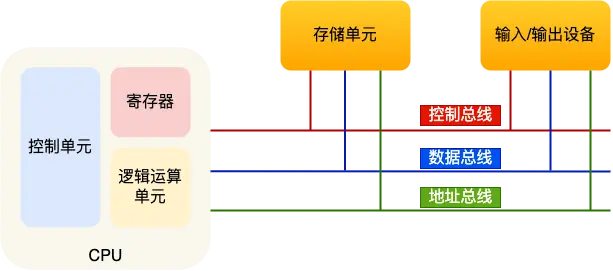
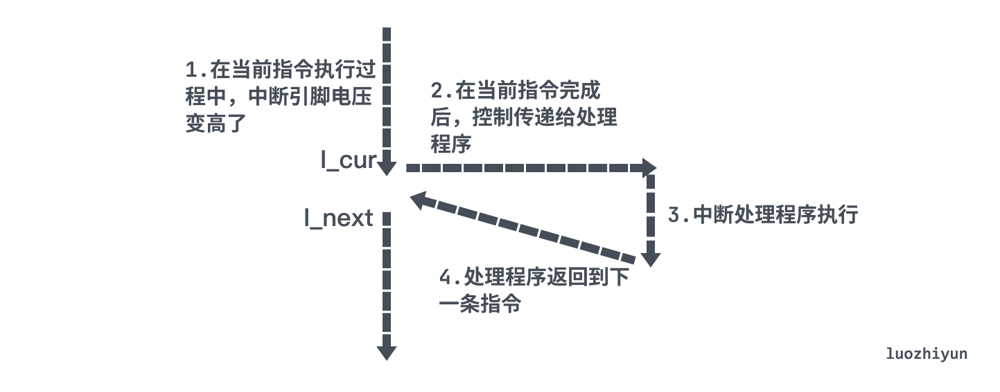
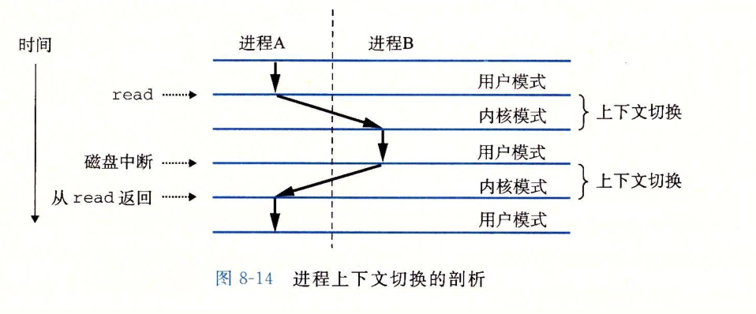

# 存储

读写速度按照离cpu由近及远和造价依次降低。
>寄存器
>1级缓存
>2级缓存
>3级缓存
>内存
>固态硬盘
>机械硬盘
>网络/网盘

内存地址从0开始编号，自增排列，最后一个地址为 内存总字节数-1。
正数的符号位是0，负数的符号位是1，负数以补码表示，把正数的二进制全部取反再加1。补码是为了运算方便。
0.1+0.2不等于0.3：IEEE规范的二进制只能精准表达2除尽的数字1/2,1/4,1/8等，其它小数无法用完整的二进制来表示，只能取近似值。
BigDecimal的解决方案就是，不使用二进制，而是使用十进制（BigInteger）+小数点位置(scale)来表示小数，100.001 = 100001 * 0.1^3

**虚拟内存**
不同的内存都有一套自己的虚拟地址，进行隔离。CPU通过内存管理单元（MMU）将虚拟内存地址转化为物理内存地址。
可以让程序突破物理内存大小限制，其最大值由32和64位决定。

**分页**
是把整个虚拟和物理内存空间切成一段段固定尺寸的大小。这样一个连续并且尺寸固定的内存空间，我们叫页（Page）。在Linux下，每一页的大小为4KB。
页与页之间是紧密排列的，所以不会有外部碎片。

LRU算法一般是用链表作为数据结构来实现的，链表头部的数据是最近使用的，而链表末尾的数据是最久没被使用的。当空间不够了，就删除链表末尾的数据。

# CPU

32 位 CPU 一次可以计算 4 个字节；
64 位 CPU 一次可以计算 8 个字节；
32和64的区别：
32位CPU的地址总线是32位，64位CPU的地址总线是48位。
64位和32位软件，实际上代表指令是64位还是32位的。
32位处理64位大小的数字，需要把64位的数字分成低位32位数字和高位32位数字，计算完后再整合成64位。

32 位系统的内核空间占用1G，位于最高处，剩下的3G是用户空间。因此最大能申请3GB大小的虚拟内存空间。
64 位系统的内核空间和用户空间都是128T，分别占据整个内存空间的最高和最低处，剩下的中间部分是未定义的。

CPU内部组件包含寄存器、控制单元、逻辑运算单元。

在Linux内核中，进程和线程都是用`task_struct`结构体表示，Linux内核调度器调度的对象就是`task_struct`。
CPU运行队列优先级，Deadline运行队列dl_rq > 实时任务运行队列rt_rq > CFS运行队列cfs_rq（红黑树，优先级值排序）

# 总线

* 地址总线，用于指定 CPU 将要操作的内存地址；每个bit都需要一条线。
* 数据总线，用于读写内存的数据。
* 控制总线，用于发送和接收信号，比如中断、设备复位等信号，CPU 收到信号后自然进行响应，这时也需要控制总线。

当 CPU 要读写内存数据的时候，一般需要通过下面这三个总线：
首先要通过「地址总线」来指定内存的地址，然后通过「控制总线」控制是读或写命令，最后通过「数据总线」来传输数据。

# 内核

内核的基本功能：
* 进程调度的能力
* 内存管理的能力
* 硬件通信能力
* 提供系统调用

让内核作为应用与硬件设备之间的桥梁

# 中断&异常&信号

中断处理程序的上部分和下半部
* 上半部直接处理硬件请求，也就是硬中断，主要是负责耗时短的工作，特点是快速执行；
* 下半部是由内核触发，也就说软中断，主要是负责上半部未完成的工作，通常都是耗时比较长的事情，特点是延迟执行；

中断和异常可以归结为一种事件处理机制，通过中断或异常发出一个信号，然后操作系统会打断当前的操作，然后根据信号找到对应的处理程序处理这个中断或异常，处理完毕之后再根据处理结果是否要返回到原程序接着往下执行。

`中断`由硬件设备生成。
`异常`是一个同步的事件，通常由程序的错误产生的，或是由内核必须处理的异常条件产生的。
`信号`是一种软件形式的异常。kill -l查看所有64种信号。Ctrl+C产生SIGINT信号，表示终止该进程。kill -9 1050 ，表示给 PID 为 1050 的进程发送 SIGKILL 信号，用来立即结束该进程。信号事件的来源主要有硬件来源（如键盘 Cltr+C ）和软件来源（如 kill 命令）。

# 进程

进程的三种基本状态：就绪状态、运行状态、阻塞状态。
进程调度算法：
先来先服务（First Come First Serve, FCFS），一直运行，直到进程退出或被阻塞。
最短作业优先（Shortest Job First, SJF），优先选择运行时间最短的进程来运行。
高响应比优先 （Highest Response Ratio Next, HRRN），优先级=(等待时间+运行时间)/运行时间，等待时间是指进程在就绪队列中等待调度的时间。
时间片轮转（Round Robin, RR），每个进程被分配一个时间片，到期后就切出。
最高优先级（Highest Priority First，HPF），先运行优先级高的，缺点可能会导致低优先级的进程永远不会运行：
非抢占式：当就绪队列中出现优先级高的进程，运行完当前进程，再选择优先级高的进程。
抢占式：当就绪队列中出现优先级高的进程，当前进程挂起，调度优先级高的进程运行。
多级反馈队列（Multilevel Feedback Queue）时间片轮转算法+最高优先级算法。
多级表示有多个队列，每个队列优先级从高到低，同时优先级越高时间片越短。
反馈表示如果有新的进程加入优先级高的队列时，立刻停止当前正在运行的进程，转而去运行优先级高的队列；

**上下文切换**

系统调用上下文切换
CPU 寄存器里原来的指令位置是在用户态。但是为了执行内核态代码，需要先把用户态的位置保存起来，然后寄存器更新为内核态指令的新位置。最后跳转到内核态运行内核任务。当系统调用结束后，CPU 寄存器需要恢复原来保存的用户态位置，然后再切换到用户空间，继续运行进程。一次系统调用会产生两次 CPU 上下文切换。
进程上下文切换
内核通过调度器（scheduler）来控制当前进程是否可以被抢占，如果被抢占那么内核会选择一个新的进程运行，将旧进程的上下文保存起来，并恢复新进程的上下文，然后将控制转交给新进程，这就是上下文切换。

上图展示的是 A 和 B 进程之间切换的示例。进程 A 初始在用户模式中，直到它通过执行系统调用 read 进入到内核，因为磁盘读取数据需要一定时间，所以内核执行进程 A 到 B 的切换。随后磁盘数据 ready 之后磁盘控制器会发出一个中断信号，表示数据已经从磁盘传送到了内存，那么内核会从内核 B 切换到 A ，并接着执行进程 A 中紧随在系统调用 read 之后的那条指令。

**匿名管道**（竖线|）：ps auxf | grep mysql

# 文件
Linux中一切皆文件，不仅普通的文件和目录，就连块设备、管道、socket等，也都是统一交给文件系统管理的。
每个文件都包含
索引节点（index node）比如 inode 编号、文件大小、访问权限、创建时间、修改时间、数据在磁盘的位置等等。索引节点是文件的唯一标识，存储在硬盘中。
目录项（directory entry），用来记录文件的名字、索引节点指针以及与其他目录项的层级关联关系，缓存在内存。目录项和索引节点的关系是多对一。
目录是个文件，持久化存储在磁盘，甚至可以通过vim打开它，而目录项是内核一个数据结构，缓存在内存。

硬链接：只有删除文件的所有硬链接以及源文件时，系统才会彻底删除该文件。硬链接是不可用于跨文件系统。
软链接：目标文件被删除了，链接文件还是在的，只不过指向的文件找不到了而已。软链接是可以跨文件系统。

DMA 直接内存访问（Direct Memory Access）在进行I/O设备和内存的数据传输的时候，数据搬运的工作全部交给DMA控制器，不经过CPU。

