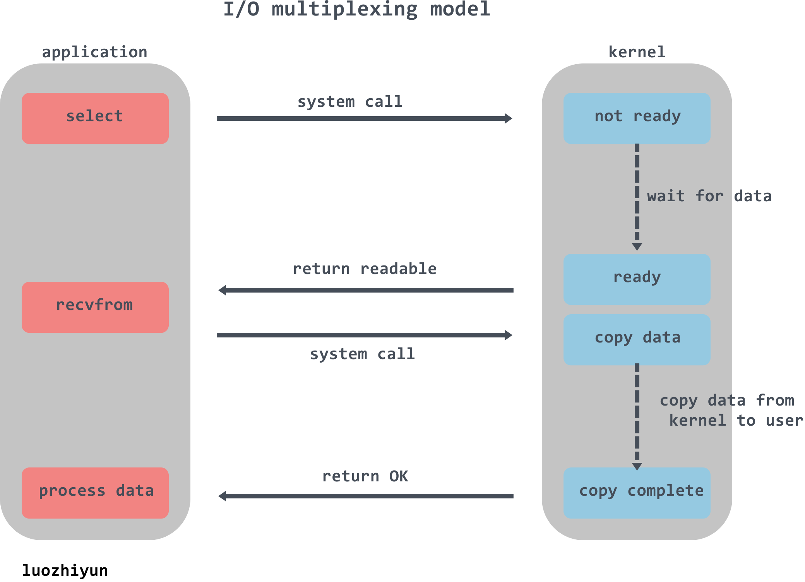

>应用层 http https smpt ftp ssh telnet | ntp(网络时间同步) dhcp(动态配置IP地址) | dns
>传输层 tcp udp
>网络层 ip数据报
>链路层 传输ip数据报组装成的帧，在两个相邻节点的链路上传输帧，mac地址
>物理层 传输bit字节

`upd`的特点：无连接的，发送数据之前不需要建立连接，减少开销和发送数据之前的延时，支持一对一、一对多、多对一和多对多的交互通信，使用最大努力交付，不保证可靠交互，没有拥塞控制，网络出现的拥塞不会使源主机的发送速率降低，首部开销小，只有8个字节，比 TCP 的20个字节的首部要短。
`tcp`的特点：有连接的，发送数据之前需要建立连接，数据发送完后需要释放连接，只支持一对一的通信，提供可靠交互（无差错、不丢失、不重复，并且按序到达），全双工通信，允许通信双方的应用进程在任何时候都能发送数据。

tcp三次握手：服务器listen状态->客户端发送syn报文，syn_send状态->服务器接收报文，发送syn+ack报文，syn_recv状态->客户端接收报文，发送ack报文，established状态->服务器接收报文，established状态。
为什么三次握手：双方确认自己与对方的发送与接收是正常的。

tcp四次挥手：客户端established，服务器端established->客户端发送fin报文，并停止发送数据，fin_wait1状态->服务器接收报文，发送ack报文，close_wait状态->客户端接收报文，fin_wait2状态->服务器也没有数据需要发送后，发送fin+ack报文，lask_ack状态->客户端接收报文，发送ack报文，time_wait状态,超时后进入closed状态->服务器接受报文，closed状态
为什么四次挥手：tcp的半关闭特性决定的，即连接的一端发送完数据之后，还能接受另一端的数据的能力。
TIME-WAIT是什么，为什么必须等待 2MLS(最大数据段生命周期，默认2分钟):
* 防止延迟的数据段被其他使用相同源地址、源端口、目的地址以及目的端口的 TCP 连接收到。
* 保证 TCP 连接的远程被正确关闭，即等待被动关闭连接的一方收到`FIN`对应的`ACK`消息。

建立套接字的步骤：创建socket，绑定socket到指定ip和端口，开始监听连接，接受客户端数据，关闭socket。

HTTP报文是纯文本字符串，不是二进制代码
|  编码   |  文本   | 说明   |
| --- | --- | --- |
|301|Moved Permanently|在请求的链接被移除时使用|
|302|Found|在请求临时的链接使用
|400|Bad Request|告知客户端发送了错误请求
|403|Forbidden|请求被服务器拒绝
|404|Not Found|无法找到所请求的 URL
|413|Request entiry too large|请求实体过大
|500|Internal Server Error|服务器遇到错误
|502|Bad Gateway|代理或网关错误(无法连接到其父网关) php-fpm 没有可用的worker进程（worker进程不够用了）
|503|Service Unavailable|无法为请求提供服务
|504|Gateway Timeout|代理或网关超时(等待另一服务器响应超时) worker进程响应超时（php代码执行超时）

心跳机制：定时发送一个自定义的数据包，以确认双发是否保持连接。

Websocket:Websocket与HTTP(80)和HTTPS(443)使用相同的TCP端口。服务器可以随时主动给客户端下发数据。WebSocket 是独立的、建立在TCP上的协议。Websocket 通过 HTTP/1.1 协议的101状态码进行握手。

HTTP1.x和HTTP2的区别：
新的二进制格式（Binary Format），HTTP1.x的解析是基于文本。基于文本协议的格式解析存在天然缺陷，文本的表现形式有多样性，要做到健壮性考虑的场景必然很多，二进制则不同，只认0和1的组合。基于这种考虑HTTP2.0的协议解析决定采用二进制格式，实现方便且健壮。
多路复用（MultiPlexing），即连接共享，即每一个request都是是用作连接共享机制的。一个request对应一个id，这样一个连接上可以有多个request，每个连接的request可以随机的混杂在一起，接收方可以根据request的 id将request再归属到各自不同的服务端请求里面。
header压缩，如上文中所言，对前面提到过HTTP1.x的header带有大量信息，而且每次都要重复发送，HTTP2.0使用encoder来减少需要传输的header大小，通讯双方各自cache一份header fields表，既避免了重复header的传输，又减小了需要传输的大小。
服务端推送（server push），同SPDY一样，HTTP2.0也具有server push功能，服务器可以对一个客户端请求发送多个响应。
HTTP2.0的多路复用和HTTP1.X中的长连接复用有什么区别？

HTTP/1.* 一次请求-响应，建立一个连接，用完关闭；每一个请求都要建立一个连接；
HTTP/1.1 Pipeling解决方式为，若干个请求排队串行化单线程处理，后面的请求等待前面请求的返回才能获得执行机会，一旦有某请求超时等，后续请求只能被阻塞，毫无办法，也就是人们常说的线头阻塞；
HTTP/2多个请求可同时在一个连接上并行执行。某个请求任务耗时严重，不会影响到其它连接的正常执行；
*****
同步是需要主动等待消息通知，而异步则是被动接收消息通知，通过回调、通知、状态等方式来被动获取消息。
阻塞：程序会一直等待。非阻塞：程序轮询等待。
现代操作系统都是采用虚拟存储器，对32位操作系统而言，它的寻址空间为4G。为了保证用户进程不能直接操作内核，操作系统将虚拟空间划分为两部分，一部分为内核空间，一部分为用户空间。针对linux操作系统而言，将最高的1G字节，供内核使用，称为内核空间，而将较低的3G字节，供各个进程使用，称为用户空间。
为了控制进程的执行，内核必须有能力挂起正在CPU上运行的进程，并恢复以前挂起的某个进程的执行。这种行为被称为进程切换。当进程进入阻塞状态，是不占用CPU资源的。
网络IO的本质是socket的读取，IO的数据会先被拷贝到操作系统内核的缓冲区中，然后才会从操作系统内核的缓冲区拷贝到应用程序的地址空间。
1 等待网络数据到达网卡并读取到内核缓冲区，数据准备好。
2 从内核缓冲区复制数据到进程空间。
文件描述符（File descriptor），FD，是一个指向文件的引用，是一个索引值。当程序打开一个现有文件或者创建一个新文件时，内核向进程返回一个文件描述符。
fd=io=连接
*****

链表、数组区别：数组查询快，插入删除慢很多，长度固定，顺序存储，链表插入删除快，查询线性时间慢，长度动态灵活，随机存储。相同数量的元素，链表更耗内存（存储了前后指针）

在一个线程中，同步阻塞只能等待一个连接，I/O 复用可以等待多个连接（kernel监控），用于海量并发连接且大量连接idle的场景。

select缺点：性能开销大，文件描述符数量少。
epoll是一种I/O事件通知机制，内部存储：
监听列表：所有要监听的文件描述符，使用红黑树；
就绪列表：所有就绪的文件描述符，使用链表；
select和poll都只提供了一个函数——select或者poll函数。而epoll提供了三个函数，epoll_create,epoll_ctl和epoll_wait，epoll_create是创建一个epoll句柄；epoll_ctl是在epoll上注册fd要监听的事件类型；epoll_wait则是等待事件的产生。
I/O Multiplexing首先向kernel发起system call，传入file descriptor和感兴趣的事件(readable、writable等)让kernel监测，当其中一个或多个fd数据就绪，就会返回结果。程序再发起真正的I/O操作recvfrom读取数据，或者write()。
在一个线程中对N个套接字进行事件捕获，当读写事件产生后再真正read()或者write()
epoll的连接上限是最大可以打开文件的数目。
*****

系统用一个4四元组来唯一标识一个TCP连接：{local ip, local port,remote ip,remote port}。
client最大tcp连接数：tcp端口的数据类型是unsigned short，因此本地端口个数最大只有65536，端口0有特殊含义，不能使用，这样可用端口最多只有65535。
server最大tcp连接数：理论上是客户端ip数×客户端port数，在unix/linux下限制连接数的主要因素是内存和允许的文件描述符个数。
服务器端最多可以拥有65535个Bind的Socket，最多可以开65535个服务器进程，但是你要知道这个能够连接客户端的数量没有任何关系。
*****
经典模式：
A类:1.0.0.0~126.255.255.255,默认子网掩码/8,即255.0.0.0，一个子网最多容纳1677万多个ip
(其中127.0.0.0~127.255.255.255为环回地址,用于本地环回测试等用途)
B类:128.0.0.0~191.255.255.255,默认子网掩码/16,即255.255.0.0，一个子网最多容纳65534个ip
C类:192.0.0.0~223.255.255.255,默认子网掩码/24,即255.255.255.0，一个子网最多容纳254个ip
要想在同一网段，必需做到网络标识一样。

CIDR划分法比较灵活，不再区分A~E类，并且随意使用子网掩码，因此，可以把IP段尽量划分的小一些，每个CIDR段分配给一个单位。

IP地址组成为：网络号+子网号+主机号。
网络号是在广域网中的集合标识，子网号是在网络号中的集合标识。实际场景中，单个网络支持的机器数目有限，对于a类和b类网络号会造成ip浪费。因此在网络号之下增加一层子网号。
为了使目的主机所在网路的路由器能够很方便的找到目的子网，引入子网掩码的概念。
子网掩码的高24位为全1，等价于 11111111.11111111.11111111.00000000，即255.255.255.0。

私有地址(private address)也叫专用地址，它们不会在全球使用，只具有本地意义：
A类私有地址：10.0.0.0/8，范围是：10.0.0.0~10.255.255.255
B类私有地址：172.16.0.0/12，范围是：172.16.0.0~172.31.255.255
C类私有地址：192.168.0.0/16，范围是：192.168.0.0~192.168.255.255