>应用层 http https smpt(邮件传输协议) ftp ssh telnet | ntp(网络时间同步) dhcp(动态配置IP地址) dns
>传输层 tcp udp
>网络层 ip icmp
>链路层 arp 传输ip数据报组装成的帧，在两个相邻节点的链路上传输帧，mac地址
>物理层 传输bit字节

# HTTP
MIME类型：http所传输的资源的类型。
示例：
* text/html HTML格式的文本文档
* text/plain 普通的 ASCII 文本文档
* image/jpeg 图片
* application/json json格式的数据

URL 
`<scheme>://<user>:<password>@<host>:<port>/<path>`
URL 最重要的 3 个部分是方案（scheme）、主机（host）和路径（path）。
scheme方案：访问资源所使用的协议类型。
服务器地址
资源路径
URL不是HTTP协议所独有的。
URL使用ascii编码，对于其它字符编码和特殊字符会转义。

HTTP 报文包括3个部分：
起始行
首部字段（header）
主体（body）

基本的HTTP连接处理：
(a) 浏览器从 URL 中解析出服务器的主机名；
(b) 浏览器将服务器的主机名转换成服务器的 IP 地址；
(c) 浏览器将端口号（如果有的话）从 URL 中解析出来；
(d) 浏览器建立一条与 Web 服务器的 TCP 连接；
(e) 浏览器向服务器发送一条 HTTP 请求报文；
(f) 服务器向浏览器回送一条 HTTP 响应报文；
(g) 关闭连接，浏览器显示文档。

HTTP 报文包括3个部分：
起始行
首部字段（header）
主体（body）
请求报文的格式：
```
<method> <request-URL> <version>
<headers>
<entity-body>
```
响应报文的格式：
```
<version> <status> <reason-phrase>
<headers>
<entity-body>
```

HEAD方法与GET方法的行为很类似，但服务器在响应中只返回首部。不会返回实体的主体部分。
OPTIONS 方法请求 Web 服务器告知其支持的各种功能。不会访问服务器实际资源。

跨源资源共享（CORS）是一种基于HTTP头的机制，允许服务器标示其它源（域、协议和端口），解决XMLHttpRequest和Fetch API遵循同源策略的问题。
首次交互是预检请求/响应：
```
OPTIONS /doc HTTP/1.1
Host: bar.other
User-Agent: Mozilla/5.0 (Macintosh; Intel Mac OS X 10.14; rv:71.0) Gecko/20100101 Firefox/71.0
Accept: text/html,application/xhtml+xml,application/xml;q=0.9,*/*;q=0.8
Accept-Language: en-us,en;q=0.5
Accept-Encoding: gzip,deflate
Connection: keep-alive
Origin: https://foo.example
Access-Control-Request-Method: POST
Access-Control-Request-Headers: X-PINGOTHER, Content-Type

HTTP/1.1 204 No Content
Date: Mon, 01 Dec 2008 01:15:39 GMT
Server: Apache/2
Access-Control-Allow-Origin: https://foo.example
Access-Control-Allow-Methods: POST, GET, OPTIONS
Access-Control-Allow-Headers: X-PINGOTHER, Content-Type
Access-Control-Max-Age: 86400
Vary: Accept-Encoding, Origin
Keep-Alive: timeout=2, max=100
Connection: Keep-Alive
```

Origin 表示需要跨域的源，Access-Control-Max-Age表示预检请求有效期。

预检请求完成之后，发送实际请求：
```
GET /resources/credentialed-content/ HTTP/1.1
Host: bar.other
User-Agent: Mozilla/5.0 (Macintosh; Intel Mac OS X 10.14; rv:71.0) Gecko/20100101 Firefox/71.0
Accept: text/html,application/xhtml+xml,application/xml;q=0.9,*/*;q=0.8
Accept-Language: en-us,en;q=0.5
Accept-Encoding: gzip,deflate
Connection: keep-alive
Referer: https://foo.example/examples/credential.html
Origin: https://foo.example
Cookie: pageAccess=2

HTTP/1.1 200 OK
Date: Mon, 01 Dec 2008 01:34:52 GMT
Server: Apache/2
Access-Control-Allow-Origin: https://foo.example
Access-Control-Allow-Credentials: true
Cache-Control: no-cache
Pragma: no-cache
Set-Cookie: pageAccess=3; expires=Wed, 31-Dec-2008 01:34:53 GMT
Vary: Accept-Encoding, Origin
Content-Encoding: gzip
Content-Length: 106
Keep-Alive: timeout=2, max=100
Connection: Keep-Alive
Content-Type: text/plain
```

Access-Control-Allow-Credentials true 表示支持cookie等身份凭证信息。

重定向的关键：302 Location
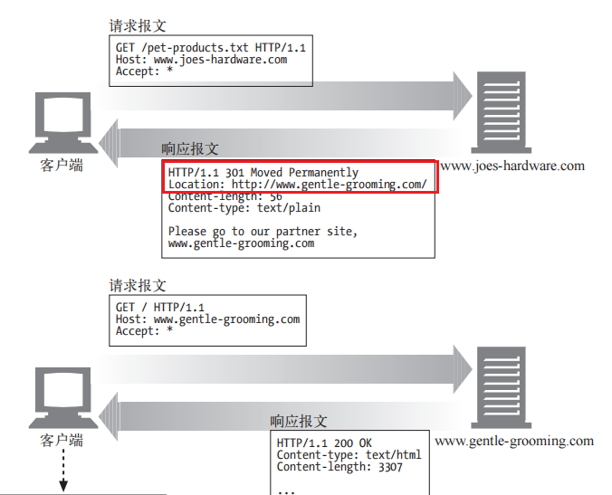


CGI（Common Gateway Interface）通用网关接口

cookie通常由服务器创建。


**对称加密**：加密和解密都是使用同一个密钥，常见的对称加密算法有DES、3DES和AES。
优点：计算量小、加密效率高，适合加密比较大的数据。
缺点：密钥在传输过程中无法保证不被截获。

**非对称加密**，加密和解密需要使用两个不同的密钥：公钥（public key）和私钥（private key）。公钥与私钥是一对，如果用公钥对数据进行加密，只有用对应的私钥才能解密；如果用私钥对数据进行加密，那么只有用对应的公钥才能解密。常用的非对称加密算法是 RSA 算法。
优点：加密和解密使用不同的钥匙，私钥不需要通过网络进行传输，安全性很高。
缺点：计算量比较大，加密和解密速度相比对称加密慢很多。

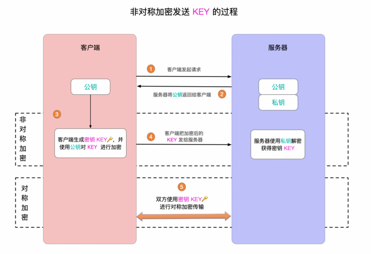

linux的OpenSSL库 是 SSL 和 TLS 最常见的开源实现。

**HTTPS SSL 隧道协议**，该协议解决代理不能读取HTTPS的 HTTP 首部，就无法知道应该将请求转向何处的问题。HTTP 通过 CONNECT 方法来发送明文形式的端点信息。CONNECT 方法会告诉代理，打开一条到所期望主机和端口号的连接隧道，并进行数据传输。
```
CONNECT home.netscape.com:443 HTTP/1.0
User-agent: Mozilla/1.1N
<raw SSL-encrypted data would follow here...>
```

**NAT**（Network Address Translation）网络地址转换
当私有网主机和公共网主机通信的IP包经过NAT网关时，将IP包中的源IP或目的IP在私有IP和NAT的公共IP之间进行转换。
SNAT（Source NAT，SNAT）：修改数据包的源地址。
DNAT（Destination NAT，DNAT）：修改数据包的目的地址。
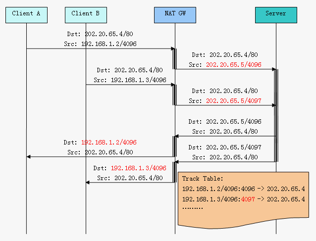
**DNS**
分布式域名服务器是树状结构。
域名解析过程：客户端先检查本地的 DNS 缓存，DNS 是以存活时间（Time to Live，TTL）来衡量缓存的有效情况的，本地 DNS 收到查询请求后，会按照“是否有www.icyfenix.com.cn的权威服务器”→“是否有icyfenix.com.cn的权威服务器”→“是否有com.cn的权威服务器”→“是否有cn的权威服务器”的顺序，依次查询自己的地址记录，如果都没有查询到，就会一直找到最后点号代表的根域名服务器为止。它将会得到“cn的权威服务器”的地址记录，然后通过“cn的权威服务器”，得到“com.cn的权威服务器”的地址记录，以此类推，最后找到能够解释www.icyfenix.com.cn的权威服务器地址。通过“www.icyfenix.com.cn的权威服务器”，查询www.icyfenix.com.cn的地址记录。
`<link rel="dns-prefetch" href="//domain.not-icyfenx.cn">`前端对域名预加载。
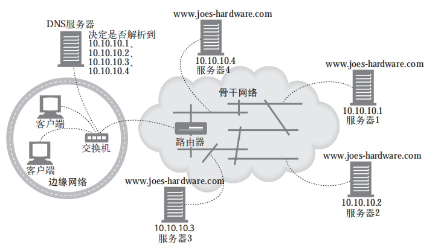
dns源起于hosts，各级域名，包括顶级域名都可向ICANN申请购买。


**CDN** 路由解析：
1 架设好“icyfenix.cn”的服务器后，将服务器的 IP 地址在你的 CDN 服务商上注册为“源站”，注册后你会得到一个 CNAME，即本例中的“icyfenix.cn.cdn.dnsv1.com.”。
2 将得到的 CNAME 在你购买域名的 DNS 服务商上注册为一条 CNAME 记录。
3 当第一位用户来访你的站点时，将首先发生一次未命中缓存的 DNS 查询，域名服务商解析出 CNAME 后，返回给本地 DNS，至此之后链路解析的主导权就开始由内容分发网络的调度服务接管了。
4 本地 DNS 查询 CNAME 时，由于能解析该 CNAME 的权威服务器只有 CDN 服务商所架设的权威 DNS，这个 DNS 服务将根据一定的均衡策略和参数，如拓扑结构、容量、时延等，在全国各地能提供服务的 CDN 缓存节点中挑选一个最适合的，将它的 IP 代替源站的 IP 地址，返回给本地 DNS。
5 浏览器从本地 DNS 拿到 IP 地址，将该 IP 当作源站服务器来进行访问。

CDN 获取源站资源的过程被称为“内容分发”：
主动分发（Push）：分发由源站主动发起，将内容从源站或者其他资源库推送到用户边缘的各个 CDN 缓存节点上。
被动回源（Pull）：当某个资源首次被用户请求的时候，CDN 缓存节点发现自己没有该资源，就会实时从源站中获取，这时资源的响应时间可粗略认为是资源从源站到 CDN 缓存节点的时间，再加上资源从 CDN 发送到用户的时间之和。


**XSS**（cross site script） 在网站上注入恶意客户端代码（js脚本、链接、html实体），过滤输入请求，strip_tags、htmlspecialchars、htmlentities 
**CSRF** （cross site request forgery）攻击者诱导用户进入第三方网站，在第三方网站中向被攻击网站发送跨站请求，1 同源检测 2 token 将CSRF Token输出到页面中，请求时携带Token，服务器端验证token。

HTTP报文是纯文本字符串。
|  编码   |  文本   | 说明   |
| --- | --- | --- |
|301|Moved Permanently|在请求的链接被移除时使用|
|302|Found|在请求临时的链接使用
|400|Bad Request|客户端请求错误
|403|Forbidden|请求被服务器拒绝
|404|Not Found|无法找到所请求的 URL
|500|Internal Server Error|服务器错误
|502|Bad Gateway|代理或网关错误(无法连接到其父网关) php-fpm 没有可用的worker进程（worker进程不够用了）
|504|Gateway Timeout|代理或网关超时(等待另一服务器响应超时) worker进程响应超时（php代码执行超时）

**Websocket**:Websocket与HTTP(80)和HTTPS(443)使用相同的TCP端口。服务器可以随时主动给客户端下发数据。WebSocket 是独立的、建立在TCP上的协议。Websocket 通过 HTTP/1.1 协议的101状态码进行握手。

**HTTP2**
HTTP1.x和HTTP2的区别：
新的二进制格式（Binary Format），HTTP1.x的解析是基于文本。基于文本协议的格式解析存在天然缺陷，文本的表现形式有多样性，要做到健壮性考虑的场景必然很多，二进制则不同，只认0和1的组合。基于这种考虑HTTP2.0的协议解析决定采用二进制格式，实现方便且健壮。
多路复用（MultiPlexing），即连接共享，即每一个request都是是用作连接共享机制的。一个request对应一个id，这样一个连接上可以有多个request，每个连接的request可以随机的混杂在一起，接收方可以根据request的 id将request再归属到各自不同的服务端请求里面。
header压缩，如上文中所言，对前面提到过HTTP1.x的header带有大量信息，而且每次都要重复发送，HTTP2.0使用encoder来减少需要传输的header大小，通讯双方各自cache一份header fields表，既避免了重复header的传输，又减小了需要传输的大小。
服务端推送（server push），同SPDY一样，HTTP2.0也具有server push功能，服务器可以对一个客户端请求发送多个响应。
HTTP2.0的多路复用和HTTP1.X中的长连接复用有什么区别？

HTTP/1.* 一次请求-响应，建立一个连接，用完关闭；每一个请求都要建立一个连接；
HTTP/1.1 Pipeling解决方式为，若干个请求排队串行化单线程处理，后面的请求等待前面请求的返回才能获得执行机会，一旦有某请求超时等，后续请求只能被阻塞，毫无办法，也就是人们常说的线头阻塞；
HTTP/2多个请求可同时在一个连接上并行执行。某个请求任务耗时严重，不会影响到其它连接的正常执行；
*****
**概述**


应用层不能关心（也不关心）一台主机是在以太网上，而另一台主机是在令牌环网上，它们通过路由器进行互连。物理细节的隐藏使得互联网功能非常强大，也非常有用。
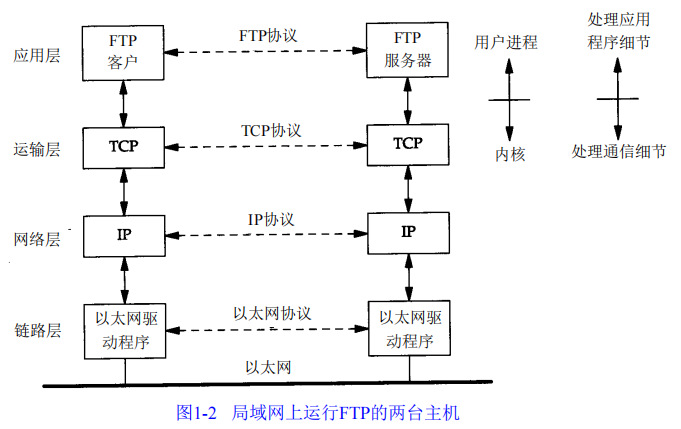
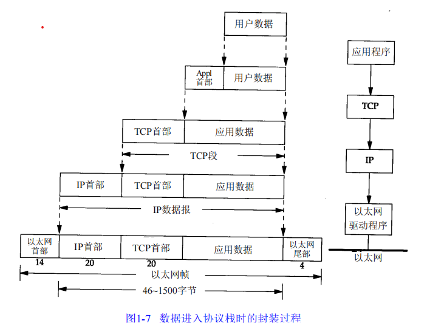


三网融合：电信网络、有线电视网络、计算机网络
互联网：Internet

物理层传输方式：双绞线（铜线，内网）和光纤（外网）。基于多路复用提高并发时的传输效率。
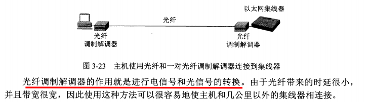

单工通信：只能有一个方向的通信，而没有反方向的交互。需要1条信道
半双工通信：通信双方都可以发送信息，但不能同时发送。需要2条信道
全双工通信：通信双方可以同时发送和接收信息。需要2条信道

bit byte kb m g t

**链路层**
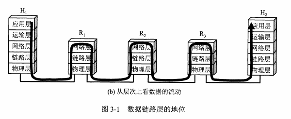

CRC 循环冗余检验，解决传输时的比特差错（1变成0，0变成1）。错误的帧会被丢弃。

802.1 桥接/体系架构
802.3 以太网 以太网v2 只支持单播帧、广播帧和多播帧。
802.11 无线局域网

曼彻斯特码
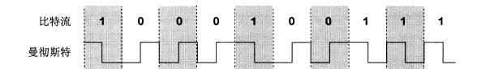


Mac地址 物理地址 硬件地址 硬编码 48位 对应网卡，网卡厂商也要向RA购买Mac地址段。
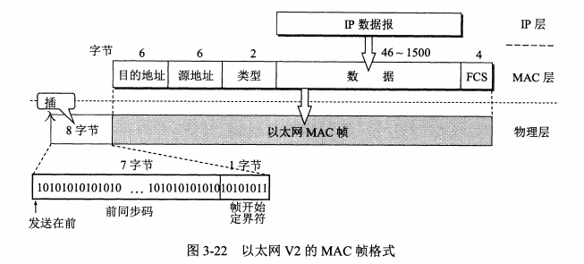


以太网v2 帧

bridge 网桥，可以配置 IP、MAC 等，还是一个交换机，具有交换机所有的功能。通过网桥相连的主机都属于同一个局域网。

交换机
交换机是全双工方式，多接口的网桥。
通过广播、丢弃的方式自学习维护地址表（MAC地址与转发接口对应表），因此具有即插即用的功能，不需要人工配置。

VLAN 虚拟局域网
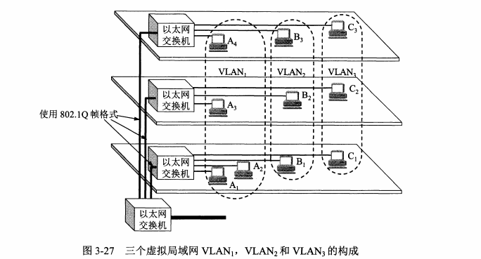


**网络层**

不需要建立连接，每个IP数据报独立发送，与其前后的数据报无关，是不可靠的。
通过IP地址，整个互联网就是一个单一的、抽象的网络。
IP地址是逻辑地址，通过软件实现。
IP地址放在IP数据报的首部，MAC地址放在MAC帧的首部。
IP的源和目的地址始终不变，MAC则会变化。
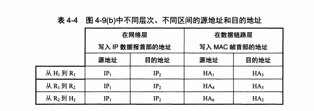

IP数据报只检验首部。
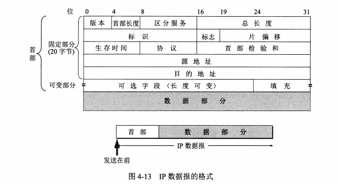
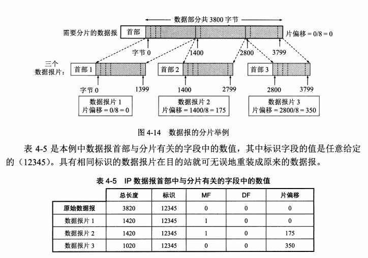


ARP， 地址解析协议，为IP地址到对应的硬件地址之间提供动态映射。

**IPV4**
经典模式：
A类:1.0.0.0~126.255.255.255,默认子网掩码/8,即255.0.0.0，一个子网最多容纳1677万多个ip
(其中127.0.0.0~127.255.255.255为环回地址,用于本地环回测试等用途)
B类:128.0.0.0~191.255.255.255,默认子网掩码/16,即255.255.0.0，一个子网最多容纳65534个ip
C类:192.0.0.0~223.255.255.255,默认子网掩码/24,即255.255.255.0，一个子网最多容纳254个ip
要想在同一网段，必需做到网络标识一样。

CIDR划分法比较灵活，不再区分A~E类，并且随意使用子网掩码，因此，可以把IP段尽量划分的小一些，每个CIDR段分配给一个单位。

IP地址组成为：网络号+子网号+主机号。
网络号是在广域网中的集合标识，子网号是在网络号中的集合标识。实际场景中，单个网络支持的机器数目有限，对于a类和b类网络号会造成ip浪费。因此在网络号之下增加一层子网号。
为了使目的主机所在网路的路由器能够很方便的找到目的子网，引入子网掩码的概念。
子网掩码的高24位为全1，等价于 11111111.11111111.11111111.00000000，即255.255.255.0。有着相同子网掩码的主机属于同一局域网。

私有地址(private address)也叫专用地址，它们不会在全球使用，只具有本地意义：
A类私有地址：10.0.0.0/8，范围是：10.0.0.0~10.255.255.255
B类私有地址：172.16.0.0/12，范围是：172.16.0.0~172.31.255.255
C类私有地址：192.168.0.0/16，范围是：192.168.0.0~192.168.255.255

ICMP经常被认为是 IP层的一个组成部分。它传递差错报文以及其他需要注意的信息。ICMP报文通常被I P层或更高层协议（TCP或UDP）使用。一些 ICMP报文把差错报文返回给用户进程。
Ping程序是为了测试另一台主机是否可达。该程序发送一份ICMP回显请求报文给主机，并等待返回ICMP回显应答。Ping服务器一般在内核中实现ICMP的功能。
数据报的总长度不能超过链路层的MTU值。

路由表由内核维护。
路由器任务是转发数据报，这些路由器按照复杂的路由算法，得出整个网络的拓扑变化情况，生成路由表。

IPv6数据报首部与IPv4不兼容，但是IPv6系统必须向后兼容，能够接收和转发IPv4数据报。

**NAT**（Network Address Translation）网络地址转换
当私有网主机和公共网主机通信的IP包经过NAT网关时，将IP包中的源IP或目的IP在私有IP和NAT的公共IP之间进行转换。
SNAT（Source NAT，SNAT）：修改数据包的源地址。
DNAT（Destination NAT，DNAT）：修改数据包的目的地址。
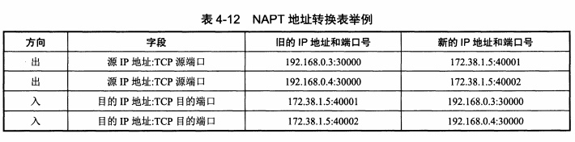


**UDP**
发送数据之前不需要建立连接，不保证可靠交付，首部8个字节，比TCP的20个字节的首部要短，减少开销和发送数据之前的延时。
UDP会把首部和数据一起检验。
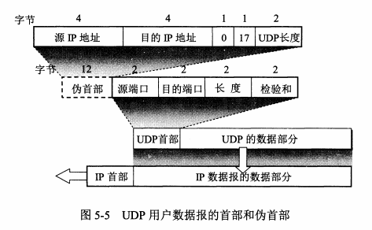

# TCP
发送数据之前需要建立连接，数据发送完后需要释放连接，只支持一对一的通信，提供可靠交互，全双工通信，允许通信双方的应用进程在任何时候都能发送数据，发送的是byte字节流。
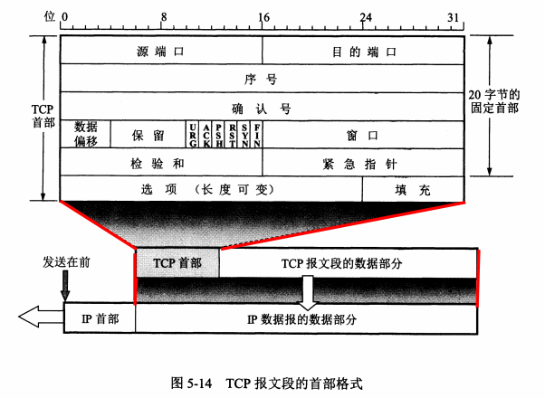
TCP在不可靠的I P层上提供了一个可靠的运输层。


tcp的连接是逻辑连接。

tcp缓存空间是环状，每一方都有自己的发送和接收窗口。
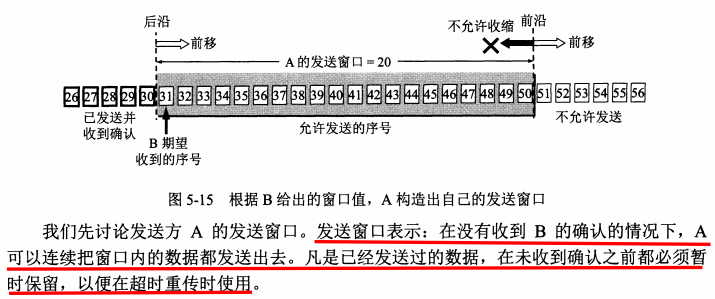
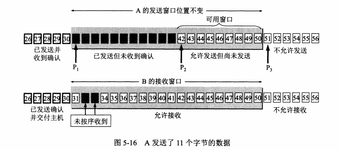
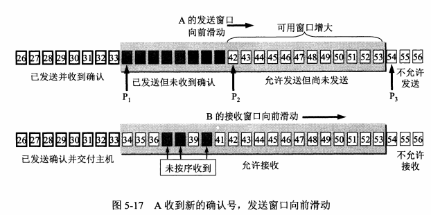
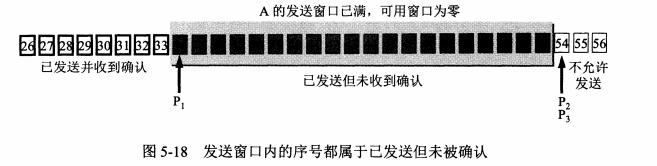

**超时重传**时间算法：取加权平均往返时间RTT，发生重传后时间记为两倍，直到不再重传。
syn 同步，ack 确认，fin 终止
cwnd 拥塞窗口
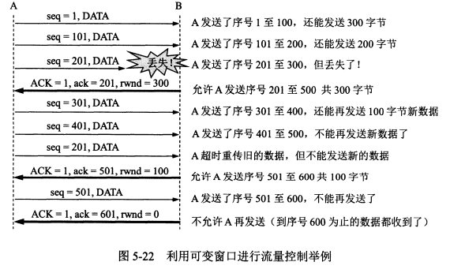

拥塞引起的重传不会缓解网络的拥塞，反而会加剧网络的拥塞。拥塞控制是全局性的，涉及所有的主机、路由器、链路。
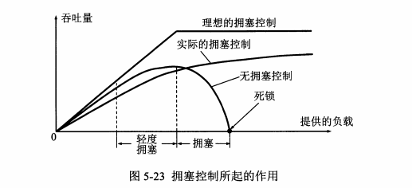

TCP拥塞控制方法：
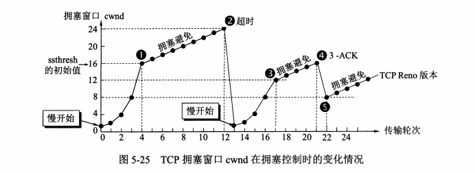

**拥塞窗口**：
慢（cwnd=1）开始，由小到大（开始cwnd=2*cwnd 指数增长，达到ssthresh后，cwnd=cwnd+常数 线性增长）逐渐增加发送窗口。传输出错而丢失报文的概率很小，因此判断网络拥塞的依据就是出现了超时，这时就减小发送窗口。

**tcp三次握手**：服务器listen状态->客户端发送syn报文，syn_sent状态->服务器接收报文，发送syn+ack报文，syn_rcvd状态->客户端接收报文，发送ack报文，established状态->服务器接收报文，established状态。
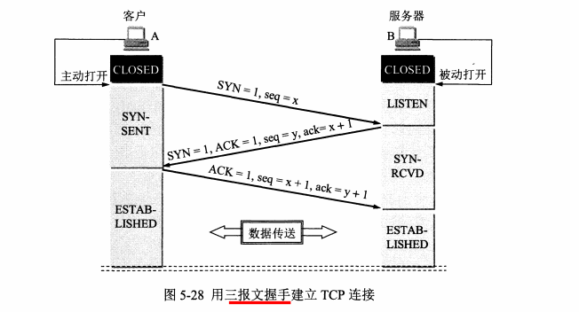

为什么三次握手：双方确认自己与对方的发送与接收是正常的。

**tcp四次挥手**：客户端established，服务器端established->客户端发送fin报文，并停止发送数据，fin_wait1状态->服务器接收报文，发送ack报文，close_wait状态->客户端接收报文，fin_wait2状态->服务器也没有数据需要发送后，发送fin+ack报文，lask_ack状态->客户端接收报文，发送ack报文，time_wait状态,超时后进入closed状态->服务器接受报文，closed状态。
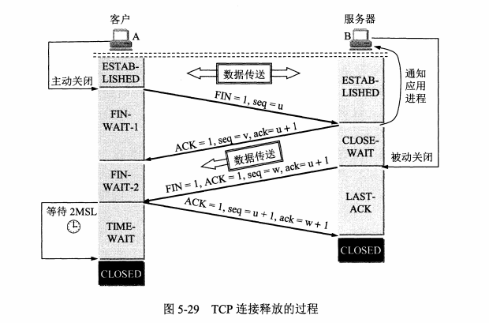

为什么四次挥手：tcp的半关闭特性决定的，即连接的一端发送完数据之后，还能接受另一端的数据的能力。
TIME-WAIT是什么，为什么必须等待 2MLS(报文最大生命周期，默认2分钟):
* 保证 TCP 连接的远程被正确关闭，即发送的最后一个ack能够成功到达（服务器会超时重传fin+ack）。
* 防止延迟的旧报文被其他使用相同源地址、源端口、目的地址以及目的端口的新连接收到。
TIME-WAIT可能导致端口耗尽。

**心跳机制**：定时发送一个心跳报文，以确认双发是否保持连接。


系统用一个4四元组来唯一标识一个TCP连接：{local ip, local port,remote ip,remote port}。
client最大tcp连接数：tcp端口的数据类型是unsigned short，因此本地端口个数最大只有65536，端口0有特殊含义，不能使用，这样可用端口最多只有65535。
server最大tcp连接数：理论上是客户端ip数×客户端port数，在unix/linux下限制连接数的主要因素是内存和允许的文件描述符个数。
服务器端最多可以拥有65535个Bind的Socket，最多可以开65535个服务器进程，但是你要知道这个能够连接客户端的数量没有任何关系。
tcp相关的参数可以在内核文件`/etc/sysctl.conf`中修改。
*****


**同步** 主动等待消息通知。
**异步** 被动接收消息通知，通过回调、通知、状态等方式来被动获取消息。
**阻塞** 程序会一直等待。
**非阻塞** 程序轮询等待。
**用户空间/内核空间** 现代操作系统都是采用虚拟存储器，对32位操作系统而言，它的寻址空间为4G。为了保证用户进程不能直接操作内核，操作系统将虚拟空间划分为两部分，一部分为内核空间，一部分为用户空间。针对linux操作系统而言，将最高的1G字节，供内核使用，称为内核空间，而将较低的3G字节，供各个进程使用，称为用户空间。
**进程切换** 为了控制进程的执行，内核必须有能力挂起正在CPU上运行的进程，并恢复以前挂起的某个进程的执行。这种行为被称为进程切换。当进程进入阻塞状态，是不占用CPU资源的。
**网络IO** 本质是socket的读取，IO的数据会先被拷贝到操作系统内核的缓冲区中，然后才会从操作系统内核的缓冲区拷贝到应用程序的地址空间。
1 等待网络数据到达网卡并读取到内核缓冲区，数据准备好。
2 从内核缓冲区复制数据到进程空间。
1对1的通信示例（同步阻塞）：创建socket，绑定socket到指定ip和端口bind，开始监听连接listen，接受客户端数据accept，关闭socket。

**文件描述符**（File descriptor），FD，是一个指向文件的引用，是一个非负整数索引值。当程序打开一个现有文件或者创建一个新文件时，内核向进程返回一个文件描述符。
fd包含socket连接、文件句柄、输入输出流。Linux中一切皆文件。

**IO多路复用** 多个网络连接复用同一个线程。它是时分多路复用。
链表、数组区别：数组查询快，插入删除慢很多，长度固定，顺序存储，链表插入删除快，查询线性时间慢，长度动态灵活，随机存储。相同数量的元素，链表更耗内存（存储了前后指针）

在一个线程中，同步阻塞只能等待一个连接，I/O 复用可以等待多个连接（kernel监控），但一次只能处理一个连接，用于海量并发连接且大量连接idle的场景。

**select**
将已连接的 Socket 都放到一个文件描述符集合BitsMap，然后调用 select 函数将BitsMap拷贝到内核，内核遍历BitsMap，当检查到有事件产生后，将此 Socket 标记为可读或可写，再把BitsMap拷贝回用户态，用户态遍历BitsMap找到可读或可写的 Socket，然后再对其处理。时间复杂度O(n)。BitsMap固定长度，仅能存储1024个fd。
**poll**
在select基础上，用链表替代BitsMap存储fd的方式，突破了select 的文件描述符1024个数限制。其它没太大区别。
**epoll**
1 在内核中使用红黑树存储fd，增删改一般时间复杂度O(logn)。
2 使用事件驱动机制，内核里维护了一个就绪事件链表，当某个socket有事件发生时，通过回调函数内核会将fd加入到这个就绪事件链表，当用户调用epoll_wait()时，只会返回有事件发生的文件描述符。

epoll用法示例：
```
int s = socket(AF_INET, SOCK_STREAM, 0);
bind(s, ...);
listen(s, ...)

int epfd = epoll_create(...);
epoll_ctl(epfd, ...); //将所有需要监听的socket添加到epfd中

while(1) {
    int n = epoll_wait(...);
    for(接收到数据的socket){
        //处理
    }
}
```

epoll的连接上限是最大可以打开文件的数目。
linux内核2.6以上才支持epoll。