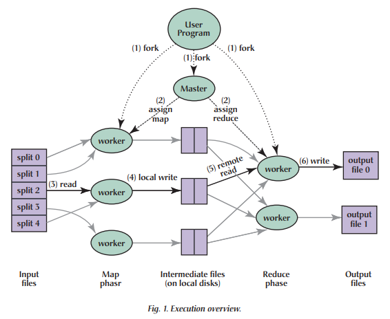

**MapReduce**
编程模型的原理是：利用一个输入 key/value 集合来产生一个输出的 key/value 集合。MapReduce 库的用户用两个函数表达这个计算：Map 和 Reduce。
用户自定义的 Map 函数接受一个输入的 key/value 值，然后产生一个中间 key/value 值的集合。MapReduce 库把所有具有相同中间 key 值 I 的中间 value 值集合在一起后传递给 reduce 函数。
用户自定义的 Reduce 函数接受一个中间 key 的值 I 和相关的一个 value 值的集合。Reduce 函数合并这些value 值，形成一个较小的 value 值的集合。一般的，每次 Reduce 函数调用只产生 0 或 1 个输出 value 值。通常我们通过一个迭代器把中间 value 值提供给 Reduce 函数，这样我们就可以处理无法全部放入内存中的大量的 value 值的集合。

计算 URL 访问频率：Map 函数处理日志中 web 页面请求的记录，然后输出(URL,1)。Reduce 函数把相同URL 的 value 值都累加起来，产生(URL,记录总数)结果。

当用户调用 MapReduce 函数时，将发生下面的一系列动作：
1. 用户程序首先调用的 MapReduce 库将输入文件分成 M 个数据片度，每个数据片段的大小一般从16MB 到 64MB(可以通过可选的参数来控制每个数据片段的大小)。然后用户程序在机群中创建大量的程序副本。
2. 这些程序副本中的有一个特殊的程序–master。副本中其它的程序都是 worker 程序，由 master 分配任务。有 M 个 Map 任务和 R 个 Reduce 任务将被分配，master 将一个 Map 任务或 Reduce 任务分配给一个空闲的 worker。
3. 被分配了 map 任务的 worker 程序读取相关的输入数据片段，从输入的数据片段中解析出 key/value pair，然后把 key/value pair 传递给用户自定义的 Map 函数，由 Map 函数生成并输出的中间 key/value pair，并缓存在内存中。
4. 缓存中的 key/value pair 通过分区函数分成 R 个区域，之后周期性的写入到本地磁盘上。缓存的key/value pair 在本地磁盘上的存储位置将被回传给 master，由 master 负责把这些存储位置再传送给Reduce worker。
5. 当 Reduce worker 程序接收到 master 程序发来的数据存储位置信息后，使用 RPC 从 Map worker 所在主机的磁盘上读取这些缓存数据。当 Reduce worker 读取了所有的中间数据后，通过对 key 进行排序后使得具有相同 key 值的数据聚合在一起。由于许多不同的 key 值会映射到相同的 Reduce 任务上，因此必须进行排序。如果中间数据太大无法在内存中完成排序，那么就要在外部进行排序。
6. Reduce worker 程序遍历排序后的中间数据，对于每一个唯一的中间 key 值，Reduce worker 程序将这个 key 值和它相关的中间 value 值的集合传递给用户自定义的 Reduce 函数。Reduce 函数的输出被追加到所属分区的输出文件。
7. 当所有的 Map 和 Reduce 任务都完成之后，master 唤醒用户程序。在这个时候，在用户程序里的对MapReduce 调用才返回。

应用场景：在分布式环境中处理海量数据，Hadoop。